# 铸币 - 小红书笔记汇总

- **小红书号**: 42969392368
- **用户昵称**: 铸币
- **IP属地**: 广东
- **个性签名**: 我因为常见些但愿不如所料，以为未必竟如所料的事，却每每恰如所料的起来，所以很恐怕这事也一律。
- **整理时间**: 2026-02-27

---

## 1. 白蛆过隙的一年

短短24小时，对年终总结从最初的无感，到刷朋友圈时的跃跃欲试，再到下了班后的磨蹭拖延准备放弃，再到深夜觉醒emo人格重新打开文本编辑器。像极了这匆匆忙忙原地打转的一年，顺带领悟了一个歪理：最高级的放弃是放弃放弃。

然而磨蹭拖延并非毫无道理，列表诸位不知道为什么，突然合起伙来过起了现充生活。仿佛在这个寒冷的冬天升起许多希望的篝火，我出于取暖的目的试图凑上去，却发现自己被烤的滋滋作响。

今年原本是没什么变化的，就像过去混沌的许多年一样。然而不知道什么时候开始突然感觉变老了，或者至少不再那么年轻，同时发现自己似乎还没长大。

马原上对此似乎有一个解释，叫做社会意识落后于社会存在，而落后就要挨打，于是我继续遭受生活的痛打。其实这种打击感似乎没有很充足的根据，毕竟从很多个角度来看，我大致上是步入了正轨。但总怀疑我没坐到车上，而是坐到了车对面。

偶尔抬头看看四周，发现身边人似乎已经开始结婚生子，以及秃顶了。有时看着他们让我想起坐井观天的青蛙，就这样长久而茫然的看着，一切似乎离我很遥远，然而我脚下的大地也是这片天空的一小部分，我自己也是这片天空的更小一部分。我并不远在天空之下，而是就在宇宙之中。然而不管能不能意识到这一点，似乎都难以跳出这口井，只好继续梗着脖子，瞪大双眼。

工作日益摸鱼化，开始萌生跑路想法，尤其是在周围同事，或是不在周围的同事，已经实现或是预备实现的跳槽下。然而又不太舍得当前这个难得清闲的工作。时不时会想起哈克当时差点去的欧共体，或者是苏秦曾经耿耿于怀的二顷郭田。进而开始怀疑会不会是因为素来退路太多，所以也一直看不到什么前路。

然而冷静下来意识到哈克和苏秦都是极少数，想来历史上也不缺乏没有两顷田随后饿死的普通人，只不过没人愿意特意记录。有田种好过没田种，有饭吃好过没饭吃，这大约是不错的，虽然我又隐隐觉得有哪里不对。

打开群聊又抢到几个红包，也算先充带动后充了，不知道会不会有共同现充的那天。虽然定睛一看发红包几位平日里似乎也是负能量大户，不过这样更显得感人。

说起来这段时间经常能被附近的施工声吵得睡不好觉，然而跨年夜居然听不见烟花声，不禁有些担心起这里的风水。不过群里另一个阴暗哥已经在吐槽烟花吵了，我想我大概也是一样。

算了，新年快乐。

---

## 2. 都23了，我怎么还没退休

调bug调到一半突然想起来那首小诗《走在自己的时区里》，愈发觉得我已经走到了该退休的时区，然而还得在工位跟bug斗智斗勇，想必是被资本做局了的缘故。

摸鱼水了一下群，发现其他人也以差不多的心态哀嚎。有人终于看不下去，鼓励到应该朝前看。另一个人汇报了一下他朝前看之后的发现，据说是四十年当前生活的重复。

有时候还挺难分清急性死亡和慢性死亡的好坏的。

最近歌单里越来越多励志歌曲，突然发现喜欢积极向上曲风的不一定是积极向上的人。也可能是我这种一年见不了两次太阳的阴暗败犬。越来越理解为什么老年人都喜欢晒太阳了，这大约也是我到了退休年龄的有力证据。

所幸的是睡眠得到了保障，现在睡前只要想想第二天的工作就能很快两眼一黑失去意识，直到被闹铃叫醒。

前段时间和朋友电话被告知工作压力大更应该和别人多交流，要不然可能成为压垮骆驼的最后一根稻草。然而我顿时觉得都要被压垮了似乎不应该纠结一两根稻草的事，可惜到现在也没找到把稻草之外的东西移走的方法。

此外又被劝说不该这么悲观，应该主动发现生活的闪光点。但我只发现了自己的夜盲症，在乌漆嘛黑的生活里什么也看不见。聊天很快退化成没营养的车轱辘话。最后被问难道没有什么可分享的生活吗，这倒是略微触动了我麻木的神经。

然而重新回顾了一下日常，愈发确定任何一件事拿出来都不叫分享，而是诉苦。而诉苦似乎没什么必要，下水道里的每一只蟑螂都已经听说了我的故事，这大约已经足够了。于是佯装欠费挂断了电话。

恰逢降温，虽然不知道寒气有没有传给每个人，但确实是已经传给我个人了。

---

## 3. 猪在床上，我在梦里

世界是真的很奇妙，假如迷失在黑夜里，只需要昏昏沉沉的睡上一觉，醒来可能就会发现天亮了。就像这个跟我八字不合的项目，突然就见到了黎明的曙光，然而实际上好像什么也没做成。

算了，可能是Windows之神终于听到了我虔诚的祷告，于是给了我一点难得的救赎。明天把模型跑起来给它烧点显卡，权当是一个卑微码农的小小孝敬。

仔细想想，这段时间以来的痛苦之源不只是结果不对的代码，还有二十四小时不打烊的例会。很早以前就听说i人的社交会消耗能量，但由于孤寡老人当久了一直不以为意。直到这段时间被迫时刻跟项目老哥同步进展，才意识到不间断社交的恐怖。

偏偏老哥似乎是个e人，打破我对程序员的刻板印象的同时也差点打破心理防线。日常几乎是一到工位就会收到他的会议邀请，事实上并没有这么多东西需要对，主要还是听他吐槽项目的艰难以及工作的苦楚。

其实我觉得这种事应该大家心知肚明就好，然而说都说了，我要是默默点点头他也看不见，只好不断附和，总结下来基本就是三个词:确实，真的，唉。我原本寄希望于他能尽快发现我的疲惫，没想到他最先发现的是我的敷衍，跟我说我好像自动回复。

唉，天凉好个秋。我只好再努力打起精神输出一些比较认真的回复。原本看到营销号发的什么三句话暖他一整天都是嗤笑一声直接划走的，现在我很后悔没有点个收藏并且很想翻出来看看。

掐指一算，健身房已经大约两周没去了，之所以说大约是因为手指头只有十根，不够数。极其明显的感觉思维变迟钝了许多，并且时常陷入发呆，上百度一查，说这是痴呆的征兆，买了两盒脑白金，希望有效。

---

## 4. 咸鱼唯一一次翻身是在锅里

最近发现工作和地球一样都是圆的，因为我往前走了一段时间以后回到了原点。唯一的区别是上一个发现地球是圆的人被写进了历史课本，但我可能会被写进失业救济名单。

其实这件事不应该这么晚才发现的，毕竟很久以前就见过驴拉磨。但不知道为什么，那时竟以为这不是我。

这两周深夜加班和周六加班已然成为常态，偏偏还赶上了大到暴雨，不能不说二者还挺配，只是我不配。听说大雨能洗刷很多东西，但我总感觉洗刷的是我的求生欲。

除了以不变应万变的项目进度，更加折磨人的是连轴转的例会和汇报交接，某天发现只有在深夜加班的时候才能真正开始写代码，这辈子有了。长久的开会让我怀疑自己的脑血栓要被耳机挤破了，但结果大概也就是一堆和我无关的事阻止我做和我有关的事。

至今不能理解需要每天同步进展的例会，尤其是在我没有进展可同步的时候，感觉我是个僵尸进程，等待某天系统注意到的时候就会收回工牌。

今天又是非常寻常的加班到十一点多，原本摸鱼的时候还会有点担心以后怎么办，现在不用担心了，活不到那时候。这原本是很令人悲伤的事，然而想了想眼前的工作，偶尔又觉得也不妨再快点。

跟同事交流的时候他问了一句并行是在计算上做的吗，我问了一句还能在其他地方做吗？天地良心，我真的是纯发问，然而他并没有回答。虽然素来十分ky，也大概意识到他以为我在怼他。原本想告诉他我只是纯疑问，但又担心他以为我在阴阳他，好吧深层原因应该是因为我是个哑巴。

喧哗是i人的落日，沉默是i人的末日。

---

## 5. 摸不着头脑也摸不着心跳的工作

来公司这段时间见证了隔壁老哥从时刻紧盯主机，到偶尔打开手机，再到逐渐戴上耳机，原本是心里暖暖的，因为减轻了我摸鱼的负罪感和紧张感。

然而那时还是太年轻，不知道牛马守恒定律。据说每一份命运的馈赠都会在暗中标好价格，但具体到我，则是馈赠没领到，反而作为价格被贴了上去。

被丢到训推组以后每一天都在怀念当初做agent时的美好时光，每天调调prompt看看数据，模型跑起来以后玩玩手机，当时只道是寻常，现在则脑海时刻回响李斯的遗言:吾欲与汝复牵黄犬，俱出上蔡东门逐狡兔，岂可得乎？

知不可乎骤得，托遗响于悲风。然而悲风吹走以后，我还得继续写一堆陌生的代码。这本来也只不过要走我一半的狗命，但某天突然发现组里另一个老哥在喝中药，不是哥们，我才刚来，别吓我好吗？

当然，喝中药也未必是加班的缘故，可能有别的原因，我竭力的安慰自己。但就效果而言，则有点像小学数学考了个二十分，老师摸着我的头说你其实是个很聪明的孩子，只要认真学一定会有进步的。

而回到工作本身，代码，已令我手不忍敲了，数据，尤令我目不忍视。开会的时候大领导明里暗里的让对标当前SOTA跑出一版更好的结果，但语气极其和善，措辞极其淡然，我一度以为这是说指标无所谓，测出结果就行。直到带我的老哥给我来了波中译中，只能说还好没活在三国，要不然估计死的比汉灵帝还早。

但是数据依然惨不忍睹，尤其是对比隔壁的模型结果。现在愈发感觉我像一只屎壳郎，非常努力的工作，但成果只是一个越来越大的粪球。同时这个粪球还挡住了我的视线，令我找不到方向。

不过这并不是什么十分要紧的事，因为周一这个粪球就要推到主管和各位领导面前了。唉，事已至此，先睡觉吧。

---

## 6. 搬砖日记（无题）

不知道是不是上了年纪的缘故，最近总感觉时间过得飞快，手忙脚乱中又在公司混了三个多月。据说男人过了二十五就是六十了，那么依据当前接近二十三的年龄来估算，现在大概是五十八岁左右。

按理来说已经是知天命的年纪了，然而去公司食堂时仍然不知道吃什么比较好。躺在床上思考人生的意义时，也往往以睡着而告终，醒来甚至连做了什么梦也不记得。这让我想起来那天背对着阳光，在一只猪身上看见了我的影子。

唯一的变数是原本的摸鱼项目被主管认为没前途而冷藏了，现在被分到另一个牛马项目组。我就像被一只拍死在墙上的蟑螂，原本已经快要风干了，突然又被抠了下来让我去拉磨。

于是体会了一次持续到第二天凌晨的加班，凌晨四点的洛杉矶虽然没见过，但是午夜十三点的深圳是见到了，四周一片寂静，只有耳机里的信乐团在唱什么北方的狼族。

和我交接工作的老哥略有些健谈（如果是和我这种i人比的话就是很有些健谈），但他跟我说的都是这个项目有多么的压榨员工，自己的生活是如何凄惨身体是怎样的遭不住。自然，我是很同情他的，但是作为一个即将和他一起吃苦的新人，我其实还是有点希望他多说点正能量的东西，给我一点虚假的希望也好。

然而并没有，他说完自己的苦难经历以后又说起同组的另一个哥们，又是同样的苦难和同样的身体遭不住，很彻底的打消了我的幻想与侥幸心理。我唯唯诺诺的点点头，喝了口王老吉，感觉心里凉凉的。

然后就被丢去参与项目，有一点被丢河里的感觉。我怀疑是触发了大脑的自保机制，现在它已经基本不会转了，让我想把它放转转上回收，你怎么这么自私？

然而上级的催促并不会因为我的愚蠢而停止，只好手脚并用地狼狈前进。同时发现精神疲劳会带动肉体产生疲惫，于是目前的坐姿愈发扭曲，并且无暇顾及，直到某一刻发现我的姿势和霍金有点神似。

很早以前就听说过青春易逝，但我没想到居然这么易逝。昨天在一个学姐的朋友圈看见一首歌《此刻，我们应该坐在年轻的海岸上》，第一次见这种轻小说型歌名，于是搜来听了听，里面有句歌词是"我熄灭了，还有那天晚上的星光。"

然而当时的想法是:熄灭可能不假，但是那天晚上的星光必然已经不复存在了。真的，心里阴暗的人就是这样，我服了。

---

## 7. 搬砖日记 九

折磨了我两天的代码终于跑通了，出公司的时候感觉已经提前看见了明天的太阳。

自从端午回来后就一直不在状态，然而端午实际上也没干什么。感觉我像一只竹篮，在极其自然的情况下就可以耗光我的所有精力。

主管素来是鼓励行人格，然而在我入职的一个多月以来，他对我的评价从"非常好！"到"很好，但还有进步空间"，再到"不错，但也存在一些问题"，再到"还有很大的进步空间"，再到"你需要加把劲"，直到现在，他已经习惯了沉默不语，然而我想他的内心想法是："这人什么时候能滚出我们公司"。

周二例会主管略有点激动的说这周需要出一个优化方案，而我的内心戏是："那么你在下周之前可就不能炒我鱿鱼了，嘿嘿"。

但我在摸鱼之余又不免感到冤枉，毕竟目前为止干的活无非是连连服务器跑跑模型，服务器崩了我不能拿个扳手去看是不是那个螺丝松了，大模型输出结果不理想我也不能警告他下次注意，只好忠实的向主管反馈情况。

不过在主管的视角大约是："怎么你到哪哪的大环境就不好，你就是破坏大环境的人啊？"

不过这么想或许也没错，因为我旁边工位的哥们在我来以后玩手机的频率似乎高了一些。

但是关于服务器的问题实在是让我十分无语，不知道什么时候得罪了windows之神，我所接触的代码似乎总会出一些奇奇怪怪的bug，我连接的服务器也总会莫名其妙的崩掉。

由于反馈服务器的问题次数过多，我现在已经陷入里塔西佗陷阱，主管往往会来一句怎么其他人都没有这样的问题，甚至还会找其他人也试着启动一下这个服务。

所幸，服务器虽然我一用就坏，但也还不至于换个人用马上又好起来，不然的确是跳进黄河也洗不清了。但是在主管面前的信誉扫地是注定了的，希望他不至于怀疑是我把霉运带来了这家公司。

---

## 8. 无题

偶然一歪头，发现一只六脚朝天，躺的极其安详的苍蝇。按理来说，在我的桌子上随便睡觉是不允许的，然而试着用手在它旁边虚晃几下，毫无反应。

看来是没法把他叫醒了，也许是老死的，这倒是很让我惊讶。长这么大见过的苍蝇不是嗡嗡乱飞就是被狠狠拍死，像现在这样心平气和的端详还是二十多年来头一回。

它旁边就是我的热水壶，为了散热我还把盖子打开了。现在想来略有点惊险，不过还好它还是偏了两厘米，虽然算不上死得其所，也确实让我少了点困扰。

于是送了它一张卫生纸，用了一点人类的礼仪处理它的遗体。然而把它包起来的时候莫名感觉有点胸闷，大约是又一次触碰了生死的边界，让我心里那块虚无主义的泥潭又升腾起几个污浊的泡泡。

但是不能不说，在这个空旷的出租屋里，的确很有些兔死狐悲的感觉。从苍蝇的命运联想到我的命运，让我越来越担心其实我也是只苍蝇。

刷手机时偶然看到那句"每一个不曾起舞的日子都是对生命的辜负。"突然想起来高中的时候把它非常激动的抄在笔记本上过。

不过那时候既不知道什么是起舞，也不知道什么是日子，更不知道什么是生命和辜负，但是还是觉得自己应该并且即将就要起舞了。年轻真好，就是傻了点，不像现在，傻且不好。

上班前感觉自己就要步入新生活了，现在感觉只是换了个棺材板躺着。大约生活就是生活，没什么新旧之分。

据说人不能两次踏进同一条河流，发现这一点的人不愧是哲学家。不过对我这种俗人来说，门前的那条河从出生到现在就一直没什么变化，就算有我也不知道。

但是最近似乎隐隐有些知道了，不过从以前的经验来看，许多清楚知道的东西也往往没什么用，更不用说什么隐隐知道了。

然而还是不免好奇河流以后会变成什么样，现在的河水又会流到什么地方。

---

## 9. 搬砖日记 八

介绍新项目的时候主管问懂不懂rag，我说只懂一点，之后问懂不懂知识图谱，我说不懂一点。主管干笑两声，说看来当初面试的时候还是问少了。我冷笑两声，说看来你知道的还是太晚了。

当然这只能在心里默念，表面上我还是只能装作尴尬的挠挠头，然后不好意思的笑笑。实际上内心已经是蒙娜丽莎和乔冠华来回切换了。

现在已经过上了活一天赚一天的生活，每天下班打卡前总会检查一下邮箱，只要没收到辞退通知都会小小的精神胜利一波。同事的代码是素来看不懂的，自己的代码也是必然写不出的。产出是不可能产出的，只能趁主管不在摸摸鱼维持一下生活这样子。

但是一日三餐还是照吃不误，偶尔加份夜宵，当然偶尔只是虚词，主谓之间取消句子独立性。但是发现公司的夜宵套餐里草莓总会配蓝莓，而我不喜欢蓝莓，并且由于价贵，带蓝莓的套餐会显得格外没有性价比。

不过转念一想，主管看我会不会也像我看蓝莓一样。食之无味，弃之可喜。但是碍于规章又没法轻易抛弃，而碍于本心也没法轻易接受，于是只好继续相看两厌。

先前的电瓶车一直停在食堂下的车库，但上电梯的时候突然注意到电梯能直通地下车库。至于说为什么来了三个星期现在才发现，也实在是无可奉告。

然而当我开着电瓶去工作的那栋楼下车库踩点的时候，却很无语的发现那里没有电瓶车的车位，阶级斗争的弦又给我绷紧了。而在落魄的骑回去的时候，我还发现居然迷路了，抽象程度让我直接化身车库毕加索。

车牌到现在还没到，当了一周的无证骑士，并且不戴头盔，以及墨镜。在十字路口等起了红灯，周围没车，我看着空空如也的头顶，不禁有点疑惑这个遵纪守法的样子是装给谁看。

假如真的举头三尺有神明，他看着我这个一边等红灯一边不戴头盔，可能还有点秃顶的人，不知道会是怎样的心情。不过还好，如果他是在侧后方看，那么他将看不到我的正脸，而如果是在侧前方看，则不容易看到秃顶。

所谓关上了一扇门就会打开一扇窗，说的大概就是这种事。

---

## 10. 搬砖日记 七

中午骑着电瓶去商业街觅食，由于人员密集，电瓶车根本开不起来，只好伸出一只脚在地上滑动前进，这不能不让人想起小时候那种滑板车。

虽然在加上耽误的每一秒都要用宝贵的午睡时间来换，但是还是莫名有点开心。还好没有笑出声来，要不然我这个电瓶怪笑男怕是免不了要去派出所登记一下，葬送整个宝贵的中午。

然而下午不小心跑了个初始版本的脚本，数据文件也回退到了初始版本，正好还赶上领导查房。当他让我汇报一下工作时，我心如死灰的把白纸一般的初始数据拿了出来，并且死猪不怕开水烫的解释了一下事情的来龙去脉。

领导沉默的听完，又继续沉默。沉默呵，不在沉默中爆发，就在沉默中灭亡。当然最终既没有爆发也没有灭亡，只是我似乎已经爆亡了。

随后继续和大模型斗智斗勇，来之前我原以为大模型是全知全能的老师，而我只是一个好学而又虚心的学生，努力跟上他的步伐并尽我的微薄之力完善他的能力。

现在我发现他是个调皮捣蛋不学无术的倒霉孩子，我是个没有文化没有耐心整天还想着打麻将的废物家长。看到它能把3+4算成5的时候我恨不得把键盘摔它脑门上，但想到电脑是公司的财产又不得不屈辱的咽下这口恶气。

浑浑噩噩的拖到下班，健身房依旧人满为患，见缝插针又装模作样的练了一下又灰溜溜的离开。吃完饭回到出租屋，嘿嘿，你猜怎么着，我又忘了打卡。

算了，现在对我来说能在第二天起床前想起来下班打卡就算胜利，拖着死猪一般的躯体来到公司打卡，一看快到了夜宵时间，想着要不要顺手去领个夜宵算了。

不过转念一想，就现在这种印堂发黑的情况，再干这种败人品的事实在是很有跌入粪坑溺死的风险，于是调转车头，又拖着我死猪一般的躯体回去了。

路过一个红绿灯，等绿灯的时候旁边正好站着一个交警，而我正好忘了戴头盔，真是糟糕的相遇。但我突然发现他嘴里竟叼着一根烟，并且叉腰，这就使我产生了莫大的安全感，远比头盔给我的安全感更甚。果然，他随意的看了我一眼，又继续抽他的烟，只是没有继续叉腰。

虽然不太清楚能不能这么算，但总感觉我又赚了两百，买点夜宵犒劳犒劳自己好了。

---

## 11. 搬砖日记 六

五一像燕子那样坐上出租车就走了，并且没有把我带走。我像猪头那样边哭边追，但是她最终也没有回头。

放完长假以后重新上班，深深体会到了什么叫做由俭入奢易，由奢入俭难。前一天晚上睡不着，第二天早上起不来，一上班就感觉又发烧了，这辈子有了。

之后总是时不时的走神，或许也不是走神，是在悼念逝去的五一，所幸在的这个组比较适合摸鱼，虽然我怀疑主管也对我的进度颇有微词，但由于血氧较厚并没有很直接的说出来，只是追问了一下实验进度。

今天的健身房格外燥热，使我怀念五一时的冷清。白月光就是这样，失去的越彻底，怀念的就越深沉。卧推架等了半个小时愣是没等到空隙，只好默默的练习站军姿。

中午又来了场大雨，午觉醒来昏昏沉沉又火急火燎的骑单车去上班时，由于脑抽加地滑，给正在下雨的深圳市来了记泰山陨石坠。真是没想到，这居然是我的被动技能。

然而衣服是惨不忍睹的了，偏偏穿的是白T恤，不知道是不是因为墨菲定律，我总感觉每次穿白T恤的时候都会遇上莫名其妙的事。然后狼狈的回去换衣服。

清洗伤口的时候发现居然是在手臂内侧，看来我是以一个蛤蟆的姿势摔倒的，更狼狈了。

由于下雨，晒的衣服不是很干，穿在身上总感觉有点怪怪的。到了公司，我突然感觉衣服很湿，但是明明没流多少汗，百思不得其解。

坐下来冷静一会后，我想起来衣服本来就不干。这时候又不免有些疑惑刚才是不是把脑子摔坏了。不过仔细想想，摔倒的时候并没有磕到脑子，那看来是之前就坏了，不必理会。

下午出公司发现又没共享单车，事实上这不是第一次，而先前的每一次我都暗暗决定去买一台电动车，然而回到家以后又觉得这是应该从长计议，毕竟门口还停着一排整齐的单车。

然而今天拖延症也被暂时拖延了一下，负负得正之后还是决定去买一台，结果组装的过程远比我想象中要久，尴尬的刷了半个小时手机，同时略有点庆幸今天没怎么练腿。

偶然发现楼下烧烤摊声音比较大是因为有扇窗没关严，合紧以后收获了短暂的难得的平静，希望今晚能睡个好觉。

然而meme图是捉襟见肘了，是时候出去搜集一些库存了。

---

## 12. 在酒楼中

原本在床上惬意的养蘑菇，手机突然收到高中同学的消息，说来找我吃顿饭。

惊喜之余也不免有点狼狈，毕竟我这种纯种家猪已经习惯了混迹公司食堂与外卖，一时之间也找不到什么可以推荐的地点。

于是他问我去哪吃时，我试探性的说了家门口的隆江猪脚饭。他问我怎么不去死，我又不得不耐心的跟他解释生命的美好与希望的可贵。

当然以上全是胡扯，除了隆江猪脚饭确实在尴尬中提了一嘴。然后他表示我的确靠不住，就现场搜了一家附近的醉鹅店。

多年不见，原以为会有聊不完的话。然而只是互相问问近况，甚至在上菜之前就似乎无话可说了，于是开始尴尬的玩手机。

不知道是不是看出了我们这桌的异常，老板上菜的速度比预想中快一点。大约是野猪吃不了细糠，并不觉得菜肴比平时在楼下餐馆更好，但价格倒是贵了三四倍，这或许就是友情价？

也许是吃完饭多了点力气，我们又聊了一些别的话题，但也难免有点缺乏营养。间或问了一些未来的打算，他几乎没有，我完全没有。

然后居然也就分别了，问了问交通情况，不同城市之间的确还是颇有不便，仔细想想这顿饭大约应该我请，可惜我的人情世故已经在多年的自闭中烟消云散。

不知道他来之前对这次老友间的小聚是否抱有期待，如果有的话，大约难免有点失望。回家的时候扫了一辆共享单车，耳机里放着陈奕迅的好久不见。突然想起来忘了说句好久不见。

到家以后又想起鲁迅的那篇小说《在酒楼上》，重新翻来看了看。的确，无怪乎无话可说。可说的话无非关于过去，现在和未来。然而过去是一地狼藉，现在是一片空白，未来是一团迷雾。

据说人在森林里迷路时，如果没有额外的提示，自行摸索的轨迹会最终形成一个圆，而人也会最终回到原点。不太确定这背后有没有什么科学依据，但似乎分明是已经发生在我身上了。

自然，往任何一个方向走都是往前走，但很多时候或许并不是往前走就够了的。但是否则还能如何呢？也许没有其他办法。

楼下的烧烤摊今天格外冷清，也许是大家都出了门的缘故。犹豫着要不要下楼照顾一下老板的生意，但刚翻身起床又觉得还是躺回去更好一些。

---

## 13. 非搬砖日记

五一早上六点被附近工地的施工声吵醒，感觉像听了个地狱笑话。但下午发现公司的健身房也没放假，突然又觉得资本家也没这么面目可憎。

近段时间生活就是这样打一巴掌给个甜枣，然而我发现再厚的脸皮也会感觉疼，同时自己并不很喜欢吃甜枣。但日子好像也就继续既不幸福也不崩溃的过了下去，这大约就是苟且度日。

晚上发现自己好像有点小感冒，看了看少了一天的假期余额，心情就像被抛到河里的尸体缓缓下沉。但躺床上玩了会手机以后，突然又觉得自己快好了。不能不说，蟑螂的生命力是真的很顽强。之前听说过孤身在外时生病会格外想家，但在我身上好像没有应验。不知道是感冒算不上什么病还是没心没肺已经成了绝症。

又过了一会我妈问我五一有什么计划，我在诚实交待没什么打算和胡编乱造一个现充该有的计划之间选择了前者。看得出来，我妈也有点无语，但还是捏着鼻子问了我其他的近况。

一开始还是相当惭愧，唯唯诺诺的回应。到后来我发现话题的范围开始无限拓展，从公司办公室的电风扇功率大小，到楼下榕树的蚂蚁窝里有几只蚂蚁，她似乎都挺感兴趣。

自然，这是因为儿行千里母担忧，但我还是很无耻的心累起来。在虚伪的孝心被消磨殆尽以后，我的回复也变成了是或不是这样没营养的布尔变量。希望不至于真有树欲静而风不止的一天。

早上准备洗衣服，却发现洗衣机一直卡在加水那步。问房东他让重启一下试试。这当然很好，据说重启能解决99％的问题，但我试了几次都发现没有奏效。正当准备重新联系房东时，突然发现是我门没关紧。

我想这说明了两件事，一是我脑子上的问题属于剩下的1％，没法通过重启洗衣机解决。二是房东干了这么久也没遇见过我这种奇葩，所以也从来没考虑过有人用洗衣机不关门这种问题。

当然我最后也没好意思跟他说是我门没关严，如果日后还有像我一样的蠢猪也租到这间房，那么他将很难在这个问题上得到房东的帮助。

---

## 14. 搬砖日记 五

我真傻，真的，我单知道有些辣椒是辣的，我不知道广东的辣椒也是。

果然，弱小与无知不是生存最大的阻碍，傲慢才是。可惜人类文明明白这个道理的时候，水滴已经摧毁了三大舰队。而我明白这个道理的时候，水滴筹也已经挂上了我的照片。

今天的辣椒分明看起来与往日无异，我原以为它们不过是虚有其表的点缀。沉迷旧有思维的人会被时代抛弃，我学习了这个思想，却没有用来指导行动，于是辣椒素就这样冲昏了我的头脑。

当往事一幕幕飞快的浮现在脑海，当意识逐渐模糊，我才惊觉还有这么多事没有完成，开始感叹命途多舛世事无常。所幸附近竟有卖牛奶便利店，总算捡回半条小命。

明天就是五一，原以为像我这种在家躺平甚久的咸鱼会没法适应工作。结果却意外的顺利，又或许是我天天在工位摸鱼的缘故。

主管属于鼓励型人格，画的流程图丑的令人不忍直视，主管看着看着就激动了起来，但终究还是不愿意说什么伤感情的话。旁敲侧击的说了很多有的没的，大抵是改进建议，核心是图画的太丑，但是居然从头到尾没有说一个丑字，甚至连不美观这样的话也还是最后最后怕我没听懂才提了一句。

但是主管显然有点多虑，所谓冤枉你的人比任何人都知道你冤枉，画丑图的人也比任何人都知道这张图很丑。至于为什么就这样交上去，大抵是为了降低阈值顺带探探口风，当然手残也是重要因素。

不知不觉又过了一天，逝者如斯，随波逐流，真是稀里哗啦的人生。

---

## 15. 搬砖日记 四

拿完快递时看到一家自助餐厅，上标14.9元/人。这个价位在这个城市相当少见，因为前几天找个大爷问路他收了我十五。我想即便里面买的是蒙汗药也不妨尝尝咸淡，于是走了进去。

原本想着既然它不嫌我穷，那么我也不能嫌它难吃。但进来以后发现担心是多余的，味道略有点出人意料的不错。原本想再打点，但今天恰好不饿，同时觉得为了这个价格特意吃撑有点没必要，于是就此作罢。

而之所以来这里这么久都没发现这家物美价廉的自助餐厅，是因为从快递驿站出来时发现自己迷路了，于是七拐八拐拐到了这里。之后迷迷糊糊的绕出去以后，又惊觉不太认得回去的路了。

很有点世外桃源的感觉。

而在这之前，是i人在健身房四处碰壁的心酸故事。很早之前就听说过赵本山的打听式教学，没想到这几天也让我经历了偷窥式健身。由于不清楚很多器材究竟怎么用，许多时候还得现场查以及观察别人具体是怎么用的。

全程用你没有这么多观众之类的鸡汤竭力安慰自己，但教练似乎还是看穿了我的窘迫，很热心的上来指导了我几句，以及纠正姿势什么的。这的确令我不胜感激，但由于来的第一天就阴差阳错的了解到一节三五百的私教课，我想这份感激只有来世再报。

今天的工作也是风雨兼程，同事发来的Excel文件居然是纯手打，而且格式之古怪甚至没法用正则表达式完全解决（又或者是我自己学艺不精），总之被迫手调了一堆Excel格式错误，让我感觉自己在给苏打饼打孔。

除此以外，今天好像又这样莫名其妙的过去了。琵琶行里有一句"秋月春风等闲度"，然而哀叹的人至少也有一曲红梢不知数的风光。但我总怀疑我只是个吹着笛子的牧童，看着牛把草吃完，再看着草重新长出。数不清的轮回过后，终于永远断绝不足道的笛声。

---

## 16. 果然，我永远不能相信自己的睡姿

果然，我永远不能相信自己的睡姿。昨晚耳机盒随手放到了床脚，第二天起床发现它已经人间蒸发了。

---

## 17. 毋须笔记（2）

早晨起床突然有种浓浓的死感，仿佛今天太阳没有升起。追根溯源，居然是因为十几天以前发现自己被卡单科线没进复试，没想到除了延迟满足以外居然还有延迟挫败。

这大约也算一种保护机制，毕竟当时连和我有关的人都比我激动的多。考研群的老师前两晚特意打电话安慰，表示今年大家分都低，单科线应该会降，我唯唯诺诺的表示附和。出线那天也第一时间通知我真的卡了单科线，配了个肥肥大哭的表情。我则说不清具体是什么感受，只回了一个捂脸苦笑的表情。

快中午的时候老师甚至怼了一波复试群（提前拉的）的卖弱佬，问有没有考虑过被卡线的同学感受云云。当然其实被卡单科线的不止我一个，群也本应该第一时间退的，只是当时好像没有动力做任何事，不过后来磨蹭了一会也还是默默退群了，那时还莫名其妙想起来几年前的一个土嗨文案（女王陛下，臣退了，这一退，就是一辈子），神经。

不过纸里包不住火，被掩埋的失败依然是真实的，总有破土而出追上我的一天，也就是今天。之前听过一个段子，说有司机在即将撞车时，在转方向盘和踩刹车之间会选择捂眼睛。我大概也是选捂眼睛的那类，不过其实这么做并不够，因为撞车时还会听到一声巨响，所以应该把耳朵也捂上。

虽然不确定在真正撞车时司机还能不能真的"听"到巨响，不过今天我确实是听到了。

当然，这其实也是三天前的想法，只是由于重度的拖延症，到现在才开始记录。今天投了家初创公司的实习，对面表示很缺我这样的人，以及简历已经非常丰富就不需要面试了，然后开始讲公司的项目，很前沿很亮眼，听得我备受鼓舞，直到他告诉我由于是初创公司实习工资较低，一天一百左右。

唉，当然也可以理解，初创公司总会遇到经济困难的问题，之后告诉我转正之后可以分股权，上市以后会很值钱之类。只是小时候把光借给了迪迦，把元气借给了孙悟空，现在似乎没有多余的希望寄托给对面，于是很抱歉的说需要再考虑考虑就挂了。

中午的oc同样被hr以二战为由狠狠压薪，弱弱的提了一句能不能参考上份工作的工资，又招来一波连环巴掌（工作时间太短未必能胜任，不能作为参考云云）。

自然，这也是两天前的事。有时候感觉在诸多挫折中，我的挫折算是比较没品的那种，有些人的挫折能催人奋进甚至促人涅槃，我的挫折就像堆积在地上的垃圾，还得自己清理，要不然可能会腐烂发酵。勉强清理一波以后，似乎也不能收获什么，只是疲惫。不过拉开窗帘以后，发现太阳还是好端端的挂在天上。

---

## 18. 搬砖日记 三

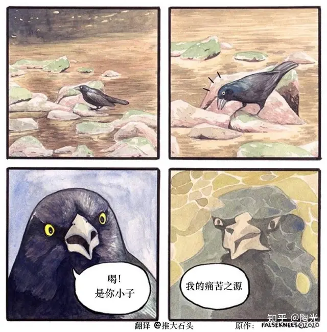

前天下班忘了打卡，狼狈的赶回公司时看了看表，似乎快到了夜宵时间，索性加了加班准备领夜宵。然而由于光顾着领夜宵，回去时又忘了打卡。第三次回公司时，保安问我是不是和家里人吵架了。

昨天继续化身反卷斗士，拒绝为了五斗米折腰加班，回出租屋时却总觉得少了点什么，我想是夜宵。

今天上班打卡时发现昨天被记了旷工，一翻记录发现昨天又忘了打卡。我的记忆力总能恰到好处的让我想起来忘记了某些事，但是却决不能提醒我究竟忘了什么。就像在监狱里的"请勿犯罪"的提示，或是河底的"当心落水"的铭牌。

算了，就当多熟悉熟悉公司的补签到流程了。据说从没旷过课的大学生活是不完整的，我想打工或许也是吧，或许。

日子就是这样平淡又倒霉，以至于偶尔想记点东西也觉得自己在做黑暗料理。曾经听到很多人说没到xx阶段看不懂听不懂xx作品，起初是相当不以为然的。但最近重新听到《鱼仔》。

"去学校的路很久没走，最近也换了新的工作，所有的追求，是不是缺少了什么？"

本身是略有伤感的歌，作者似乎是写给一个对他重要如氧气的人，虽然我并没有这样一个人，但似乎更加让人伤感起来。不可得与无所有进行了关于谁更可怜的角力，战场是我颓唐的生活，啧。

今天终于需要写代码了，潜伏了许久的大水比终于还是藏不住。还好有chatgpt。

很久以前还很担心人工智能的代码能力太强会不会替代我这种菜鸟程序员，现在，笑死，没有gpt我一天都装不下去。

其余似乎没有变化，只是越吃越多。略感消极的跟朋友倾诉除了吃饭什么也不会，他义愤填膺的让我不要妄自菲薄，告诉我起码还会睡觉，而且很会。

我想，他的话也不错。

---

## 19. 搬砖日记 day1

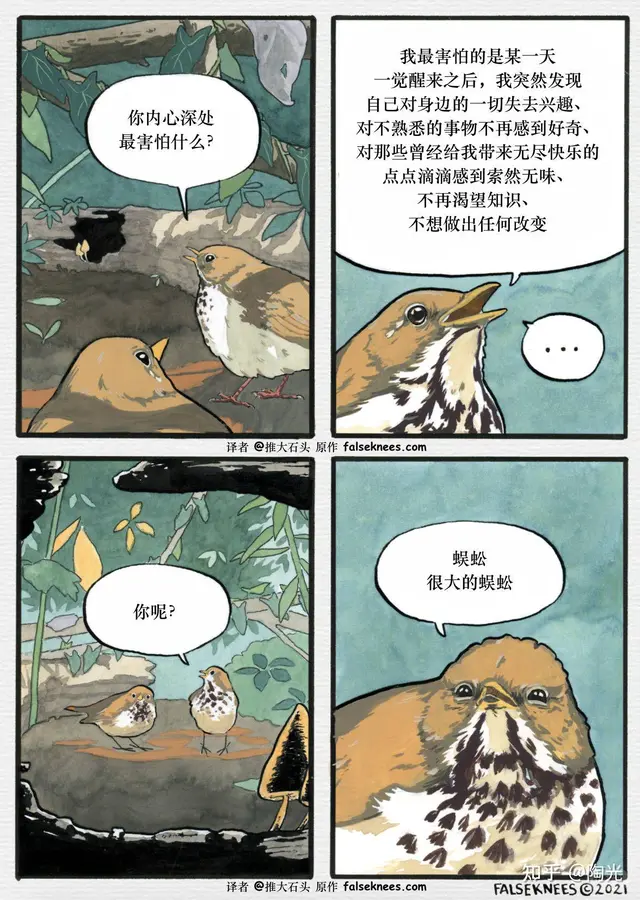

家住烧烤摊的恶果在半夜十二点开始显现，那时的喧哗依然不绝于耳。烧烤的气味关上窗就能隔绝，当然这是吃完以后才意识到的，而且我有预感在下次想吃时又会碰巧忘记。但划拳声却没那么好打发，还好生性多疑的我提前准备了一副耳塞，嘿嘿，它还是没精过我。

然而还是失眠了。

去年一战失败时似乎也是这样独自一人来到另一座城市，那时我也以为自己的第一个晚上会很难熬，结果睡得格外香甜。今年我以为大约能够习以为常安然入睡，结果反而寤寐思服辗转反侧。常常满怀憧憬，往往事与愿违。

最担心的入职第一天就迟到倒是没有发生，然而入职培训是学一上午极度缺乏营养的信息安全课，甚至还有课后考核，使我不能安心摸鱼。

中午吃饭时左边是两个似乎同龄的女生，其中一个吐槽了大半天爸妈爱买保健品，很平凡的话题，然而突然有点羡慕，同时愈发感觉处境寒凉。果然，孤独和幸福一样，也是对比出来的。

右边则是两位资深程序员，聊着自己过去十几年辗转各国各大厂的职业经历，忍不住往旁边瞄了一眼，可恶，他们的头发居然还在，我更加不平衡了。

下午则是等着装系统，又顺便摸了半天鱼，下班前一个多小时主管发了个项目让我看。对比了一下我简历里的玩具项目，果然，他能把我招进来完全是为了回馈社会。

下班打完卡突发奇想，问在另一个分部的同学能不能去食堂吃完晚饭再打卡，他说他们经常这样干。很好，今天是我最后一次在外面吃晚饭。

吃到一半又问了一句公司食堂做不做早餐，他反问不做早餐我们吃什么。很好，今天也是我最后一次在外面吃早餐。他终于还是没忍住，问我怎么不一次性问完。

废话，既然饭要分几顿吃，那么问题自然也要分几次问。就像鲁迅家门口的两棵枣树要分两次介绍那样。不能不说，路边摊的炒饭份量是真的很足，如果我是一个饥肠辘辘的旅客，此时一定能感到身心极高的满足。

可惜我只是个摸鱼了一整天的程序员，吃到一半突然感觉有点吃不下。但秉承粒粒皆辛苦的崇高信念，我还是勉为其难的吃完了，随后买了个菠萝权当消食用。

我想有必要找家健身房锻炼一番，否则过年回家容易被当成猪宰了。

晚上洗完澡发现门怎么推也推不开，我一面怀疑是不是锁坏了或者门外有什么东西挡住，一面怀疑是不是这间房子闹鬼或者撞上了什么灵异事件，正当我犹豫要不要对着窗口大声呼救时，突然发现门是需要从里面拉开的。的确是被猪油蒙了心。

---

## 20. 搬砖日记 day0

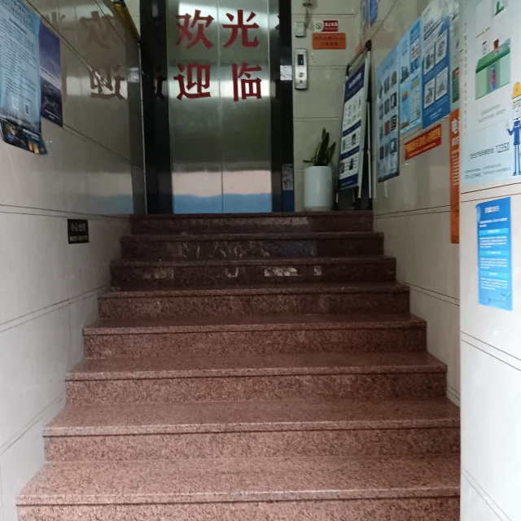

据说生命总能找到出路，但是仔细想想，出路就像吃饭，虽然必不可少，但也并非有了就万事大吉了，大约。

就像今天预订的这家酒店，我至今也不能理解这种电梯前面加一条十几级楼梯的设定。不消说，来这里的生命是有出路的，但对于我这种凌晨下飞机拖着行李又颠簸许久，濒临猝死边缘的苦旅受害者来说，这条楼梯仿佛不是通往前台，而是通往天堂。

后来静下心来想想，也许这里曾遭受过暴雨，电梯曾被淹坏过，于是老板痛定思痛加高了电梯的海拔。但何以周围的电梯都是正常高度？这仍然是悬而未决的问题。

突然想起来鲁迅当年为了给父亲治病，辗转当铺和药铺时，也常常见到高高在上的柜台。没有办法完全体会他的心境，但痛苦也许多少是有几分相似。

随后是体检，一个发现是矮了两厘米，这必然是不小心驼了背的缘故。另一个发现是仍然很害怕打针，虽然实际上并不很痛，还好没有很明显的表现出来，世界上又少了个被护士鄙视的人。

结果出的很快，精神病并没有被检查出来，我放心了许多，可以顺利入职了。租房的地方下面居然是一整条烧烤街，本来我是个十分自律的人，对于烧烤素来敬而远之，但是今天烧烤味飘到了我的出租屋里。

我想起了小时候听过的一个阿凡提的故事，说是他在饭店里闻着香气吃他的饼，老板让他为香气付费，他摇了摇钱袋让老板听铜钱响，以此作为香气的报酬。

这自然很高明，可是我又突然觉得老板的说法也没什么问题，香气某种程度上来说也算劳动成果之一，而闻到香气的我仿佛白嫖了老板的劳动成果。我极高的道德感不允许我做这样的事，于是下楼买了两串烤鱿鱼作为回报。

时间就这样不快不慢的一直往前，我也就以同样的速度被推向未来。并不知道自己准备好没有，命运也懒得问，只是催我快走。下机场的时候发现满屏的ai大模型广告，翻了翻hr先前画的饼，大模型是未来这条似乎略有些可信度，惶恐之余又多了些期待。

---

## 21. 关于日见稀少的头发的杂思

很早之前就听说过一句话：没有人能笑着从理发店里走出来。那时还很幼稚，过度迷信于自己半桶水的逻辑思维，总以为这种绝对化的言论必然有失偏颇而且漏洞百出。

不过比较遗憾的是，长这么大还从来没有从这句话里走出来过。后来慢慢意识到和理发师的沟通其实是种艺术，同时发现我是个与艺术绝缘的人。

细细想来，过去和理发师的沟通无非以下几类：

1.告诉他随便剪剪，于是他给我剪了个很随便的发型，从此不敢随便出门；

2.告诉他剪短就好，于是他误以为我已经看破红尘，尽心竭力帮我彻底去除这些尘世的挂念；

3.告诉他别剪太短，于是他与空气斗智斗勇了十分钟，出门撞见老师，他跟我说头发长了该去剪剪。

其实我是想直接跟他说给我剪个帅气的发型的，但一来有些羞耻，二来很担心他会无奈的笑笑，然后来一句风之积也不厚，则其负大翼也无力，于是作罢。

有时又想说理个时髦的发型，但是转头又看见了墙壁上那些照片，照片里像风一样自由的头发或许就是这家理发店对于时髦的理解，沉默良久又发现我其实是个保守派。

后来想也许说理个普通的发型也不错，可是托尼老师意气风发的姿态加上三分好奇七分期待的目光，又让我觉得普通这个字眼恐怕容易刺痛他。

于是在一片空白中装模作样的思考了一下，最终告诉他剪短就好。

---

## 22. 二战败犬的窃窃私语（18）

> **注意**: 本篇为图片帖（共6张图），以下为可获取的文字部分，图片内容无法自动提取。

今天全没月光，我知道不妙。

---

## 23. 二战败犬的窃窃私语（17）

> **注意**: 本篇为图片帖（共6张图），以下为可获取的文字部分，图片内容无法自动提取。

死猪一般的笑点和活猪一般的面试问答

---

## 24. 二战败犬的窃窃私语（16）

> **注意**: 本篇为图片帖（共7张图），以下为可获取的文字部分，图片内容无法自动提取。

丧友式聊天

---

## 25. 二战败犬的窃窃私语（15）

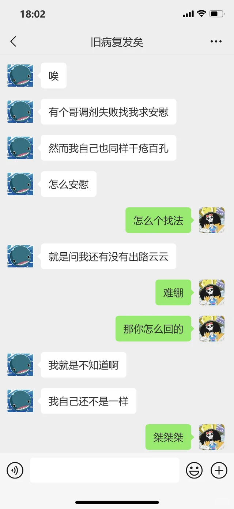

> **注意**: 本篇为图片帖（共7张图），以下为可获取的文字部分，图片内容无法自动提取。

今日份功德

---

## 26. 二战败犬的窃窃私语（14）

> **注意**: 本篇为图片帖（共6张图），以下为可获取的文字部分，图片内容无法自动提取。

水逆 浸透了生活之苦的绝味鸭脖

---

## 27. 二战败犬的窃窃私语（13）

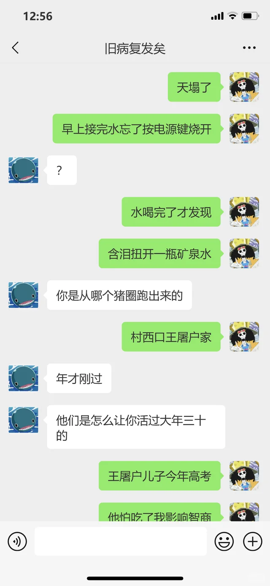

> **注意**: 本篇为图片帖（共8张图），以下为可获取的文字部分，图片内容无法自动提取。

从百草园到三味书屋

---

## 28. 二战败犬的窃窃私语（12）

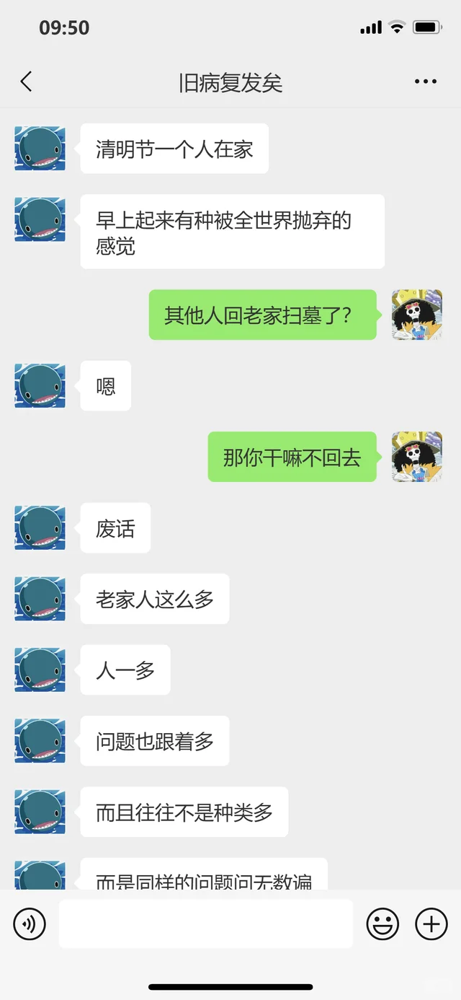

> **注意**: 本篇为图片帖（共6张图），以下为可获取的文字部分，图片内容无法自动提取。

天黑黑，欲落雨。早晨撞响的第一声丧钟。

---

## 29. 二战败犬的窃窃私语（11）

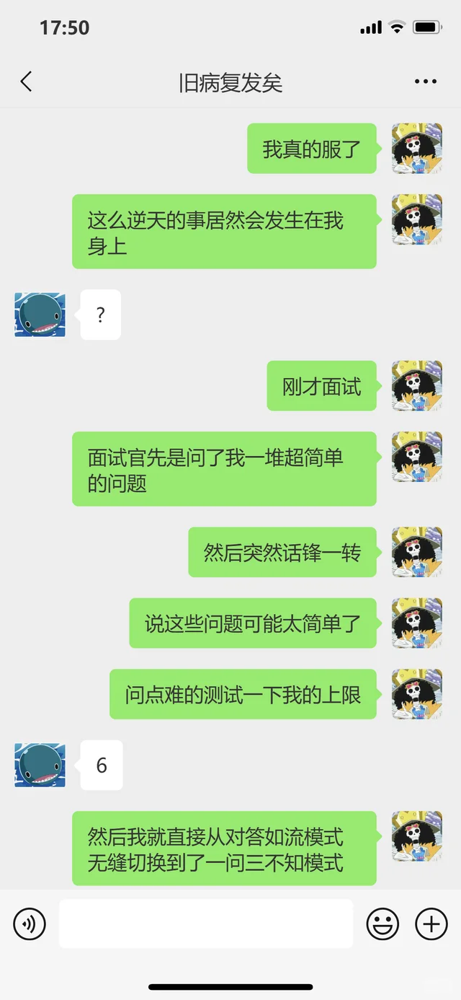

> **注意**: 本篇为图片帖（共6张图），以下为可获取的文字部分，图片内容无法自动提取。

今天，我面试寄了，也许是昨天，我不知道。

---

## 30. 二战败犬的窃窃私语（10）

> **注意**: 本篇为图片帖（共6张图），以下为可获取的文字部分，图片内容无法自动提取。

仿佛连emo的力气都已经失去，于是开始有气无力的emo。

---

## 31. 二战败犬的窃窃私语（9）

> **注意**: 本篇为图片帖（共6张图），以下为可获取的文字部分，图片内容无法自动提取。

我家门前有两轮面试，一轮寄了，另一轮也寄了。

---

## 32. 二战败犬的窃窃私语（8）

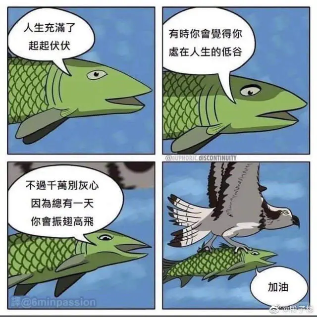

> **注意**: 本篇为图片帖（共6张图），以下为可获取的文字部分，图片内容无法自动提取。

面试社死日记

---

## 33. 二战败犬的窃窃私语（7）

> **注意**: 本篇为图片帖（共6张图），以下为可获取的文字部分，图片内容无法自动提取。

二婚男的坎坷相亲之路以及自清男的抽象解决方案

---

## 34. 二战败犬的窃窃私语（6）

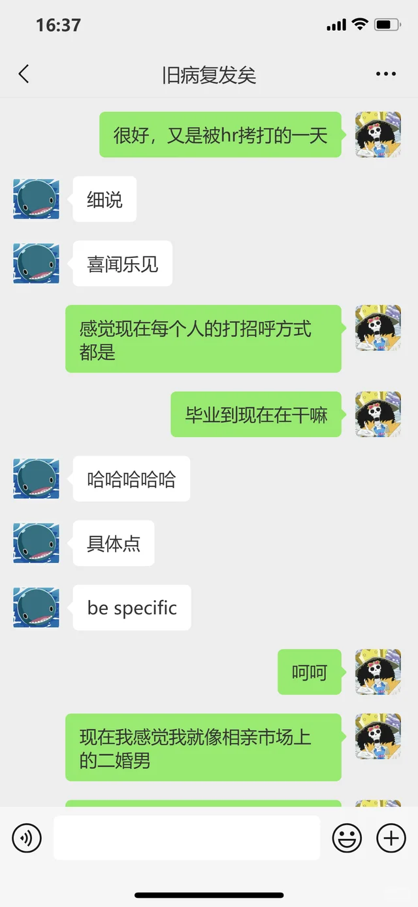

> **注意**: 本篇为图片帖（共5张图），以下为可获取的文字部分，图片内容无法自动提取。

宁愿三年不打粮，此生不当孩子王。

---

## 35. 二战败犬的窃窃私语（5）

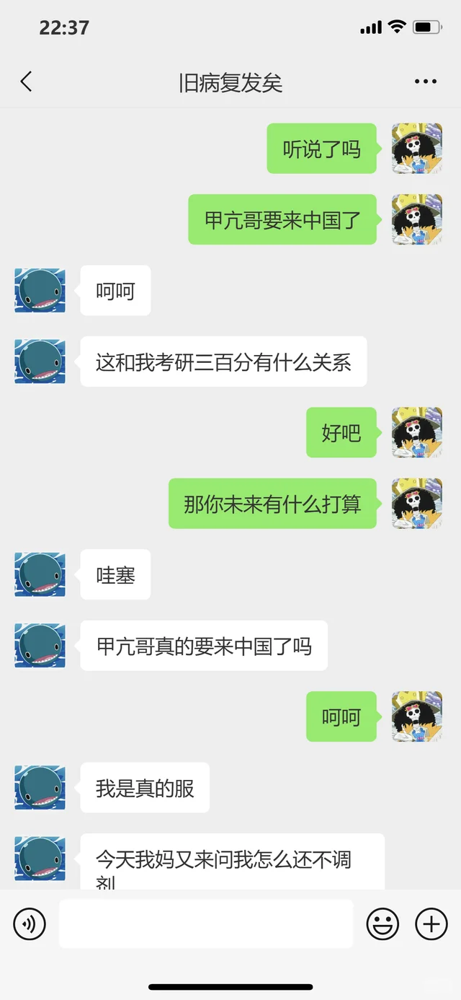

> **注意**: 本篇为图片帖（共7张图），以下为可获取的文字部分，图片内容无法自动提取。

现在是幻想时间

---

## 36. 毋须笔记

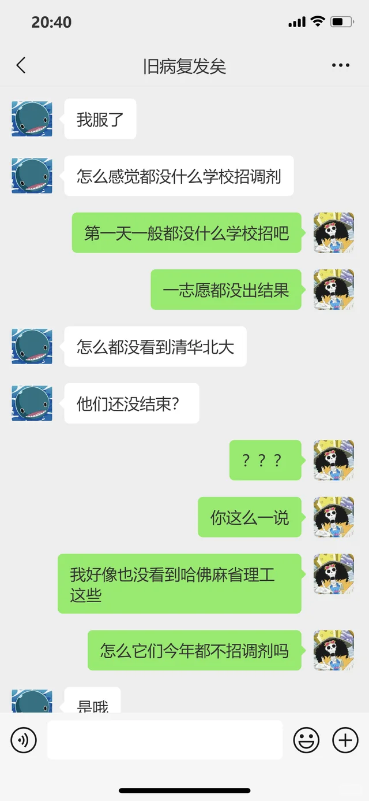

今天的一场面试约在两点，看过动物世界的朋友应该知道，猪素来有午睡的习惯。为了面试放弃午休违反猪性，为了午休放弃面试违反人性，所以我做出了一个违背天性的决定。

然而当我13：55放弃一切从床上爬起来的时候，突然发现BOSS上有条未读消息：面试官说临时有事改到三点。

我又弹回床上，准备继续我未竟的午休。这时候感觉我有点像年幼时不讲理的老妈，非要让我先把游戏暂停帮她干点什么再继续玩。众所周知，很多游戏根本没法暂停，就像我的午觉也不可能先睡一半再睡一半。

于是在床上辗转反侧寤寐思服，既不能睡去又不愿醒来。于是开始想我颓唐的人生，这段时间一直喜欢伤春悲秋，直到昨天刷到一篇疑似抑郁症患者的文章。

看到一半发现和他比起来我实在是为赋新词强说愁，不免有些惭愧，但看到结尾发现他说了一句"你不必比所有人都痛苦才有资格感觉痛苦"，其实也不是原句应该，大意是这样。于是感动之余又心安理得的emo了起来，顺带翻了个身，又挠了挠脚。

其实有时候感觉在山巅固然令人羡慕，在谷底也未必十分可怜，至少有知足常乐乃至向上进取的希望。但我现在属于坠落山崖又在半空中被树枝挂上了的状态。向上无望，又没有真的跌落谷底，但树枝分明摇摇欲坠，我也不知道什么时候就会忽然断裂。

想到这里又烦躁的翻了个身。

痛定思痛觉得不能再这样下去，但又苦无动力前进，于是打开汽水音乐想从音乐中汲取一点力量，然而它给我推荐的第一首歌是《if I die young》——哈哈，这是真的很难绷。

但不管怎么说，来都来了，勉强听下去，这时突然发现其实作者居然还是热爱生活的，if I die young是对未知的预备，不是对当下的放弃。唉，我还真共情上了，更小丑了。

然后是面试，对面试官第一印象是个同龄人，直到听他讲他是如何辗转字节腾讯等大厂又出来杭州创业的经历，我又无奈的扶额苦笑起来。我在树枝上求神拜佛的时候，有人已经环游世界了。

原本看到笔记字数限制1000字的时候是非常担心的，感觉这会限制我汹涌的才思，写到一半发现我老爱有些无聊的担心，就像每次放假前都会担心带回家的书不够看。

---

## 37. 够了长官，你不要总是借故一扣再扣的

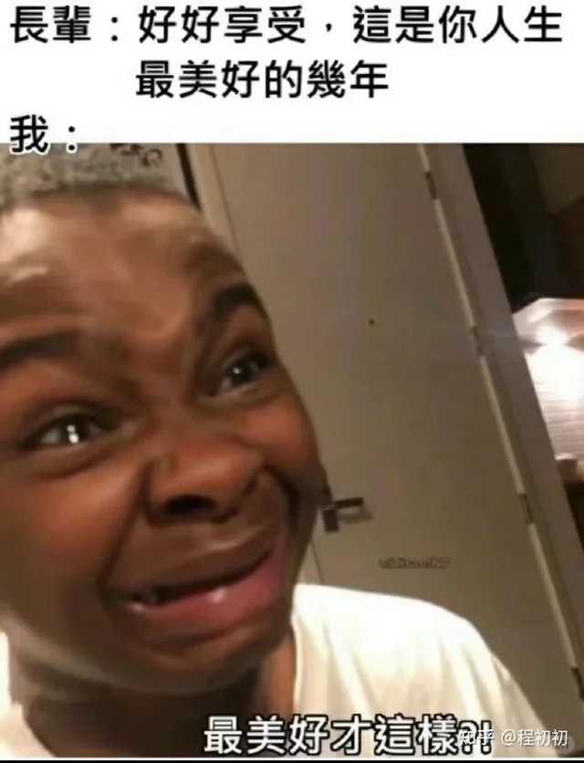

不是，给我一个倒霉工科生发法助岗就算了，不就是半个小时没回吗？为什么就扣了我五百？

---

## 38. 二战败犬的窃窃私语（4）

> **注意**: 本篇为图片帖（共11张图），以下为可获取的文字部分，图片内容无法自动提取。

以及一些没什么用的反相亲对策

---

## 39. 二战败犬的窃窃私语（3）

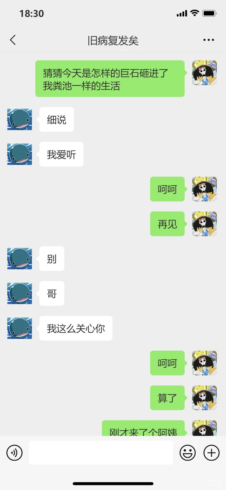

> **注意**: 本篇为图片帖（共5张图），以下为可获取的文字部分，图片内容无法自动提取。

话题有一搭没一搭的聊，日子有一搭没一搭的过

---

## 40. 工贼罪恶的一天/半天

> **注意**: 本篇为图片帖（共4张图），以下为可获取的文字部分，图片内容无法自动提取。

所以加班一般多晚算晚？

---

## 41. 二战败犬的窃窃私语（2）

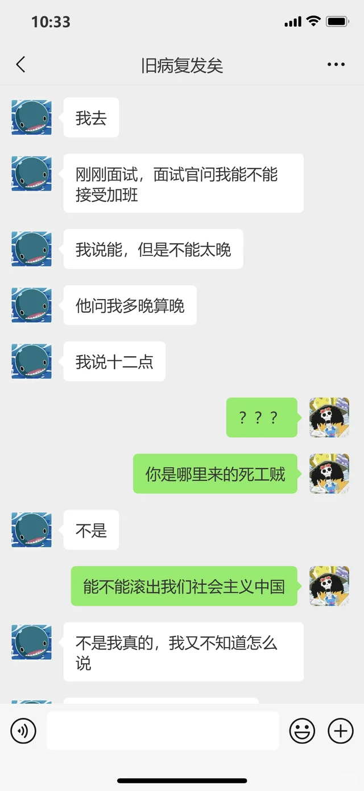

> **注意**: 本篇为图片帖（共6张图），以下为可获取的文字部分，图片内容无法自动提取。

彷徨与艰难的反彷徨

---

## 42. 二旬老头在线等推

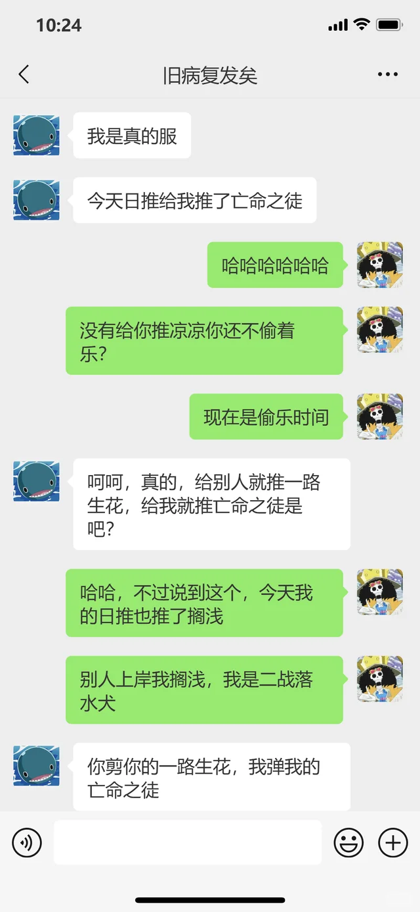

> **注意**: 本篇为图片帖，以下为可获取的文字部分，图片内容无法自动提取。

（推歌/歌单分享）

---

## 43. 两只二战败犬的窃窃私语

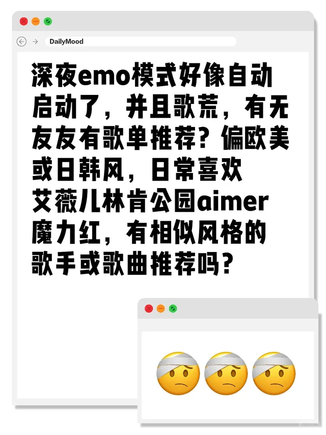

> **注意**: 本篇为图片帖（共6张图），以下为可获取的文字部分，图片内容无法自动提取。

也不知道未来会不会埋怨一意孤行的自己。

---

> **说明**: 全部43篇笔记已获取完成。
