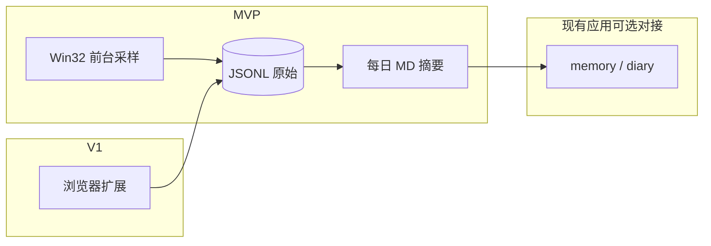

# 用户「行程」全记录：范围决策、MVP 与隐私（落实调研）

本文档落实调研计划中的待办：**产品范围**、**MVP 与扩展路线**、**隐私与 opt-in 草案**（不修改 Cursor 内的原 `.plan.md` 文件）。

---

## 1. 产品范围决策

| 维度 | 决策 | 说明 |
|------|------|------|
| 操作系统 | **Windows 优先** | 首版以 Win32 API 验证；macOS/Linux 需另立项（API 与权限模型不同）。 |
| 浏览器 URL | **非 MVP 必备** | 前台采样仅能稳定拿到窗口标题；**可靠 URL** 依赖 **Chrome/Edge 扩展（V1）** 或用户显式启用 CDP。 |
| 数据驻留 | **默认仅本地** | 原始事件与摘要默认写入本机目录（如 `workspace/` 下专用子目录）；**若未来同步云端**，须独立开关、单独同意与加密传输。 |
| 采集粒度 | **不做「全操作/键鼠记录」** | 不包含键盘记录、持续录屏、读他进程内存；仅允许前台窗口元数据级采样 +（可选）浏览器扩展上报。 |

**结论**：当前阶段将「行程」定位为 **本机、可解释、可关闭的粗粒度时间线**，与完整监控软件划清界限。

---

## 2. MVP 与扩展路线

### 2.1 MVP（建议实现包）

- **形态**：独立 **Windows 原生辅助进程**（推荐 C#/.NET 或 Rust；不推荐纯 JVM 做高频 Win32 调用），与现有 **Java `manus_ai_agent` 解耦**，经本地文件或本地 HTTP/命名管道通信可选。
- **采样内容**：定时（如 1–5s）记录 **前台窗口**：进程名、PID、窗口标题、时间戳。
- **聚合**：状态机合并连续相同「前台状态」，计算 **停留时长**；按日生成 **Markdown 摘要**（例如「14:00–15:30  chrome.exe  ·  窗口标题 …」）。
- **落盘**：例如 `workspace/activity/yyyy-MM-dd.jsonl`（原始） + `workspace/memory/diary/` 或独立 `workspace/memory/activity/yyyy-MM-dd-summary.md`（摘要），**由用户配置是否与 `memory.md` / 日记塌缩联动**。
- **明确不做**：浏览器 URL、非浏览器内「当前文档路径」的可靠解析。

### 2.2 V1

- **Chrome / Edge 扩展（MV3）**：在用户安装并授权的前提下，上报 **当前活动标签 URL + 标题**（可配置仅域名级脱敏）。
- 与本机汇总服务通过 **Native Messaging** 或本地 WebSocket 合并进同一日时间线。

### 2.3 V2

- **忽略列表 / 仅工作日 / 仅白名单应用**；标题与 URL **脱敏规则**（正则、域名黑名单）。
- 与 [`VisualizedMemoryManager`](../src/main/java/com/manus/aiagent/chatmemory/VisualizedMemoryManager.java) 的日记与塌缩流程对接：将「行程摘要」作为 `memory.md` 的 `## diary` 或独立 `## activity` 区块的输入源之一（需产品确认）。

---

## 3. 隐私、用户协议与 opt-in 草案

以下内容供法务/产品定稿前使用，**不构成法律意见**。

### 3.1 核心原则

- **显式同意（opt-in）**：首次开启「行程记录」前展示说明，用户主动开启；默认关闭。
- **本地优先**：默认数据仅存本机；出境或上传需再次授权。
- **最小必要**：只采集实现时间线所必需的元数据；不采集键盘输入、不默认录屏。
- **用户控制**：随时 **暂停**、**导出**、**删除** 全部或按日期删除。

### 3.2 建议提供的用户可见说明（摘要）

1. **我们收集什么**：前台应用名称、窗口标题、时间；若安装浏览器扩展，则增加当前标签 URL（可配置为仅域名）。
2. **我们不收集什么**：不记录键盘输入、不默认截取屏幕内容、不读取其他应用内文档内容。
3. **用途**：生成本人可读的每日行程摘要，辅助记忆与对话；不用于广告画像（若变更须重新同意）。
4. **存储位置**：默认路径（可在设置中修改）；文件格式说明。
5. **第三方与云端**：默认无；若开启同步，单独说明对象与安全措施。

### 3.3 产品内控制项（清单）

| 功能 | 说明 |
|------|------|
| 总开关 | 关闭后立即停止采样；可选清空当日内存缓存。 |
| 暂停 | 临时暂停若干分钟/至次日，不卸载配置。 |
| 删除 | 按日删除 / 删除全部原始与摘要。 |
| 导出 | 导出 JSONL 或 Markdown 供用户自持。 |
| 忽略列表 | 按进程名或窗口标题关键字忽略（如银行类应用由用户自行添加）。 |

### 3.4 风险与免责提示（给用户的提醒）

- 公司设备可能受组策略限制，部分 API 不可用。
- 窗口标题可能含敏感词，用户应使用忽略列表与脱敏。
- 若将摘要同步至网络盘或 Git，由用户自行评估风险。

---

## 4. 与当前仓库的关系

- **本仓库（Java Spring AI）**：适合作为 **消费侧**——读取已生成的「行程摘要」Markdown、注入 RAG/Advisor；**不负责** Win32 高频采样。
- **采集组件**：建议 **独立仓库或子模块**，便于签名分发与权限说明。

---

## 5. 待产品确认项（后续需求单）

- [ ] 摘要是否必须合并进 `memory.md` 还是独立文件即可。
- [ ] MVP 是否接受「无 URL、仅窗口标题」。
- [ ] 是否允许匿名遥测（如仅崩溃日志），默认建议否。

---

## 6. 工程规格与第三方接入（Win11）

GitHub 现成方案对比、ActivityWatch REST 接入方式、以及 `workspace` / [`MemoryWorkspaceTool`](../src/main/java/com/manus/aiagent/tools/MemoryWorkspaceTool.java) 边界说明见：**[user-activity-windows11-requirements.md](./user-activity-windows11-requirements.md)**。  
若已选定 **ActivityWatch**，**可行性结论与边界条件**（技术/数据/合规/维护）见：**[activitywatch-manus-integration.md](./activitywatch-manus-integration.md)**。实现细节与 REST 见 [user-activity-windows11-requirements.md](./user-activity-windows11-requirements.md)。
