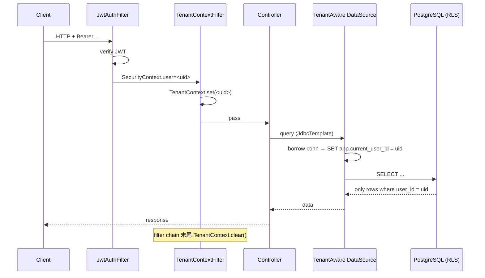

# Plan-01 多租户基础（Foundation）

> **必须最早完成的模块**，其他模块都依赖它的 JWT 鉴权、TenantContext 与 RLS 基础设施。
>
> 关联：[plan-00-overview.md](./plan-00-overview.md) · [spec.md](./spec.md) §FR-1, §FR-10, §11.1, §7.2

---

## 0. 模块边界

### 做什么

1. 账号体系：注册、登录、登出、Refresh Token；
2. JWT 签发与校验 + 拦截器；
3. **多租户上下文（`TenantContext`）+ PG Row Level Security（RLS）联动**；
4. 用户表 / 套餐表 / 配额相关表的 DDL 与 Flyway 基线；
5. 全局配额读取接口（`GET /me/quota`）；
6. 全局限流框架（基于 PG 表的窗口计数器）；
7. 全局异常处理 + 错误码登记。

### 不做什么

- 不做 OAuth / 第三方登录（非目标，但接口预留扩展点）；
- 不做支付/订阅 UI；
- 不做配额业务（具体配额值由各模块在自己 plan 里申报）；
- 不做权限模型超过 `user / admin` 两级。

---

## 1. 对外契约（其他模块如何用它）

### 1.1 Java API（供其他模块调用）

```java
package com.manus.aiagent2.common.tenant;

public final class TenantContext {
    public static UUID currentUserId();           // 从 ThreadLocal 取
    public static UUID requireCurrentUserId();    // 取不到抛 AUTH_*
    public static boolean isAdmin();
    public static void runAs(UUID userId, Runnable r);  // 后台任务用
}
```

```java
package com.manus.aiagent2.foundation.quota;

public interface QuotaService {
    UserQuota getQuota(UUID userId);
    boolean tryConsumeAgentSlot(UUID userId);   // FR-11 用：占一个并发槽
    void releaseAgentSlot(UUID userId);
    void recordTokenUsage(UUID userId, long tokens);
    void recordDiskUsage(UUID userId, long bytes);
}
```

### 1.2 REST API

| 方法 | 路径 | 说明 |
|------|------|------|
| POST | `/auth/register` | 注册 |
| POST | `/auth/login` | 登录，返回 access + refresh |
| POST | `/auth/refresh` | 用 refresh 换 access |
| POST | `/auth/logout` | 登出（撤销 refresh） |
| GET | `/me` | 当前用户信息 |
| GET | `/me/quota` | 配额详情（v1 套餐表硬编码） |

详细字段见 §5。

### 1.3 数据库表（提供给所有模块的 RLS 与多租户列约定）

- 任何业务表必须有 `user_id uuid NOT NULL`；
- 任何业务表 `migration` 完成 DDL 后必须执行：

```sql
ALTER TABLE <table> ENABLE ROW LEVEL SECURITY;
CREATE POLICY <table>_isolation ON <table>
    USING (user_id = current_setting('app.current_user_id', true)::uuid);
```

- foundation 模块提供一个 helper 视图 `__rls_health` 用于自检。

### 1.4 错误码（登记到 plan-00 §3.2）

| 码 | HTTP | 含义 |
|----|------|------|
| `AUTH_BAD_CREDENTIALS` | 401 | 邮箱或密码错 |
| `AUTH_TOKEN_EXPIRED` | 401 | access 过期，让前端 refresh |
| `AUTH_TOKEN_INVALID` | 401 | 解析失败/签名错 |
| `AUTH_REFRESH_REVOKED` | 401 | refresh 被撤销 |
| `USER_EMAIL_TAKEN` | 409 | 注册邮箱已存在 |
| `USER_PASSWORD_WEAK` | 400 | 密码不达标 |
| `USER_NOT_FOUND` | 404 | — |
| `QUOTA_AGENT_CONCURRENCY` | 429 | 并发 Agent 超限 |
| `QUOTA_TOKENS_EXCEEDED` | 429 | 日 token 上限 |
| `QUOTA_DISK_EXCEEDED` | 429 | 磁盘超额 |
| `RATELIMIT_EXCEEDED` | 429 | 通用限流 |

---

## 2. 技术细节

### 2.1 密码哈希

- `BCryptPasswordEncoder(12)`；不接受小于 8 位、不含字母+数字的密码；
- 密码字段 `password_hash VARCHAR(72)`。

### 2.2 JWT

- 算法：HS256（v1）；私钥从环境变量 `MANUS_JWT_SECRET` 注入，至少 64 byte；
- Access Token TTL = 15 min；Refresh Token TTL = 30 day；
- claims：`sub`（userId UUID）、`role`（user/admin）、`exp`、`iat`、`jti`；
- Refresh 用单独 `jti`，存数据库 `refresh_token` 表，状态：`active/revoked/used`；
- Refresh 旋转：每次 refresh 后旧 token 立刻 `used`，签发新 token。

### 2.3 TenantContext 与 RLS 联动

**关键挑战**：RLS 依赖 `SET app.current_user_id = '...'`，必须在每次 DB 操作前设置。

**实现**：用 Spring 的 `LazyConnectionDataSourceProxy` + 自定义 `Connection` 包装：

```java
// 借出 Connection 时
@Override
public Connection getConnection() {
    Connection conn = delegate.getConnection();
    UUID uid = TenantContext.currentUserId();
    if (uid != null) {
        try (Statement st = conn.createStatement()) {
            st.execute("SET app.current_user_id = '" + uid + "'");
        }
    } else {
        try (Statement st = conn.createStatement()) {
            st.execute("RESET app.current_user_id");  // 守护：未登录请求绝不带过期上下文
        }
    }
    return conn;
}
```

**注意事项**：

- 连接池复用要 reset（HikariCP 提供 `connection-init-sql` 但每次 borrow 不会跑，所以走包装）；
- 后台任务（Sandbox 清理、配额采集）用 `TenantContext.runAs(systemUserId, ...)` 或专用 BYPASSRLS 账号；
- admin 路由用专用 DB 账号 `manus_admin`（拥有 `BYPASSRLS`），其他路由用 `manus_app`（受 RLS）。

### 2.4 限流（PG 实现）

`rate_limit_counter` 表：

```sql
CREATE TABLE rate_limit_counter (
    bucket_key VARCHAR(128) NOT NULL,   -- 如 "user:<uuid>:login" / "user:<uuid>:llm-daily"
    window_start TIMESTAMP NOT NULL,    -- 窗口起点
    count BIGINT NOT NULL DEFAULT 0,
    PRIMARY KEY (bucket_key, window_start)
);
CREATE INDEX idx_ratelimit_window ON rate_limit_counter (window_start);
```

- 滑动窗口实现：upsert 当前桶 + 求和近 N 个桶；
- 后台任务每 10min 删除 `window_start < now() - 1day`；
- **此表不开 RLS**（系统级，按 bucket_key 内部隔离）。

### 2.5 并发 Agent 槽（FR-11）

- 配置 `manus.quota.max-concurrent-agents=3`（默认 3）；
- 实现：`chat_session.running_agent_count` 累计（行锁），并在 user 维度求和 `SELECT SUM(running_agent_count) FROM chat_session WHERE user_id = ? FOR UPDATE`；
- 占槽 / 放槽由 `QuotaService.tryConsumeAgentSlot / releaseAgentSlot` 提供，**对 chat-agent 模块透明**。

### 2.6 使用量采集（为后期计费铺路）

`usage_metric_daily`：

```sql
CREATE TABLE usage_metric_daily (
    user_id UUID NOT NULL,
    day DATE NOT NULL,
    metric VARCHAR(32) NOT NULL,    -- 'llm_tokens_in', 'llm_tokens_out', 'sandbox_minutes', 'disk_bytes_max'
    value BIGINT NOT NULL DEFAULT 0,
    PRIMARY KEY (user_id, day, metric)
);
-- RLS POLICY 同上
```

`QuotaService.recordXxx` 写入此表（upsert）。

---

## 3. 包结构

```
module-foundation/
  src/main/java/com/manus/aiagent2/foundation/
    auth/
      AuthController.java
      AuthService.java
      JwtAuthFilter.java       // OncePerRequestFilter
      JwtIssuer.java / JwtVerifier.java
      RefreshTokenRepository.java
    user/
      UserController.java      // /me
      UserService.java
      UserRepository.java
      UserAccount.java         // Entity
    quota/
      QuotaService.java
      QuotaController.java     // /me/quota
      RateLimiter.java         // 给其他模块用的 @AspectJ + 注解
    tenant/
      TenantContextFilter.java // 从 JWT 解析 userId → 写 TenantContext
      TenantAwareDataSource.java
    config/
      FoundationConfig.java
      JwtProperties.java
      QuotaProperties.java
  src/main/resources/
    db/migration/
      V202605260001__core_users.sql
      V202605260002__rls_policies.sql
      V202605260003__quota_tables.sql
```

---

## 4. 数据库 DDL（Flyway baseline）

### V202605260001__core_users.sql

```sql
CREATE EXTENSION IF NOT EXISTS pgcrypto;
CREATE EXTENSION IF NOT EXISTS vector;

-- 用户
CREATE TABLE user_account (
    id            UUID PRIMARY KEY,
    email         VARCHAR(255) NOT NULL UNIQUE,
    password_hash VARCHAR(72)  NOT NULL,
    role          VARCHAR(16)  NOT NULL DEFAULT 'user',  -- user|admin
    plan_tier     VARCHAR(32)  NOT NULL DEFAULT 'free',
    subscription_status VARCHAR(16) NOT NULL DEFAULT 'active',
    status        VARCHAR(16)  NOT NULL DEFAULT 'active',
    created_at    TIMESTAMP    NOT NULL DEFAULT now(),
    updated_at    TIMESTAMP    NOT NULL DEFAULT now()
);
CREATE INDEX idx_user_email ON user_account(email);

-- Refresh Token
CREATE TABLE refresh_token (
    jti          UUID PRIMARY KEY,
    user_id      UUID NOT NULL REFERENCES user_account(id) ON DELETE CASCADE,
    status       VARCHAR(16) NOT NULL DEFAULT 'active',   -- active|used|revoked
    issued_at    TIMESTAMP NOT NULL DEFAULT now(),
    expires_at   TIMESTAMP NOT NULL
);
CREATE INDEX idx_refresh_user ON refresh_token(user_id);

-- 套餐定义（v1 只插一行 free）
CREATE TABLE plan_tier (
    code              VARCHAR(32) PRIMARY KEY,
    display_name      VARCHAR(64) NOT NULL,
    max_sessions      INT NOT NULL,
    max_workspace_mb  INT NOT NULL,
    max_daily_tokens  BIGINT NOT NULL,
    max_concurrent_agents INT NOT NULL DEFAULT 3,
    created_at        TIMESTAMP NOT NULL DEFAULT now()
);
INSERT INTO plan_tier(code, display_name, max_sessions, max_workspace_mb, max_daily_tokens, max_concurrent_agents)
VALUES ('free', 'Free', 50, 5120, 200000, 3);

-- 审计日志
CREATE TABLE audit_log (
    id          BIGSERIAL PRIMARY KEY,
    user_id     UUID,            -- 可为 NULL（系统操作）
    action      VARCHAR(64) NOT NULL,
    target_type VARCHAR(64),
    target_id   VARCHAR(128),
    payload     JSONB,
    created_at  TIMESTAMP NOT NULL DEFAULT now()
);
CREATE INDEX idx_audit_user_time ON audit_log(user_id, created_at DESC);
```

### V202605260002__rls_policies.sql

```sql
-- 创建应用账号（受 RLS）与管理员账号（绕过 RLS）
-- 生产环境通过运维脚本创建，这里仅示意

-- ALTER USER manus_app NOSUPERUSER NOBYPASSRLS;
-- ALTER USER manus_admin BYPASSRLS;

-- 启用 RLS（核心表）
ALTER TABLE refresh_token ENABLE ROW LEVEL SECURITY;
CREATE POLICY refresh_token_isolation ON refresh_token
    USING (user_id = current_setting('app.current_user_id', true)::uuid);

-- 自检视图：上下文是否被正确设置
CREATE OR REPLACE VIEW __rls_health AS
SELECT current_setting('app.current_user_id', true) AS current_user_id_setting;

-- user_account 不开 RLS（注册阶段还没有 userId 上下文；通过应用层 + 业务校验保证）
```

### V202605260003__quota_tables.sql

```sql
CREATE TABLE rate_limit_counter (
    bucket_key  VARCHAR(128) NOT NULL,
    window_start TIMESTAMP NOT NULL,
    count       BIGINT NOT NULL DEFAULT 0,
    PRIMARY KEY (bucket_key, window_start)
);

CREATE TABLE usage_metric_daily (
    user_id UUID NOT NULL,
    day     DATE NOT NULL,
    metric  VARCHAR(32) NOT NULL,
    value   BIGINT NOT NULL DEFAULT 0,
    PRIMARY KEY (user_id, day, metric)
);
ALTER TABLE usage_metric_daily ENABLE ROW LEVEL SECURITY;
CREATE POLICY usage_metric_isolation ON usage_metric_daily
    USING (user_id = current_setting('app.current_user_id', true)::uuid);
```

---

## 5. REST API 详细

### POST /auth/register

请求：

```json
{
  "email": "alice@example.com",
  "password": "Str0ngPass!"
}
```

响应 201：

```json
{ "code": "OK", "data": { "userId": "<uuid>" } }
```

错误：`USER_EMAIL_TAKEN`(409) / `USER_PASSWORD_WEAK`(400) / `RATELIMIT_EXCEEDED`(429, 同 IP 5/min)。

### POST /auth/login

请求：

```json
{ "email": "alice@example.com", "password": "Str0ngPass!" }
```

响应 200：

```json
{
  "code": "OK",
  "data": {
    "accessToken": "eyJ...",
    "accessExpiresIn": 900,
    "refreshToken": "eyJ...",
    "refreshExpiresIn": 2592000,
    "user": { "id": "<uuid>", "email": "...", "role": "user" }
  }
}
```

### POST /auth/refresh

请求 `{"refreshToken":"..."}` → 200 同上结构 / 401 `AUTH_REFRESH_REVOKED`。

### GET /me

响应 200：

```json
{
  "code": "OK",
  "data": {
    "id": "...", "email": "...", "role": "user",
    "planTier": "free", "createdAt": "...", "updatedAt": "..."
  }
}
```

### GET /me/quota

响应 200：

```json
{
  "code": "OK",
  "data": {
    "planTier": "free",
    "limits": {
      "maxSessions": 50,
      "maxWorkspaceMB": 5120,
      "maxDailyTokens": 200000,
      "maxConcurrentAgents": 3
    },
    "usage": {
      "sessionsActive": 12,
      "workspaceMB": 234,
      "tokensToday": 14302,
      "agentsRunningNow": 1
    }
  }
}
```

---

## 6. 配置示例

```yaml
manus:
  auth:
    jwt-secret: ${MANUS_JWT_SECRET:}  # 必填，否则启动失败
    access-ttl: PT15M
    refresh-ttl: P30D
  quota:
    max-concurrent-agents: 3
    free-tier:
      max-sessions: 50
      max-workspace-mb: 5120
      max-daily-tokens: 200000
spring:
  datasource:
    url: jdbc:postgresql://postgres:5432/manus
    username: manus_app
    password: ${PG_APP_PASSWORD}
    hikari:
      maximum-pool-size: 30
      connection-init-sql: SELECT 1
  flyway:
    enabled: true
    baseline-on-migrate: true
```

---

## 7. 关键流程

### 7.1 请求进入到 DB 上下文设置



### 7.2 占用并发 Agent 槽

```java
// chat-agent 模块在启动 Agent 前调用
if (!quotaService.tryConsumeAgentSlot(userId)) {
    throw new BusinessException("QUOTA_AGENT_CONCURRENCY", "您还有 N 个会话在跑");
}
try {
    runAgent(...);
} finally {
    quotaService.releaseAgentSlot(userId);
}
```

`tryConsumeAgentSlot` 内部：

```sql
BEGIN;
SELECT COALESCE(SUM(running_agent_count),0) FROM chat_session
WHERE user_id = :uid FOR UPDATE;
-- 若 < 上限：UPDATE chat_session SET running_agent_count=running_agent_count+1
-- WHERE id = :sid AND user_id = :uid
COMMIT;
```

---

## 8. 测试

| 项 | 用例 |
|----|------|
| 单元 | JwtVerifier / PathSafety / BCrypt 强度 |
| 集成（Testcontainers） | 注册 → 登录 → /me → 用过期 token 401；越权访问别人 refresh 401 |
| RLS 验收 | 应用账号下 `SELECT * FROM refresh_token`（不 SET 上下文）返回 0 行；SET 后只返回自己的 |
| 并发槽 | 并行 5 个线程 tryConsume，断言只有 3 个成功 |

---

## 9. 验收清单（DoD）

- [ ] DDL Flyway 跑通；`__rls_health` 视图存在
- [ ] 注册 / 登录 / refresh / 登出端到端通过
- [ ] JWT 拦截器在所有 `/auth/*` 以外路由生效
- [ ] TenantContextFilter 设置后能在 Repository 层成功命中 RLS（写一个集成测试故意不带上下文断言 0 行）
- [ ] `/me/quota` 返回正确套餐与使用量
- [ ] `QuotaService.tryConsumeAgentSlot` 并发安全（用 Testcontainers 真 PG 验）
- [ ] 错误码全部按 §1.4 登记
- [ ] `mvn verify` 通过

---

## 10. 实施步骤建议

1. 写 Flyway 三份 SQL；
2. 写 `module-common` 的 `TenantContext` / `BusinessException` / `ApiResponse`；
3. 写 `JwtIssuer` / `JwtVerifier` + 单元测试；
4. 写 `JwtAuthFilter` + `TenantContextFilter` + DataSource 包装；
5. 写 `AuthController` + `AuthService`；
6. 写 `QuotaService` 基础（getQuota / tryConsume，记录 usage 暂用 stub）；
7. 集成测试 + RLS 真测。

---

## 11. 与其他模块的交互（清单）

| 谁 | 用什么 | 怎么用 |
|----|-------|--------|
| plan-02 sandbox | `TenantContext.currentUserId()` | 启动 sandbox 时取 userId |
| plan-02 sandbox | `QuotaService.recordDiskUsage` | 周期采集卷大小 |
| plan-03 workspace | `TenantContext` + RLS | 所有 DB 查询自动隔离；路径检查 `PathSafety` |
| plan-04 chat-agent | `QuotaService.tryConsumeAgentSlot` | 起 Agent 前占槽 |
| plan-04 chat-agent | `QuotaService.recordTokenUsage` | LLM 调用回调记 token |
| plan-05 frontend | `/auth/*`, `/me`, `/me/quota` | 登录态 + 配额面板 |
