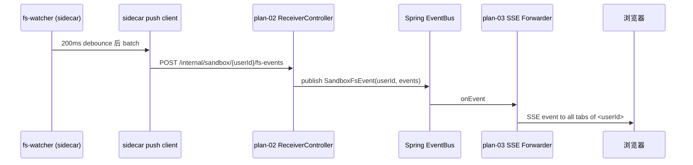

# Plan-02 Sandbox 编排 + Agent-Runner Sidecar

> 系统的"右手"——所有命令执行、文件 IO 都发生在这里。
> **本模块最重要的产出**：**`agent-runner` sidecar HTTP API 契约**（§3）——plan-03 / plan-04 都要消费它，必须**早冻结**。
>
> 关联：[plan-00](./plan-00-overview.md) · [plan-01](./plan-01-foundation.md) · [spec.md](./spec.md) §FR-6, §6.1–6.5, §11.2

---

## 0. 模块边界

### 做什么

1. `SandboxManager`：用户级 Sandbox 容器的生命周期（创建 / 复用 / 冷冻 / 唤醒 / 销毁）；
2. **Sandbox 镜像**（`Dockerfile`）+ 镜像版本管理；
3. **`agent-runner` sidecar**（容器内常驻 HTTP 服务）：文件 IO、命令 exec、fs-watcher 上报；
4. 资源配额（cgroup）、网络默认策略；
5. 冷冻 / 唤醒后台任务；
6. Sandbox 表 DDL + 状态机。

### 不做什么

- 不直接对外暴露 REST（plan-03 / plan-04 才对外）；
- 不处理 ETag 乐观锁（plan-03）；
- 不做 SSE 推送给前端（plan-03 在文件 watcher 上做转发）；
- 不实现具体 Agent 逻辑（plan-04）。

---

## 1. 对外契约

### 1.1 Java API（供 plan-03 / plan-04 调用）

```java
package com.manus.aiagent2.sandbox;

public interface SandboxManager {
    /** 幂等：确保该用户有一个 running 状态的 sandbox；返回握手信息 */
    SandboxHandle ensureRunning(UUID userId);

    /** 仅尝试复用，不启动；用于轻量探测 */
    Optional<SandboxHandle> tryGet(UUID userId);

    /** 停止容器但保留 volume（冷冻） */
    void freeze(UUID userId);

    /** 销毁容器 + volume（注销用户时用） */
    void destroy(UUID userId);

    /** 心跳：标记该用户最近活动时间，避免被冷冻 */
    void touch(UUID userId);
}

public record SandboxHandle(
    UUID userId,
    String containerId,
    String sidecarBaseUrl,    // 如 http://172.17.0.2:8642，或走 docker network alias
    Instant startedAt
) {}
```

### 1.2 关键事件（供其他模块订阅）

通过 Spring `ApplicationEventPublisher` 发布：

```java
record SandboxStartedEvent(UUID userId, String containerId)
record SandboxFrozenEvent(UUID userId)
record SandboxFsEvent(UUID userId, FsEventPayload payload)   // 文件变更事件，plan-03 消费
```

### 1.3 **agent-runner sidecar HTTP API（外部契约，对 plan-03/04 暴露）**

**这是本模块对外契约的核心，必须早冻结，其他 plan 才能并行开发。**

详细见 §3。

### 1.4 错误码

| 码 | HTTP | 含义 |
|----|------|------|
| `SANDBOX_BOOT_FAILED` | 503 | 容器拉起失败 |
| `SANDBOX_NOT_RUNNING` | 503 | 试图操作一个未启动的 sandbox |
| `SANDBOX_BUSY` | 429 | 启动互斥锁竞争失败 |
| `SANDBOX_QUOTA_EXCEEDED` | 429 | 全局活跃 sandbox 上限 |

---

## 2. 技术细节

### 2.1 容器命名与查找

- 容器名：`manus-sandbox-<userId>`（短横线连接 UUID，符合 Docker name 规范）；
- 启动前先 `docker inspect` 看是否已有同名容器：
  - 存在且 running → 复用；
  - 存在但 stopped → `docker start`；
  - 不存在 → `docker run`；
- 启动竞态由 **PG advisory lock** 防护（避免并发请求都尝试启动）：

```sql
SELECT pg_try_advisory_xact_lock(hashtext('sandbox-boot:' || :userId));
```

### 2.2 Docker run 关键参数（合并到 docker-java API）

```bash
docker run -d \
  --name manus-sandbox-<userId> \
  --hostname sandbox-<userId-short> \
  --user 1000:1000 \                # 非 root
  --cap-drop ALL \
  --security-opt no-new-privileges \
  --security-opt seccomp=/etc/manus/seccomp.json \
  --network manus-sandbox-net \     # 自建桥，受控
  --read-only \
  --tmpfs /tmp:size=256m,mode=1777 \
  --tmpfs /home/sbx:size=64m,mode=0700 \
  --mount type=volume,src=ws-<userId>,dst=/workspace \
  --cpus 1.0 \
  --memory 1g --memory-swap 1g \
  --pids-limit 256 \
  --storage-opt size=5G \           # 仅当存储驱动支持
  -e MANUS_USER_ID=<userId> \
  -e MANUS_BACKEND_URL=http://api:8123 \   # sidecar 上报变更用
  -e MANUS_BACKEND_TOKEN=<内部 token> \
  --restart no \
  manus/sandbox:<version>
```

- **不暴露任何对外端口**（sidecar 端口仅 docker 内网可达）；
- 后端通过容器 IP 或 docker network alias `sandbox-<userId>` 访问 sidecar。

### 2.3 文件卷

- `ws-<userId>`：Docker named volume，宿主机由 docker 管理；
- 注册用户时**预创建**空 volume（懒创建也行，但 spec §8.2 流程要求注册即建）；
- 删除用户时显式 `docker volume rm ws-<userId>`。

### 2.4 镜像版本管理

- 镜像 tag：`manus/sandbox:1.0.0`（语义化版本）；
- 后端配置 `manus.sandbox.image=manus/sandbox:1.0.0`；
- 升级：改配置 → 重启后端 → 后续新启的 sandbox 用新版本，老的等冷冻后自然换代（**不强制 kill 在线用户**）；
- 紧急升级通道：`POST /admin/sandboxes/{userId}/reclaim` 强制回收。

### 2.5 冷冻策略

- 每 5 min 扫描：`sandbox.last_active_at < now() - 12h` AND 该用户没有 `running_agent_count > 0` → 调用 `freeze`；
- 冷冻 = `docker stop` + DB 更新 `status='frozen'`；
- 卷保留。

### 2.6 网络默认策略

- 自建 docker 网络 `manus-sandbox-net`（bridge），后端 api 容器也加入此网络，能访问 sandbox；
- **沙箱出网由 sidecar 内置 HTTP 代理客户端控制**：sandbox 内的命令访问外网走 `HTTP_PROXY=http://api:8923`（后端跑一个白名单出网代理，pip/npm 镜像白名单），其他流量被宿主防火墙挡住；
- L1 简化：可暂时允许 sandbox 直连外网（白名单代理放二期），但镜像基础设施留出 hook。

### 2.7 资源闸门：全局活跃上限

- 配置 `manus.sandbox.max-active=100`（L1 单机；L2 按 node）；
- 启动前 `SELECT count(*) FROM sandbox WHERE status='running'`，超限返回 `SANDBOX_QUOTA_EXCEEDED`。

---

## 3. agent-runner sidecar HTTP API 契约（**外部契约**）

> **运行位置**：每个 Sandbox 容器内常驻一个轻量 Spring Boot 应用（独立打包，置于 `/opt/agent-runner/app.jar`），监听 `0.0.0.0:8642`。
>
> **鉴权**：所有请求必须带 `X-Manus-Token: <env MANUS_BACKEND_TOKEN>`（容器启动时由后端注入）；token 错误返回 401。
>
> **错误响应**统一：`{ "code": "FILE_NOT_FOUND", "message": "...", "detail": {...} }`。

### 3.1 健康与元信息

| 方法 | 路径 | 说明 |
|------|------|------|
| GET | `/healthz` | 存活检查（无需鉴权） |
| GET | `/info` | 镜像版本、容器内时区等 |

### 3.2 文件操作（供 plan-03 调用）

| 方法 | 路径 | 说明 |
|------|------|------|
| GET | `/fs/list?path=/foo&offset=0&limit=500` | 列目录；返回每项 `name/type/size/mtime/etag` |
| GET | `/fs/read?path=/foo/bar.txt` | 流式读文件；响应头 `ETag` |
| POST | `/fs/write?path=/foo/bar.txt` | 写文件；请求体 = 内容；Header `If-Match` 可选（乐观锁由 sidecar 校验） |
| POST | `/fs/mkdir` | body `{"path":"/foo"}` |
| POST | `/fs/touch` | body `{"path":"/foo/empty.txt"}` |
| POST | `/fs/move` | body `{"from":"/a","to":"/b","overwrite":false}` |
| POST | `/fs/copy` | body `{"from":"/a","to":"/b"}` |
| DELETE | `/fs?path=/foo&hard=false` | 软删到 `/workspace/.trash/`；hard=true 直接删 |
| GET | `/fs/stat?path=/foo` | 返回 size/mtime/etag/isBinary |
| GET | `/fs/zip?path=/` | 流式 zip 下载 |

**ETag 算法**：`hex(sha256(mtime_ns + size + path).substring(0,16))`，sidecar 单点计算与校验。

**乐观锁语义**：

- `POST /fs/write` 带 `If-Match: etag-x`：
  - 当前 etag == etag-x → 写入；返回 200 + new ETag；
  - 当前 etag != etag-x → 409 + 响应体 `{ "code":"FILE_CONFLICT", "currentEtag":"..." }`；
- 不带 `If-Match` → 强写（覆盖）。

### 3.3 命令执行（供 plan-04 调用）

| 方法 | 路径 | 说明 |
|------|------|------|
| POST | `/exec/run` | 同步执行短命令；body `{"cmd":"ls -la","cwd":"/workspace","timeoutMs":10000,"sessionId":"<sid>"}` |
| POST | `/exec/stream` | SSE 流式输出长命令；body 同上；事件 `stdout / stderr / exit` |
| POST | `/exec/cancel` | body `{"execId":"<id>"}` |

`sessionId` 用于审计：sidecar 把它附加到日志和 fs 事件 `actor.sessionId`。

### 3.4 文件系统事件（sidecar → 后端的反向推送）

**sidecar 不暴露给后端订阅的 endpoint，而是主动 POST**：

- 在 `/workspace` 上跑 `inotify` watcher（Java 用 `WatchService` 或 native lib）；
- 事件 debounce 200ms 后批量 POST 到后端：
  - URL：`${MANUS_BACKEND_URL}/internal/sandbox/{userId}/fs-events`
  - Header：`X-Manus-Internal-Token: <共享 secret>`
  - Body：`{ "events":[ {"type":"modified","path":"...","etag":"...","size":..., "mtime":"...", "actor":{"type":"agent","sessionId":"..."} }, ... ] }`
- 后端收到后通过 Spring 事件 `SandboxFsEvent` 转发；plan-03 订阅它再扇出到前端 SSE。

**事件 `actor` 来源识别**：

- sidecar 通过当前操作的入口区分：
  - `/fs/write` 调用——客户端用 `X-Actor-Type: user|agent` + `X-Actor-Session: <sid>` Header 声明；
  - `/exec/*` 引发的文件变更——sidecar 在 exec 期间挂"当前 sessionId"标签，watcher 事件优先打上 `agent + sessionId`；
- 没有匹配——`actor.type = "external"`。

### 3.5 sidecar 资源消耗预算

- 内存 ≤ 80MB（Spring Boot Loom 或者 graalvm native image 二期）；
- CPU 空载 ≤ 0.01；
- 上报失败重试 3 次，仍失败 → 落本地 SQLite 缓冲，重连后续传（v1 可简化为只重试）。

---

## 4. 包结构

```
module-sandbox/
  src/main/java/com/manus/aiagent2/sandbox/
    api/
      SandboxManager.java             // interface
      SandboxHandle.java
      events/SandboxFsEvent.java
    docker/
      DockerSandboxManager.java       // 实现：docker-java
      ContainerSpecBuilder.java       // 把上面的 docker run 翻译成 CreateContainerCmd
      DockerNetworkBootstrap.java     // 启动时确保 network 存在
    sidecar/
      SidecarClient.java              // 后端 → sidecar 的 HTTP 客户端
      FsEventReceiverController.java  // POST /internal/sandbox/{userId}/fs-events
    lifecycle/
      SandboxState.java               // 状态机 enum
      SandboxRepository.java
      FreezeScheduler.java
      BootMutex.java                  // pg_try_advisory_xact_lock
    config/
      SandboxConfig.java
      SandboxProperties.java
      SeccompProfile.json (resource)
  src/main/resources/db/migration/
    V202605260101__sandbox.sql

agent-runner/                         # 独立 Spring Boot 子模块，最终打 fat jar 进镜像
  src/main/java/com/manus/aiagent2/agentrunner/
    fs/FsController.java
    fs/EtagService.java
    exec/ExecController.java
    watcher/FsWatcher.java
    push/BackendPushClient.java
    auth/InternalTokenFilter.java
```

---

## 5. DDL

### V202605260101__sandbox.sql

```sql
CREATE TABLE sandbox (
    user_id        UUID PRIMARY KEY REFERENCES user_account(id) ON DELETE CASCADE,
    container_id   VARCHAR(128),
    image_version  VARCHAR(64),
    status         VARCHAR(16) NOT NULL DEFAULT 'absent',  -- absent|starting|running|frozen|destroyed
    sidecar_url    VARCHAR(255),
    started_at     TIMESTAMP,
    last_active_at TIMESTAMP NOT NULL DEFAULT now(),
    created_at     TIMESTAMP NOT NULL DEFAULT now(),
    updated_at     TIMESTAMP NOT NULL DEFAULT now()
);
CREATE INDEX idx_sandbox_status_active ON sandbox(status, last_active_at);

ALTER TABLE sandbox ENABLE ROW LEVEL SECURITY;
CREATE POLICY sandbox_isolation ON sandbox
    USING (user_id = current_setting('app.current_user_id', true)::uuid);

CREATE TABLE workspace (
    user_id     UUID PRIMARY KEY REFERENCES user_account(id) ON DELETE CASCADE,
    volume_name VARCHAR(128) NOT NULL,    -- ws-<userId>
    size_bytes  BIGINT NOT NULL DEFAULT 0,
    quota_bytes BIGINT NOT NULL,
    created_at  TIMESTAMP NOT NULL DEFAULT now()
);
ALTER TABLE workspace ENABLE ROW LEVEL SECURITY;
CREATE POLICY workspace_isolation ON workspace
    USING (user_id = current_setting('app.current_user_id', true)::uuid);
```

注：foundation 模块在用户注册时 **insert workspace 行**（FK 反向），并触发 `SandboxManager` 异步创建 volume（不启动容器）。

---

## 6. 关键流程

### 6.1 ensureRunning

```mermaid
sequenceDiagram
    participant Caller as plan-03/04
    participant SM as SandboxManager
    participant DB as PostgreSQL
    participant DK as Docker
    participant SC as agent-runner

    Caller->>SM: ensureRunning(userId)
    SM->>DB: BEGIN; SELECT pg_try_advisory_xact_lock(...)
    alt 锁未拿到
        SM-->>Caller: 短退避后重试 / SANDBOX_BUSY
    else 拿到锁
        SM->>DB: SELECT * FROM sandbox WHERE user_id=?
        alt status=running
            SM->>SC: GET /healthz
            alt 200
                SM-->>Caller: 复用，返回 Handle
            else 异常
                SM->>DK: docker rm -f; 继续走"新建"分支
            end
        else status=frozen
            SM->>DK: docker start
            SM->>SC: 轮询 /healthz 直到 ready
            SM->>DB: UPDATE status=running
            SM-->>Caller: Handle
        else absent / destroyed
            SM->>DK: docker run (cap-drop / seccomp / volume...)
            SM->>SC: 轮询 /healthz
            SM->>DB: UPDATE container_id, sidecar_url, status=running
            SM-->>Caller: Handle
        end
    end
```

### 6.2 fs 事件上行 + 扇出



---

## 7. 配置示例

```yaml
manus:
  sandbox:
    image: manus/sandbox:1.0.0
    sidecar-port: 8642
    network: manus-sandbox-net
    max-active: 100
    freeze-after: PT12H
    boot-timeout: PT30S
    backend-internal-token: ${MANUS_INTERNAL_TOKEN}
    seccomp-profile: classpath:/seccomp/default.json
    egress:
      enabled: false  # L1 关闭出网代理；二期开
```

---

## 8. 测试

| 项 | 用例 |
|----|------|
| 单元 | EtagService 哈希稳定；ContainerSpecBuilder 拼接正确 |
| 集成（dind） | ensureRunning 幂等 / freeze→ensureRunning 复用同 volume |
| 安全 | 容器内 `whoami` 非 root；`mount` 命令被 seccomp 挡 |
| watcher | sidecar 内写 100 个文件，后端收到 ≤ 5 个 batch 事件 |
| 并发 | 同 userId 并发 10 次 ensureRunning，只新建 1 个容器 |

---

## 9. 验收清单（DoD）

- [ ] `SandboxManager.ensureRunning` 三种状态全部跑通
- [ ] sidecar API `/fs/*` 与 `/exec/*` 通过 RestAssured 契约测试
- [ ] fs 事件能 ≤ 2s 抵达后端，actor 来源正确
- [ ] `freeze` 后 volume 还在，`ensureRunning` 能恢复
- [ ] 30 个用户并发 ensureRunning 无僵尸容器（压测）
- [ ] 容器逃逸基本面：cap-drop / no-new-privileges / read-only / non-root 都生效

---

## 10. 与其他模块的交互（清单）

| 谁 | 用什么 | 何时用 |
|----|-------|--------|
| **plan-03 workspace** | sidecar `/fs/*` API、`SandboxFsEvent` | 任何文件操作必先 `ensureRunning` |
| **plan-04 chat-agent** | sidecar `/exec/*` API、`ensureRunning` | Agent terminal 工具调用 |
| plan-01 foundation | `TenantContext.currentUserId()` | 决定哪个 sandbox |
| plan-01 foundation | `QuotaService.recordDiskUsage` | FreezeScheduler 同时上报 volume 大小 |
| plan-05 frontend | ✗ 不直接调 sandbox | 始终经 plan-03 / plan-04 转 |

---

## 11. 早期产出物（让其他 plan 并行）

第 1 周必须交付：

1. **sidecar HTTP API 的 OpenAPI 文档**（基于 §3 写一份 yaml） → plan-03/04 据此 mock；
2. `SandboxManager` 接口签名（§1.1） + 内存 stub 实现 → plan-04 可先用 stub 跑通对话；
3. Sandbox 镜像最小可运行版本（健康检查能通） → plan-03 集成测试可用。
