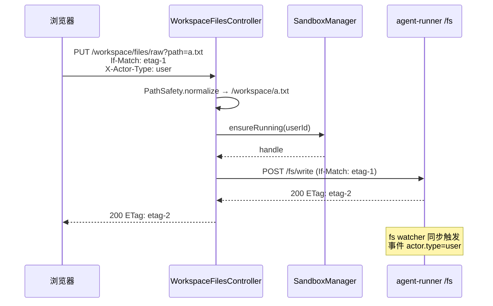
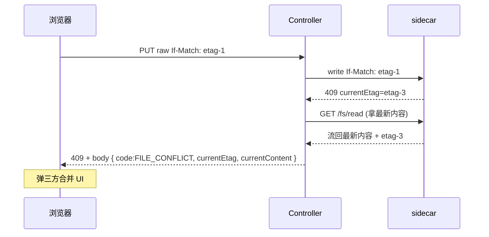
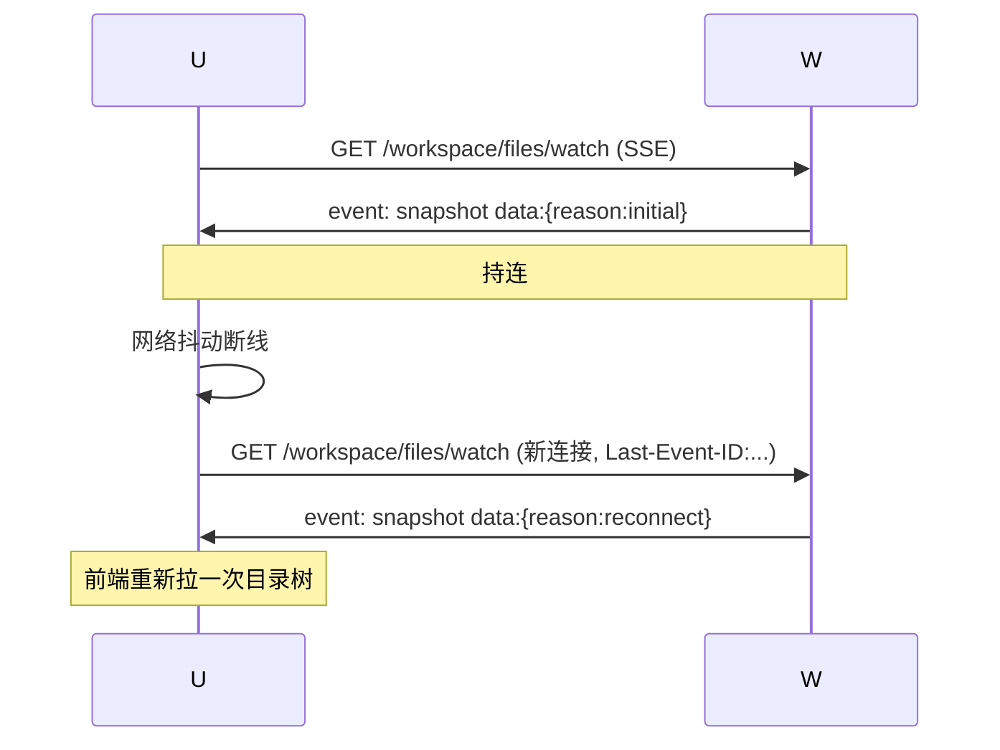

# Plan-03 Workspace 文件服务

> 用户在浏览器看见、操作、编辑自己的 workspace 的入口；承接 sandbox `agent-runner` 的 fs 能力，对外封装为 REST + SSE。
>
> 关联：[plan-00](./plan-00-overview.md) · [plan-02 sandbox sidecar API](./plan-02-sandbox.md#3-agent-runner-sidecar-http-api-契约外部契约) · [spec.md](./spec.md) §FR-4, §FR-5, §8.3–8.5

---

## 0. 模块边界

### 做什么

1. `/workspace/files/*` REST API（列目录 / 读 / 写 / 上传 / 下载 / mkdir / move / copy / delete / zip）；
2. **ETag 乐观锁**的对外语义（请求头 `If-Match`，409 响应）；
3. **`/workspace/files/watch` SSE 端点**：把 plan-02 上报的 `SandboxFsEvent` 扇出到该用户所有打开的标签页；
4. 上传分片接收 + 大文件流式转发；
5. 路径安全（`PathSafety`）；
6. workspace 配额检查（写入时拒绝超出 quota）。

### 不做什么

- 不实现 fs 真逻辑（plan-02 sidecar 实现）；
- 不直连 Docker（必经 plan-02 `SidecarClient`）；
- 不做编辑器 / 文件树 UI（plan-05）；
- 不做向量库相关（plan-04）。

---

## 1. 对外契约

### 1.1 REST API

| 方法 | 路径 | 说明 |
|------|------|------|
| GET | `/workspace/stats` | workspace 总大小、配额、sandbox 状态 |
| GET | `/workspace/files?path=&offset=&limit=` | 列目录 |
| GET | `/workspace/files/raw?path=` | 读文件（流式，响应头 `ETag`） |
| PUT | `/workspace/files/raw?path=` | 写文件（请求体=内容；`If-Match` 可选；`X-Actor-Type=user`） |
| POST | `/workspace/files/mkdir` | body `{"path":"/foo"}` |
| POST | `/workspace/files/touch` | body `{"path":"/empty.txt"}` |
| POST | `/workspace/files/move` | body `{"from":"...","to":"...","overwrite":false}` |
| POST | `/workspace/files/copy` | body `{"from":"...","to":"..."}` |
| POST | `/workspace/files/upload` | multipart：`path` + `file`；支持分片 `Content-Range` |
| DELETE | `/workspace/files?path=&hard=false` | 删除 |
| GET | `/workspace/files/zip?path=` | 打包下载（流式 zip） |
| GET | `/workspace/files/watch` | **SSE**：订阅当前用户 workspace 的变更事件 |

**响应统一**：成功 200 + `{"code":"OK","data":...}`；错误见 §1.3。

### 1.2 SSE 事件（`/workspace/files/watch`）

详细见 spec §9.2，复述要点：

```
event: created      data: {"path","etag","sizeBytes","mtime","actor":{"type","sessionId?"}}
event: modified     data: 同上
event: deleted      data: {"path","actor":{...}}
event: moved        data: {"from","to","etag","actor":{...}}
event: snapshot     data: {"reason":"reconnect","root":"/"}
```

**重连机制**：客户端断线后用 `Last-Event-ID` 重连；服务端简化版本——重连后立刻发一个 `snapshot` 事件，让前端做一次全量目录刷新（避免实现复杂的事件回放）。

### 1.3 错误码（plan-00 §3.2 已登记）

| 码 | HTTP | 含义 |
|----|------|------|
| `FILE_NOT_FOUND` | 404 | 路径不存在 |
| `FILE_CONFLICT` | 409 | ETag 不匹配（响应体携带 `currentEtag` 与 `currentContent` 让前端三方合并） |
| `FILE_TOO_LARGE` | 413 | 超出在线编辑大小阈值 |
| `FILE_PATH_OUTSIDE_WORKSPACE` | 403 | 路径越界 |
| `FILE_ALREADY_EXISTS` | 409 | mkdir / move 目标已存在且 `overwrite=false` |
| `FILE_QUOTA_EXCEEDED` | 429 | workspace 总大小超额（关联 `QUOTA_DISK_EXCEEDED`） |

---

## 2. 技术细节

### 2.1 上游依赖（来自 plan-02）

```java
@Resource SandboxManager sandboxManager;
@Resource SidecarClient sidecarClient;   // 封装 agent-runner HTTP

void doRead(UUID userId, String path) {
    SandboxHandle sb = sandboxManager.ensureRunning(userId);
    sandboxManager.touch(userId);
    return sidecarClient.fsRead(sb, path);
}
```

**注意**：每次文件 API 调用都隐式 `ensureRunning` + `touch`（更新 `last_active_at`），用户操作文件树即视为活跃。

### 2.2 路径安全（PathSafety，放 module-common）

```java
public final class PathSafety {
    private static final Path ROOT = Path.of("/workspace");
    public static String normalize(String raw) {
        if (raw == null || raw.isBlank()) raw = "/";
        Path p = ROOT.resolve(raw.startsWith("/") ? raw.substring(1) : raw)
                     .normalize();
        if (!p.startsWith(ROOT)) {
            throw new BusinessException("FILE_PATH_OUTSIDE_WORKSPACE",
                "path outside /workspace: " + raw);
        }
        return p.toString();    // 必以 /workspace 开头
    }
}
```

### 2.3 ETag 直通

后端**不重新计算** ETag，**直接透传** sidecar 返回的；保证唯一计算点。

写入流程：

```
PUT /workspace/files/raw?path=...
  Header: If-Match: <etag-from-client>
  Header: X-Actor-Type: user
  Body: <new content>
   ↓ 后端
sidecarClient.fsWrite(handle, path, body,
    ifMatch=etag-from-client,
    actorType="user",
    actorSessionId=null);
   ↓ sidecar
检查 etag → 写 → 返回 new etag 或 409
```

### 2.4 SSE 扇出（多 tab）

后端进程内维护：

```java
@Component
class FileWatchHub {
    // userId -> 该用户当前所有打开的 SSE 连接
    private final ConcurrentMap<UUID, Set<SseEmitter>> emitters = new ConcurrentHashMap<>();

    @EventListener
    public void onFsEvent(SandboxFsEvent ev) {
        Set<SseEmitter> set = emitters.get(ev.userId());
        if (set == null) return;
        for (SseEmitter em : set) {
            try { em.send(SseEmitter.event().name(ev.payload().type()).data(ev.payload())); }
            catch (IOException ignore) { /* 清理在 emitter.onError 里做 */ }
        }
    }
}
```

**L1 仅支持单实例**（plan-00 已明示）；L2 多副本时换 Redis pub/sub。

### 2.5 上传分片

- 协议：`Content-Range: bytes <start>-<end>/<total>`；
- 服务端把分片缓存在 `/tmp/upload/<userId>/<uploadId>/<chunkIndex>`（容器内）；
- 最后一个分片到达 → 合并 → 转 sidecar `POST /fs/write`；
- 上传中可调用 `DELETE /workspace/files/upload/{uploadId}` 取消。

简化：v1 允许"非分片"模式（小于 16MB 直接 multipart 一次发完），分片仅对超过阈值的大文件强制使用。

### 2.6 在线编辑大小阈值

- 配置 `manus.workspace.online-edit-max=2MB`：
  - 大于此值的 `GET /raw` 返回 `Content-Disposition: attachment`（强制下载）；
  - `PUT /raw` 体大于此值直接 413 `FILE_TOO_LARGE`，提示走上传通道。

### 2.7 配额检查

写入前查 `workspace.size_bytes + body.size > quota_bytes` → 拒绝 `FILE_QUOTA_EXCEEDED`。
size_bytes 由后台任务（FreezeScheduler 顺带）周期采集 sidecar `/fs/stat?path=/` 更新。

---

## 3. 包结构

```
module-workspace/
  src/main/java/com/manus/aiagent2/workspace/
    controller/
      WorkspaceFilesController.java       // REST
      WorkspaceWatchController.java       // SSE
      WorkspaceStatsController.java
    service/
      FileService.java
      UploadService.java
      WorkspaceQuotaGuard.java
    sse/
      FileWatchHub.java                   // 进程内多路 SSE
    upload/
      ChunkBuffer.java
    config/
      WorkspaceConfig.java
      WorkspaceProperties.java
  src/test/java/...
```

---

## 4. DDL

无新表。仅在 plan-02 已建的 `workspace` 表上读取 `size_bytes / quota_bytes`。

可选：`file_trash`（软删元数据，便于显示"回收站"）——v1 可省略，直接靠 `/workspace/.trash/` 文件夹。

---

## 5. 关键流程

### 5.1 编辑保存 happy path



### 5.2 409 冲突合并



### 5.3 SSE watch 重连



---

## 6. 配置

```yaml
manus:
  workspace:
    online-edit-max: 2MB
    upload-max: 200MB
    upload-chunk-size: 8MB
    watch:
      heartbeat: PT15S        # SSE keep-alive
      max-connections-per-user: 5   # 多 tab 上限
```

---

## 7. 测试

| 项 | 用例 |
|----|------|
| 单元 | PathSafety 各种边界（`../`、绝对路径、URL 编码） |
| 契约 | 用 sidecar mock 跑全部 REST + SSE |
| 集成 | 真起 sandbox + 上传 50MB 文件分片 → sidecar 内 `ls -l` 一致 |
| 并发 | 同一用户 2 个 tab 同时 PUT 同文件，一个成功一个 409 |
| 事件 | 在 sidecar 内 `echo > /workspace/x.txt`，2 个 tab SSE 都在 ≤ 2s 收到 modified 事件 |
| 安全 | `path=../../etc/passwd` 必 403 |
| 配额 | workspace 写满后下次 PUT 返回 429 |

---

## 8. 验收清单（DoD）

- [ ] 全部 REST API 通过契约测试
- [ ] ETag 冲突 happy/sad 双路径
- [ ] SSE 多 tab 扇出，断线重连发 snapshot
- [ ] 路径穿越测试全过
- [ ] 上传分片合并正确
- [ ] 在线编辑大小阈值生效
- [ ] 错误码登记到 plan-00 §3.2

---

## 9. 与其他模块的交互（清单）

| 谁 | 用什么 | 我对它的依赖 |
|----|-------|------------|
| **plan-02 sandbox** | `SandboxManager.ensureRunning`、`SidecarClient.fs*` | 强依赖；sidecar API 必须先冻结契约 |
| **plan-02 sandbox** | `@EventListener SandboxFsEvent` | 用于 SSE 扇出 |
| plan-01 foundation | `TenantContext` + RLS + `PathSafety` | 鉴权 + 隔离 |
| plan-01 foundation | `QuotaService.recordDiskUsage` | 周期上报 |
| plan-04 chat-agent | 无（Agent 直接走 sandbox sidecar，不经本模块） | — |
| **plan-05 frontend** | 全部 REST + `/watch` SSE | 文件树 + Monaco 编辑 + watcher 通知 |

---

## 10. 早期产出物（让 frontend 并行）

第 1 周必须交付：

1. **OpenAPI 3.0 spec**（覆盖本模块所有 REST + SSE 事件 schema） → frontend 据此 mock；
2. 用 stub `SidecarClient`（内存 Map 模拟文件系统）实现可单元跑的 `WorkspaceFilesController` → frontend 集成测试可用。
