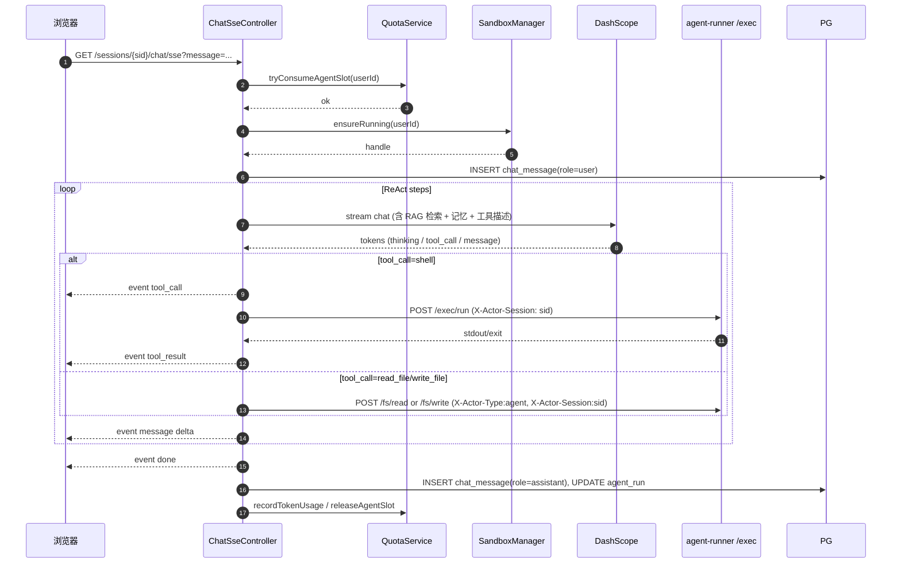
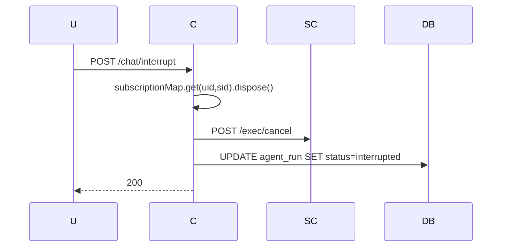

# Plan-04 会话 / 对话 / Agent / 记忆 / RAG

> 业务核心。承接现有 `manus_ai_agent` 的 Agent / Advisor / RAG 经验，按多租户改造。
>
> 关联：[plan-00](./plan-00-overview.md) · [plan-01 QuotaService / TenantContext](./plan-01-foundation.md) · [plan-02 SandboxManager / sidecar /exec/](./plan-02-sandbox.md) · [spec.md](./spec.md) §FR-2, §FR-3, §FR-6, §FR-7, §FR-8, §FR-11, §8.2, §8.4

---

## 0. 模块边界

### 做什么

1. **会话 CRUD**：`/sessions`；
2. **对话 SSE**：`/sessions/{id}/chat/sse` 流式调用 Agent；
3. **Agent Orchestrator**：基于 Spring AI，根据 session mode 选择 `OpenFriend` / `ManusAgent`（复用 + 改造）；
4. **工具调用接入 sandbox**：terminal / file 工具改走 plan-02 sidecar，禁止直达宿主；
5. **记忆**：短期（按 sessionId）+ 长期（按 userId），改写 `VisualizedMemoryManager`；
6. **RAG**：复用现有 PgVector，注入 `userId/sessionId` metadata 过滤；
7. **FR-11 并发流控**：调用 `QuotaService.tryConsumeAgentSlot`；
8. **中断生成**：`/sessions/{id}/chat/interrupt`。

### 不做什么

- 不实现命令真执行（plan-02）；
- 不实现文件 IO REST（plan-03，但 Agent 工具会调 plan-02 sidecar）；
- 不写前端（plan-05）；
- 不调优 LLM / prompt（沿用现有提示词）。

---

## 1. 对外契约

### 1.1 REST + SSE API

| 方法 | 路径 | 说明 |
|------|------|------|
| GET | `/sessions` | 列出当前用户会话（按 `lastActiveAt desc`） |
| POST | `/sessions` | 新建（body: `{name, mode}`） |
| GET | `/sessions/{id}` | 详情 |
| PATCH | `/sessions/{id}` | 重命名 / 归档 |
| DELETE | `/sessions/{id}` | 删除（不影响 workspace） |
| GET | `/sessions/{id}/messages?offset=&limit=` | 历史消息 |
| GET | `/sessions/{id}/chat/sse?message=` | **流式对话 SSE** |
| POST | `/sessions/{id}/chat/interrupt` | 中断 |
| POST | `/sessions/{id}/chat/regenerate` | 重新生成最后一条 |
| GET | `/me/running` | 当前正在跑 Agent 的会话清单（FR-11） |

### 1.2 SSE 事件（`/chat/sse`）

```
event: thinking     data: {"step":1,"text":"..."}
event: tool_call    data: {"toolName":"shell","args":{...},"callId":"c1"}
event: tool_result  data: {"callId":"c1","stdout":"...","exit":0}
event: message      data: {"delta":"..."}
event: usage        data: {"tokensIn":..,"tokensOut":..}   # 每个 LLM 回调附带
event: done         data: {"finishReason":"stop","messageId":"..."}
event: error        data: {"code":"...","message":"..."}
```

### 1.3 错误码

| 码 | HTTP | 含义 |
|----|------|------|
| `SESSION_NOT_FOUND` | 404 | — |
| `SESSION_LIMIT_REACHED` | 429 | 用户会话数达套餐上限 |
| `SESSION_ARCHIVED` | 409 | 已归档不能对话 |
| `QUOTA_AGENT_CONCURRENCY` | 429 | FR-11，复用 foundation 错误码 |
| `RAG_EMBEDDING_FAILED` | 502 | DashScope embedding 失败 |
| `LLM_PROVIDER_ERROR` | 502 | 上游 LLM 异常 |

---

## 2. 技术细节

### 2.1 Spring AI ChatClient 复用与改造

- **复用**：`ChatClient` 装配、`MyLoggerAdvisor`、`ContextualQueryAugmenter`、`PgVectorVectorStore` Bean；
- **改造**：
  - 每次请求**新建 ChatClient.Prompt**，不持有全局状态；
  - `VisualizedMemoryAdvisor` 改为按 `(userId, sessionId)` 双键取记忆，路径根从 `workspace/memory/` 改为 `/workspace/.memory/`（sandbox 容器内）——但 Memory 不再读写宿主，改为通过 sidecar `/fs/*` 来读写（spec §8.7：会话删除不动 workspace，但 memory 在 workspace 内是用户级共享）；
  - 替代方案（更稳）：**Memory 不放进 workspace 卷**，改放进 PG 表 `chat_memory_blob`，避免 fs 与对话双源耦合 → **采用此方案**。

### 2.2 工具调用接入 sandbox（替换现有 `TerminalShellRunner`）

新建 `SandboxedTerminalTool`、`SandboxedFileTool`：

```java
@Component
class SandboxedTerminalTool {
    private final SandboxManager sm;
    private final SidecarClient sc;

    @Tool(description = "Run shell command in user's sandbox")
    public String run(@ToolParam(description="cmd") String cmd) {
        UUID uid = TenantContext.requireCurrentUserId();
        UUID sid = ChatContext.requireSessionId();
        SandboxHandle h = sm.ensureRunning(uid);
        return sc.execRun(h, cmd, sid);   // 同步执行，带 sessionId 作为 actor 标签
    }
}
```

`ChatContext` 是 ThreadLocal，每次进入 chat SSE 时设置 sessionId（与 TenantContext 并列）。

### 2.3 FR-11 并发流控

进入 `/chat/sse` 后立即：

```java
if (!quotaService.tryConsumeAgentSlot(userId)) {
    return Flux.error(new BusinessException("QUOTA_AGENT_CONCURRENCY", "..."));
}
return runAgent(...)
    .doFinally(s -> quotaService.releaseAgentSlot(userId));
```

`chat_session.running_agent_count` 在 tryConsume 时 +1，会话维度也有标记，可在 `/me/running` 直接返回。

### 2.4 中断 Agent

- 进入对话时把 `Flux<...>.subscribe()` 句柄存 `ConcurrentMap<(userId,sessionId), Disposable>`；
- `/chat/interrupt` 调用 `dispose()` + 取消 sidecar exec（POST `/exec/cancel`）；
- 已生成部分要落库（doFinally 写消息表）。

### 2.5 历史消息分页

- `chat_message.id BIGSERIAL` + 时间索引；
- 前端按"加载更多"游标分页（基于 id < cursor），默认 200 条/页。

### 2.6 RAG 多租户

```java
// 检索前注入过滤
FilterExpressionBuilder b = new FilterExpressionBuilder();
Filter.Expression f = b.eq("userId", uid.toString())
    .and(b.in("scope", "user", "session"))
    .and(b.or(b.eq("scope","user"), b.eq("sessionId", sid.toString())))
    .build();

SearchRequest req = SearchRequest.query(query)
    .withTopK(8).withFilterExpression(f);
vectorStore.similaritySearch(req);
```

写入向量时（用户上传文档）：

```java
Document doc = new Document(chunkText, Map.of(
    "userId", uid.toString(),
    "scope", "user",          // or "session"
    "docId", docId.toString()
));
vectorStore.add(List.of(doc));
```

### 2.7 模式（mode）路由

- `normal` → `OpenFriend.doChatByStream(..., false)`；
- `thinking` → `OpenFriend.doChatByStream(..., true)`；
- `super` → `ManusAgent`（ReAct，多步工具调用）；
- 后续可扩展 `coding` 等 profile。

---

## 3. 包结构

```
module-chat-agent/
  src/main/java/com/manus/aiagent2/chatagent/
    controller/
      SessionController.java
      ChatSseController.java
      RunningController.java               // /me/running
    service/
      SessionService.java
      ChatService.java                     // 编排 ChatClient / ManusAgent
      InterruptService.java
    agent/
      OpenFriendV2.java                    // 改造自现有 OpenFriend
      ManusAgentV2.java                    // 改造自现有 ManusAgent
      ChatContext.java                     // ThreadLocal sessionId
      memory/
        UserLongTermMemoryAdvisor.java
        SessionShortTermMemoryAdvisor.java
        MemoryRepository.java              // 持久化到 PG
    tool/
      SandboxedTerminalTool.java
      SandboxedFileTool.java               // 经 sidecar /fs/*
      WebSearchTool.java                   // 复用现有
      RagSearchTool.java                   // 多租户改造
      ToolRegistration.java
    rag/
      MultiTenantPgVectorConfig.java       // 复用现有 PgVectorVectorStoreConfig 思路
      RagIngestionService.java             // 用户上传文档→向量化
    repository/
      ChatSessionRepository.java
      ChatMessageRepository.java
      AgentRunRepository.java
    config/
      ChatAgentConfig.java
      ChatProperties.java
  src/main/resources/
    db/migration/
      V202605260201__chat_session.sql
      V202605260202__rag_kb.sql
```

---

## 4. DDL

### V202605260201__chat_session.sql

```sql
CREATE TABLE chat_session (
    id                   UUID PRIMARY KEY,
    user_id              UUID NOT NULL REFERENCES user_account(id) ON DELETE CASCADE,
    name                 VARCHAR(255) NOT NULL,
    mode                 VARCHAR(32) NOT NULL DEFAULT 'normal',  -- normal|thinking|super
    status               VARCHAR(16) NOT NULL DEFAULT 'active',  -- active|archived|deleted
    running_agent_count  INT NOT NULL DEFAULT 0,
    last_active_at       TIMESTAMP NOT NULL DEFAULT now(),
    created_at           TIMESTAMP NOT NULL DEFAULT now(),
    updated_at           TIMESTAMP NOT NULL DEFAULT now()
);
CREATE INDEX idx_chat_session_user_active ON chat_session(user_id, last_active_at DESC);
ALTER TABLE chat_session ENABLE ROW LEVEL SECURITY;
CREATE POLICY chat_session_iso ON chat_session
    USING (user_id = current_setting('app.current_user_id', true)::uuid);

CREATE TABLE chat_message (
    id            BIGSERIAL PRIMARY KEY,
    session_id    UUID NOT NULL REFERENCES chat_session(id) ON DELETE CASCADE,
    user_id       UUID NOT NULL,
    role          VARCHAR(16) NOT NULL,   -- user|assistant|tool|system
    content       TEXT,
    tool_payload  JSONB,
    tokens_in     INT,
    tokens_out    INT,
    created_at    TIMESTAMP NOT NULL DEFAULT now()
);
CREATE INDEX idx_chat_msg_session_time ON chat_message(session_id, id);
ALTER TABLE chat_message ENABLE ROW LEVEL SECURITY;
CREATE POLICY chat_message_iso ON chat_message
    USING (user_id = current_setting('app.current_user_id', true)::uuid);

-- 短期记忆（按 session 滚动窗口）
CREATE TABLE chat_short_memory (
    session_id    UUID PRIMARY KEY REFERENCES chat_session(id) ON DELETE CASCADE,
    user_id       UUID NOT NULL,
    payload       JSONB NOT NULL,            -- 序列化的 N 条消息窗口
    updated_at    TIMESTAMP NOT NULL DEFAULT now()
);
ALTER TABLE chat_short_memory ENABLE ROW LEVEL SECURITY;
CREATE POLICY chat_short_mem_iso ON chat_short_memory
    USING (user_id = current_setting('app.current_user_id', true)::uuid);

-- 长期记忆（按用户）
CREATE TABLE user_long_memory (
    user_id       UUID PRIMARY KEY REFERENCES user_account(id) ON DELETE CASCADE,
    payload       JSONB NOT NULL,
    updated_at    TIMESTAMP NOT NULL DEFAULT now()
);
ALTER TABLE user_long_memory ENABLE ROW LEVEL SECURITY;
CREATE POLICY user_long_mem_iso ON user_long_memory
    USING (user_id = current_setting('app.current_user_id', true)::uuid);

-- Agent 运行审计
CREATE TABLE agent_run (
    id           UUID PRIMARY KEY,
    session_id   UUID NOT NULL,
    user_id      UUID NOT NULL,
    mode         VARCHAR(32),
    status       VARCHAR(16) NOT NULL,    -- running|completed|interrupted|failed
    started_at   TIMESTAMP NOT NULL DEFAULT now(),
    ended_at     TIMESTAMP,
    tokens_total BIGINT DEFAULT 0
);
ALTER TABLE agent_run ENABLE ROW LEVEL SECURITY;
CREATE POLICY agent_run_iso ON agent_run
    USING (user_id = current_setting('app.current_user_id', true)::uuid);
```

### V202605260202__rag_kb.sql

```sql
-- 知识库文档元数据
CREATE TABLE kb_doc (
    id           UUID PRIMARY KEY,
    user_id      UUID NOT NULL REFERENCES user_account(id) ON DELETE CASCADE,
    title        VARCHAR(255) NOT NULL,
    source_type  VARCHAR(32) NOT NULL,  -- upload|workspace|...
    bytes        BIGINT,
    chunk_count  INT,
    status       VARCHAR(16) NOT NULL DEFAULT 'ready',  -- pending|ready|failed
    created_at   TIMESTAMP NOT NULL DEFAULT now()
);
CREATE INDEX idx_kb_doc_user ON kb_doc(user_id, created_at DESC);
ALTER TABLE kb_doc ENABLE ROW LEVEL SECURITY;
CREATE POLICY kb_doc_iso ON kb_doc
    USING (user_id = current_setting('app.current_user_id', true)::uuid);

-- vector_store 表由 Spring AI PgVectorStore 自建；这里仅在初始化时 ALTER 加索引
-- 实际 RLS POLICY 在应用启动时调用 PgVector hook 或运维脚本添加：
-- CREATE POLICY vector_store_iso ON vector_store USING
--     ((metadata->>'userId')::uuid = current_setting('app.current_user_id', true)::uuid);
```

> 注：Spring AI `PgVectorStore` 默认 `metadata jsonb` 列；可通过表达式索引 + RLS POLICY 实现兜底过滤。

---

## 5. 关键流程

### 5.1 完整对话（super 模式）



### 5.2 中断



---

## 6. 配置

```yaml
manus:
  chat:
    default-mode: normal
    short-memory-window: 30        # 短期消息窗口
    super-max-steps: 20            # ReAct 上限
    interrupt-grace-ms: 2000
  rag:
    top-k: 8
    similarity-threshold: 0.3
spring:
  ai:
    dashscope:
      api-key: ${DASHSCOPE_API_KEY}
      chat:
        options:
          model: qwen-max
      embedding:
        options:
          model: text-embedding-v2
```

---

## 7. 测试

| 项 | 用例 |
|----|------|
| 单元 | RagFilterBuilder 正确注入 userId/sessionId |
| 集成 | normal 模式端到端：发消息→SSE→入库 |
| 集成 | super 模式：触发一次 shell 工具，能在 sidecar mock 上观察到 X-Actor-Session |
| 多租户 | 用户 B 不能 GET /sessions/{a-session-id} → 404（RLS） |
| 并发 | 单用户 4 个会话同时 SSE，第 4 个 429（concurrency=3） |
| 中断 | 长任务中按 interrupt，sidecar 收到 cancel，DB 状态正确 |
| 多源 watcher 提示 | Agent 写文件 → plan-03 SSE 收到 actor.sessionId 与本会话一致 |

---

## 8. 验收清单（DoD）

- [ ] /sessions CRUD + 列表分页
- [ ] /chat/sse 三模式跑通
- [ ] FR-11 并发上限断言（与 foundation 联调）
- [ ] 中断 & 重新生成
- [ ] 工具调用全部经 sidecar，宿主无残留进程
- [ ] RAG 多租户过滤生效（写一条 B 用户的 chunk，A 用户搜不到）
- [ ] 消息持久化（含 tokens 用量）
- [ ] 错误码登记

---

## 9. 与其他模块的交互（清单）

| 谁 | 用什么 | 我对它的依赖 |
|----|-------|------------|
| **plan-01 foundation** | `TenantContext` / `QuotaService.tryConsumeAgentSlot/release/recordTokenUsage` | 强依赖 |
| **plan-02 sandbox** | `SandboxManager.ensureRunning`、`SidecarClient.execRun/execStream/fsRead/fsWrite` | 工具调用全部走它 |
| plan-03 workspace | 无（Agent 不经 workspace REST，直接走 sidecar） | — |
| **plan-05 frontend** | 全部 REST + `/chat/sse` SSE | 对话与会话管理 UI |

---

## 10. 从现有 manus_ai_agent 的迁移要点

| 现有类 | 迁移动作 |
|-------|---------|
| `OpenFriend` | 改名 `OpenFriendV2`：移除全局 `chatMemoryStore` 单例引用，所有记忆按 `(userId, sessionId)` 取 |
| `ManusAgent` / `ToolCallAgent` / `ReActAgent` / `BaseAgent` | 包名挪到 `chatagent.agent.manus.*`；每次新建实例，注入 `ChatContext` |
| `MyLoggerAdvisor` / `VisualizedMemoryAdvisor` | 复用；后者改读写源为 PG 表（不再写 `workspace/memory/`） |
| `tools/TerminalShellRunner` | **删除**，被 `SandboxedTerminalTool` 取代 |
| `tools/FileOperationTool` | 改写：从 `FILE_DIR=tmp/file` 改为通过 sidecar `/fs/*`，根路径 `/workspace/tmp/file/`（可选） |
| `tools/ToolRegistration` | 注册新的 sandboxed 版本；移除旧的本机工具 |
| `chatmemory/VisualizedMemoryManager` | 改 PG 持久化（`user_long_memory` / `chat_short_memory`），文件源移除 |
| `chatmemory/ChatMessageStore` | 与 `chat_message` 合并，按 RLS 隔离 |
| `rag/PgVectorVectorStoreConfig` | **复用**；新增 `MultiTenantPgVectorConfig` 包装注入 metadata 过滤 |
| `controller/AiController` | 拆成 `SessionController` + `ChatSseController` + `RunningController`；路径全部走 `/sessions/*` |

---

## 11. 早期产出物（让 frontend 并行）

第 1 周必须交付：

1. **`/sessions/*` 与 `/chat/sse` 的 OpenAPI / SSE schema** → frontend 据此 mock；
2. 用 stub `SidecarClient` + `OpenFriendV2` 跑通 normal 模式 → frontend 集成测试可用 echo 模型先打通 UI。
