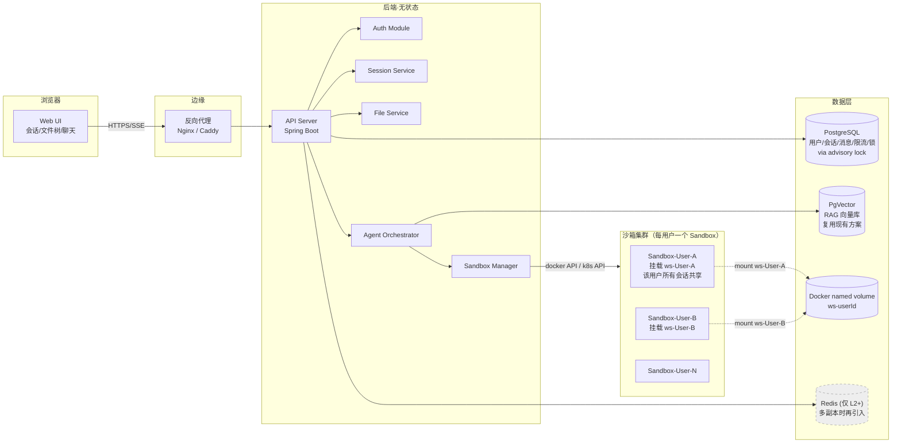
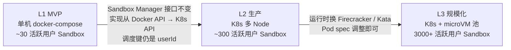
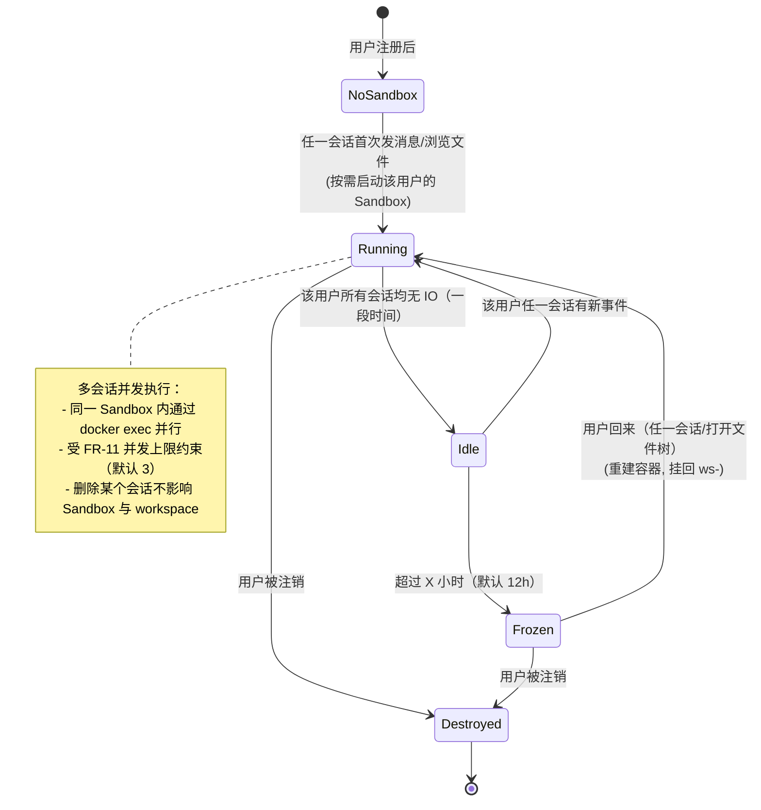
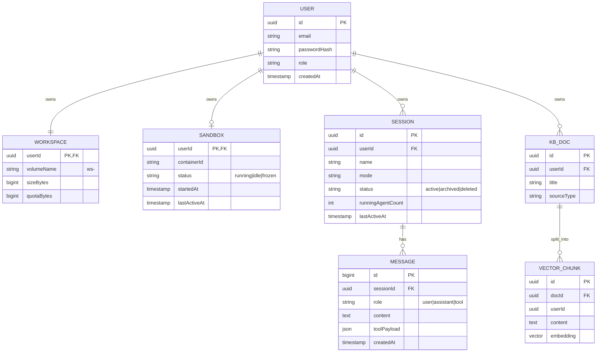
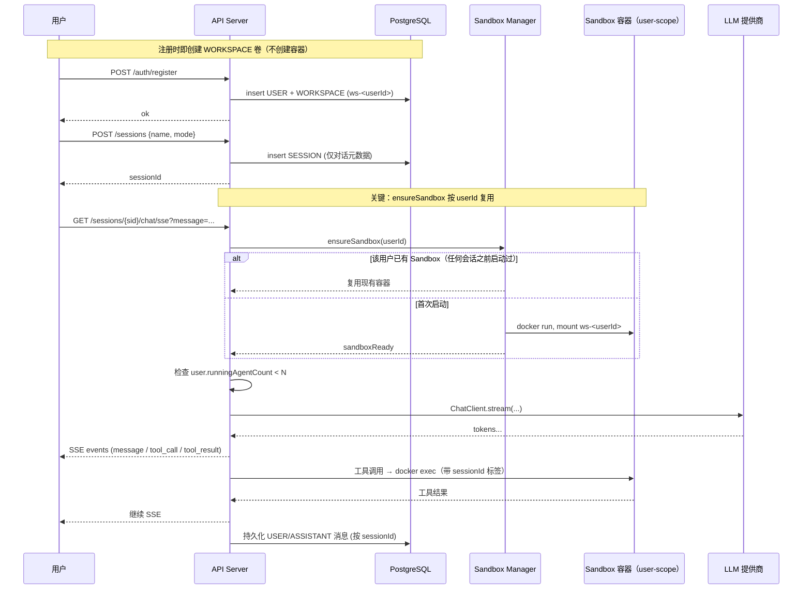
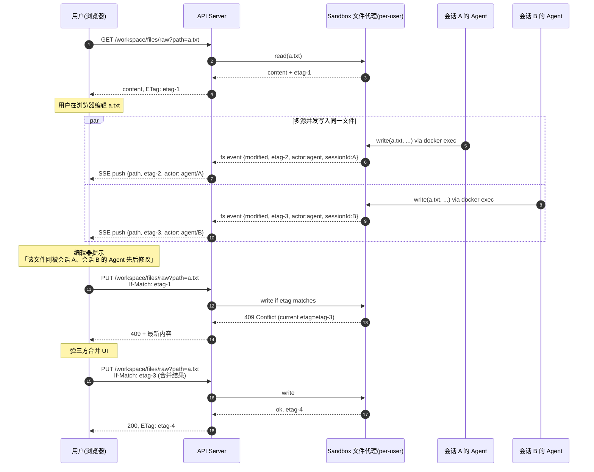

# 多用户多会话 Web Agent 系统 · 规范文档（spec.md）

> 规范驱动开发（Spec-Driven Development）路线：**spec.md（What / Why）→ plan.md（How）→ tasks.md（执行步骤）→ 代码**。
> 本文只回答「做什么、为什么、做到什么程度才算完成」，**不进入具体实现细节**（实现细节交给 plan.md）。
>
> | 项 | 值 |
> |----|----|
> | 状态 | Draft v0.1 |
> | 维护人 | mufan |
> | 关联项目 | 仅参考当前仓库 `manus_ai_agent` 的 RAG 模块；其余冲突一律以本文为准 |
> | 上一次更新 | 2026-05-26 |

---

## 1. 背景与动机

当前的 `manus_ai_agent` 是一个**单机、单用户、单 Agent 进程**的本地工具：

- `workspace/` 是项目根下的固定目录，所有用户共享；
- 终端工具 `TerminalShellRunner` 直接调用宿主机 `cmd.exe`，没有隔离；
- 没有账号体系，`chatId` 只是字符串，不归属任何用户；
- RAG 向量库 `vector_store` 全局共享，无 namespace。

我们希望把它演进为一个**可面向多人开放、可在浏览器上使用、每个用户可以维护多个独立会话**的 Web Agent 平台。每个会话拥有自己的 workspace 目录、自己的执行沙箱、自己的记忆与知识库。

**典型场景**：一个用户同时维持「写小说」「写日报」「跑数据分析」三个会话，每个会话有独立的文件、独立的命令历史、独立的 Agent 上下文；用户可以在浏览器里像浏览 IDE 文件树一样查看任意一个会话的 workspace。

---

## 2. 目标与非目标

### 2.1 目标（In Scope）

| ID | 目标 |
|----|------|
| G1 | 多用户：支持注册、登录、用户隔离 |
| G2 | 多会话：每用户可建任意多个会话，**会话之间隔离对话历史与 Agent 短期记忆，但共享同一个 workspace 与 Sandbox**（同一用户的不同对话角度，类似 IDE 多 chat tab） |
| G3 | Web UI：浏览器即可完成对话、文件浏览、文件上传下载、会话管理 |
| G4 | Workspace 可视化：用户能在网页上看到当前会话的 `workspace/` 目录树并查看/下载文件 |
| G5 | 安全执行：Agent 的命令执行、文件读写发生在**隔离沙箱**中，不能影响宿主机或其他会话 |
| G6 | 流式输出：对话支持 SSE/WS 流式响应，工具调用过程可见 |
| G7 | 长期记忆 + RAG：每用户/会话有独立的长期记忆与可选的私有知识库 |
| G8 | 可观测：用户操作、Agent 步骤、命令执行、资源占用都可审计 |

### 2.2 非目标（Out of Scope，当前版本不做）

- 团队协作（多人共享同一会话、协同编辑）；
- 移动端 App（先做响应式 Web）；
- 对外开放的 Plugin / Skill 市场；
- 跨地域、跨 Region 的高可用部署；
- Windows Sandbox 形态（沙箱镜像统一基于 Linux）。

**v1 不上线但架构必须预留扩展点的事项**（区别于"非目标"——后期会做）：

- **付费 / 订阅 / 套餐分层**（free / pro / enterprise）：v1 用户只有一档默认免费套餐，但用户表需预留 `plan_tier`、`subscription_status` 字段；配额读取必须经过套餐层（即使套餐表只有 1 行）；
- **token / 磁盘等使用量的持续统计**：v1 起就要采集，作为后期计费基础；
- **配额自服务管理界面**：v1 配额由后端配置文件给出，但接口签名 `GET /me/quota` 应在 v1 就稳定。

### 2.3 约束（Constraints，硬性边界）

> 这些是项目层面给定的硬约束，**架构设计必须服从**。后续 plan.md 与代码不得违反。

| ID | 约束 | 说明 / 影响 |
|----|------|-----------|
| **C-1** | 后端语言/框架 | **Java 21 + Spring Boot 3 + Spring AI**，与现有 `manus_ai_agent` 一致 |
| **C-2** | 存储组件 | **L1 MVP 仅使用 PostgreSQL（含 pgvector 扩展），不引入新的存储组件**（Redis / MongoDB / ES / Kafka / Milvus 等一律不上）。Redis 等组件最早 L2（多副本部署）时才引入 |
| **C-3** | 向量库（RAG） | **复用现有项目的 PgVector 方案**（`PgVectorVectorStoreConfig` 模式 + DashScope Embedding），按 `userId / sessionId` 做 metadata 过滤；**不引入独立向量服务** |
| **C-4** | LLM / Embedding | 默认 DashScope（与现有项目一致）；ChatModel 抽象保留可切换（Spring AI 已支持） |
| **C-5** | 现有代码复用策略 | 现有 `manus_ai_agent` 的 RAG、Agent、Advisor、SSE 流、ChatMemory 框架 **优先复用**；**如新需求与既有实现冲突，以本 spec 为准**（参见附录 A 的逐模块映射） |
| **C-6** | 本期重心 | **多用户多租户的实现**——账号体系、用户级 Sandbox / Workspace、跨用户隔离、同用户多会话并发、容量验收。对话/Agent/RAG 的算法层不做调优 |
| **C-7** | 部署形态 | L1 MVP 必须能用 **docker-compose 在单机起来**；L2 可平迁 K8s（参见 §13） |
| **C-8** | 前端 | 沿用 **Vue 3 + Vite**（现有 `ai-agent-frontend` 升级），不重写为 React |
| **C-9** | 多租户存储隔离方式 | **数据库表级共享 + 强制 `user_id` 过滤 + PostgreSQL Row Level Security（RLS）作为兜底**；不做 schema-per-tenant / database-per-tenant（避免运维爆炸） |
| **C-10** | 沙箱运行时 | L1 用 Docker（直连 Docker Engine API）；不引入 Firecracker / Kata / gVisor（留给 L3） |

**C-2 的具体替代方案（避免引入 Redis）**：

| 原本想用 Redis 的地方 | L1 替代方案（仅 PG + 进程内） |
|-------------------|---------------------------|
| 在线状态 / SSE 连接登记 | 后端进程内 `ConcurrentHashMap<userId, Set<sseConnection>>`（MVP 单实例足够） |
| 限流计数（QPS / 日 token） | PG 表 `rate_limit_counter`，按窗口 upsert |
| 分布式锁 / Sandbox 启动互斥 | **PostgreSQL `pg_try_advisory_lock(hashtext('sandbox-' \|\| userId))`**（无需新组件，秒级开销） |
| 用户并发 Agent 数计数 | `session` 表 `running_agent_count` 列 + PG 行锁 `SELECT ... FOR UPDATE` |
| 短期幂等 token | PG 表 `idempotency_keys`（带 TTL，后台清理） |

**L2 升级路径**：当后端水平扩容到多副本时，再把上述进程内数据迁到 Redis。**架构接口不变，只换实现**。

---

## 3. 用户与场景

### 3.1 角色

| 角色 | 描述 |
|------|------|
| 普通用户（User） | 网页上和 Agent 对话、管理自己的会话与文件 |
| 管理员（Admin） | 管理用户、查看系统资源占用、强制下线/清理沙箱 |
| 系统（System） | 调度器、清理器、计费/限额服务（后台进程） |

### 3.2 核心用户故事（User Stories）

| ID | As a | I want | So that |
|----|------|--------|---------|
| US-1 | 新用户 | 注册账号并登录 | 拥有自己独立的工作环境 |
| US-2 | 用户 | 创建一个新会话并起名 | 把不同任务分开 |
| US-3 | 用户 | 在浏览器和 Agent 流式对话 | 实时看到回答和工具调用过程 |
| US-4 | 用户 | 查看某个会话的 workspace 目录树 | 知道 Agent 给我生成了哪些文件 |
| US-5 | 用户 | 下载会话里的文件 / 上传文件给 Agent 用 | 把产物拿回本机、把素材给 Agent |
| US-5b | 用户 | 在网页文件树里直接打开并编辑文件，按 Ctrl+S 保存 | 不用下载到本地改完再传回 |
| US-5c | 用户 | Agent 写了文件时，我已打开的编辑器自动提示并能拉到最新内容 | 不会和 Agent 改的版本错位 |
| US-5d | 用户 | 我和 Agent 同时改了同一个文件时，得到冲突提示并能选择合并 | 不会被静默覆盖 |
| US-6b | 用户 | 在「修 bug 会话」装的依赖，切到「加 feature 会话」时也能直接用 | workspace 是项目，不是会话私有 |
| US-6c | 用户 | 我同时在 2 个会话里让 Agent 干活时，UI 能告诉我哪个会话的 Agent 改了哪个文件 | 不会搞不清谁动了我的文件 |
| US-7b | 用户 | 删除某个会话不会让我的项目文件丢失 | 会话只是对话，工作产物归我 |
| US-6 | 用户 | 切换不同会话，并看到各自完整的历史 | 多任务并行 |
| US-7 | 用户 | 删除/归档一个会话 | 清理不再需要的内容 |
| US-8 | 用户 | 让 Agent 执行 shell 命令（如安装依赖、跑脚本） | 完成实际任务 |
| US-9 | 管理员 | 看到当前在线沙箱数、CPU/内存占用、可强制回收 | 控制平台风险 |
| US-10 | 用户 | 我的某个会话 24h 没活动后自动「冷冻」沙箱，下次进入再恢复 | 节省资源 |

---

## 4. 功能需求（FR）

> 标号规则：FR-x（功能模块）；每条用 **必须 / 应当 / 可选** 表示优先级。

### FR-1 账户与认证

- **必须** 支持邮箱 + 密码注册、登录、登出；
- **必须** 使用 JWT 或等价短期 Token 做无状态鉴权；
- **应当** 支持密码强度校验、登录限流；
- **可选** OAuth（GitHub / Google）登录；
- **必须** 所有业务接口都要求登录，且仅能访问自己的资源。

### FR-2 会话（Session）管理

- **必须** 列出当前用户所有会话（按更新时间倒序）；
- **必须** 新建会话（指定名称、可选模式：normal / super / 自定义模型）；
- **必须** 重命名、归档、删除会话；
- **必须** 每个会话有独立 ID、独立的对话历史、独立的 Agent 上下文（短期记忆）；
- **重要** **会话不持有自己的 workspace / sandbox**——workspace 是**用户级**资产（见 FR-4），所有会话共享同一份 workspace 和同一个 sandbox（见 FR-6）；
- **应当** 会话可标星 / 打标签；
- **应当** 删除会话仅清理对话历史与上下文，**不会**删除 workspace 文件。

### FR-3 Agent 对话

- **必须** 提供 SSE 接口流式返回；
- **必须** 一个会话内的多轮对话上下文连续；
- **必须** 工具调用过程对前端可见（thinking / tool_call / tool_result / message 事件分类）；
- **应当** 支持中断当前生成；
- **应当** 同一会话内允许重新生成上一条回答。

### FR-4 Workspace 浏览与在线编辑（用户级，多会话共享，**核心交互**）

> Workspace 是这个产品的一等公民。**Workspace 归用户**（user-scoped）：用户的所有会话看到同一份 workspace，类似 IDE 里"我的项目目录 + 多个对话 Tab"。**会话不持有自己的 workspace**。

**4.1 浏览**

- **必须** 提供按当前用户查询的目录树接口：`GET /workspace/files?path=/`，返回名称/类型/大小/mtime/是否二进制；
- **必须** 大目录（>500 项）支持分页 / 懒加载子节点；
- **必须** 限制访问范围为当前用户的 workspace 根目录（**禁止路径穿越**：所有 path 规范化后必须以 `/workspace` 为前缀）。

**4.2 预览**

- **必须** 文本文件在线预览（自动语法高亮，按扩展名识别）；
- **必须** 图片（png/jpg/gif/webp/svg）、Markdown（渲染态）、PDF（嵌入预览）；
- **应当** 大文件（> 配置阈值，例如 2MB）只读 + 截断预览，提示用户下载查看；
- **应当** 二进制文件显示 hex 头 + 文件信息，不允许直接打开为文本。

**4.3 编辑（在线修改 workspace）**

- **必须** 文本文件直接在浏览器内编辑并保存：`PUT /workspace/files/raw?path=...`，body 为新内容；
- **必须** 编辑器具备语法高亮、行号、查找替换、撤销/重做（前端选型见 §10）；
- **必须** 保存采用 **ETag 乐观并发控制**：
  - 打开文件时返回 `ETag`（基于 mtime + size 或 sha256 前 16 位）；
  - `PUT` 时必须带 `If-Match: <etag>`；
  - 若 workspace 中文件已变化（**任一会话的 Agent** 或用户在别处修改过）→ 返回 `409 Conflict` + 当前最新内容，前端弹三方合并；
- **必须** 大文件（> 配置阈值）禁止在线编辑，仅允许下载后上传覆盖；
- **应当** 自动保存（debounce 2s）+ 手动 Ctrl+S；
- **应当** 「未保存草稿」标记（前端态）。

**4.4 文件操作**

- **必须** 新建文件 / 新建文件夹；
- **必须** 重命名 / 移动（拖拽）；
- **必须** 删除（默认软删 → `.trash/`，N 天后清理；也提供"立即彻底删除"）；
- **应当** 复制 / 粘贴；
- **应当** 多选批量操作。

**4.5 实时同步（多 Agent ↔ 用户）**

> 因为 workspace 是用户级共享，可能**多个会话的 Agent 与浏览器中的用户同时改文件**，事件源不止一个。

- **必须** 任何对 workspace 的写入（用户、任一会话的 Agent）发生后，**当前用户所有已打开的标签页**在 ≤ 2s 内得到通知；
- **必须** 实现方式：沙箱内 file watcher（inotify / fsnotify）→ 后端聚合 → 通过 SSE 推到该**用户**的所有打开标签页（按 userId 路由，不按 sessionId）；
- **必须** 事件粒度：`created` / `modified` / `deleted` / `moved`，带 path 与新 ETag；
- **必须** 事件 payload 要带 `actor` 信息，识别变更来源：
  - `actor: { type: "user" }`：用户在浏览器里直接改的；
  - `actor: { type: "agent", sessionId: "<sid>" }`：哪个会话的 Agent 改的（便于 UI 提示）；
  - `actor: { type: "external" }`：旁路工具；
- **必须** 当某方改动了用户**正在编辑**的文件时：
  - 用户未做修改 → 编辑器静默重载新内容；
  - 用户有未保存修改 → 提示「该文件已被 [会话 X 的 Agent] 修改，是否合并 / 放弃本地 / 覆盖远端」；
- **应当** 文件树侧用差量更新，避免整树重渲。

### FR-5 文件上传 / 下载

- **必须** 上传文件到当前用户的 workspace 指定路径（拖拽进文件树 / 点击上传按钮）；
- **必须** 大文件分片上传，断点续传；
- **必须** 上传过程显示进度；
- **必须** 下载单个文件；
- **应当** 批量打包下载（zip 流式）；
- **应当** 限制单文件大小、用户配额；
- **应当** 上传时安全扫描：拒绝可执行后缀（按配置）/ 限制 MIME。

### FR-6 沙箱化命令执行（**Sandbox per User**）

> 关键决策：**每个用户最多一个长驻 Sandbox 容器**，该用户的**所有会话共享同一个 Sandbox 与同一份 workspace**。这与 workspace 用户级归属一致，是本方案的核心简化。

- **必须** Agent 调用 terminal / 文件工具时，命令在**该用户专属的 Sandbox 容器**内执行；
- **必须** 同一用户的多个会话**共享同一个 Sandbox**，通过 `docker exec` 并行起独立进程执行，多会话之间隔离的是「对话上下文 + Agent 短期记忆 + 进程实例」，**不**隔离 workspace 文件系统；
- **必须** 不允许任何工具直达宿主机；
- **必须** 命令、参数、输出、退出码、耗时记录审计日志，**带 sessionId 标签**（便于追溯是哪个会话的 Agent 在跑）；
- **应当** 危险命令需用户确认（沿用当前 `TerminalCommandGate` 思路，确认状态按 `(userId, sessionId)` 维度隔离——不同会话的确认不会互相替代）；
- **应当** Sandbox 默认无外网，按需通过白名单代理放行（如 pip/npm 镜像）。

### FR-11 用户内 Agent 并发与流控

> 因为同一用户的多个会话共享 Sandbox 与 workspace，必须管理并发，避免互相踩踏。

- **必须** 同一用户**允许多个会话同时跑 Agent**（并行执行），不强制串行排队；
- **必须** 同一用户的并行 Agent 数有上限（默认 3，可配置）：超出时新请求返回 `429` + 提示「您还有 N 个会话在进行中，请稍后」；
- **必须** 同一 Sandbox 的整体资源由 cgroup 限制（CPU/内存/PID），不会因为多会话并发而无限放大；
- **应当** UI 上明确显示当前用户有几个会话「正在跑」（小红点或徽标），并允许一键看清单 / 一键中断某个会话；
- **应当** 当多 Agent 同时改同一文件时，靠 ETag 乐观锁 + watcher 事件提示，**不引入悲观文件锁**（会卡死 Agent）；
- **应当** Agent 工具调用日志带 `sessionId`，使 watcher 事件能告诉用户「这是会话 X 的 Agent 改的」。

### FR-7 长期记忆（每用户/每会话私有）

- **必须** 短期记忆（最近 N 条消息窗口）按 sessionId 隔离；
- **应当** 用户级长期记忆（跨会话）和会话级记忆并存，命名空间区分；
- **可选** 「记忆塌缩」机制（参考现有 `VisualizedMemoryManager` 思路）。

### FR-8 RAG（私有知识库）

- **应当** 每用户可上传文档建立私有知识库；
- **应当** 向量库按 (userId) 做 metadata 过滤或独立 collection；
- **不在 MVP 范围内**：跨用户共享知识库 / 公共知识库。

### FR-9 管理后台（最简）

- **应当** 提供 `/admin/*` 接口（仅 admin 角色）：用户列表、活跃会话列表、在线沙箱列表、强制回收沙箱。

### FR-10 配额与限流（为后期付费分层预留）

- **必须** 用户表带 `plan_tier`（默认 `free`）、`subscription_status` 字段，配额读取**统一经过套餐层**（v1 套餐表只有 1 行也要建）；
- **必须** 持续采集 token 用量、磁盘占用、活跃天数等使用量指标，写入 `usage_metric` 类表（**v1 不消费**，但为后期计费铺路）；
- **应当** 用户级别配额：最大会话数、最大 workspace 总大小、每日 LLM 调用次数；
- **应当** 沙箱级别：CPU/内存/磁盘上限；
- **应当** `GET /me/quota` 接口在 v1 即稳定（即使返回的是配置文件硬编码值）；
- **v1 不做**：付费支付、自服务套餐升降级 UI——但接口与数据模型保留扩展能力。

---

## 5. 非功能需求（NFR）

### 5.1 通用非功能需求

| ID | 项 | 要求 |
|----|----|------|
| NFR-1 | 隔离 | 会话之间在文件、命令执行、网络、资源四个维度严格隔离 |
| NFR-2 | 安全 | 沙箱 rootless、能力降权、seccomp 默认拒绝、宿主目录绝不直挂 |
| NFR-3 | 可恢复 | 会话关闭/沙箱销毁后再访问可重建沙箱，workspace 数据不丢 |
| NFR-4 | 弹性 | 后端无状态可水平扩容；沙箱可冷启动按需创建；架构本身可平迁到 K8s 与 microVM 而无需重写 |
| NFR-5 | 启动时间 | 沙箱冷启 ≤ 3s（Docker），从预热池取用 ≤ 500ms |
| NFR-6 | 时延 | SSE 首字延迟 < 800ms（不含模型时延） |
| NFR-7 | 可观测 | 结构化日志、关键指标 Prometheus 暴露、审计日志可查 |
| NFR-8 | 可移植 | 单机 docker-compose 起得来；可平迁 K8s |
| NFR-9 | 兼容性 | 主流 Chromium / Firefox 最新两版；后端 Java 21 / Spring Boot 3 |
| NFR-10 | 数据 | 关键数据持久化在 PostgreSQL；workspace 在宿主机命名卷；定期备份 |

### 5.2 容量与并发目标（多用户多租户成功标准）

> 这是本系统**是否算"多用户系统"的硬指标**。
>
> 业界经验：注册用户 : 在线峰值 : 活跃用户（在跑 Agent）≈ **100 : 10 : 1~3**。
> **本系统 Sandbox 粒度为 per-user**，所以 **「活跃 Sandbox 数」≡「活跃用户数」**——这是与 per-session 模型最大的不同，资源占用直接降一档。

**关键容量维度（不要混为一谈）：**

| 维度 | 含义 | 主要资源压力 |
|------|------|------------|
| D1 注册用户总数 | DB 里 user 行数 | 几乎为 0 |
| D2 会话总数（含冻结） | session 行数（多为对话历史） | DB |
| D3 在线用户峰值 | 浏览器开着、SSE 持连 | 长连接 + 后端内存 |
| **D4 活跃 Sandbox 数 ≡ 活跃用户数** | 用户的 Sandbox **容器在跑**（用户有任一会话的 Agent 在工作 / 在编辑文件） | **CPU / 内存 / 内核** — 真正瓶颈 |
| D5 LLM 请求 QPS | 同时在烧 token / 在调工具（同一用户可能有 N 个会话并发） | LLM 提供商配额 + 网络 |

**分级目标（必须 / 应当 / 远景）：**

| 级别 | D1 注册 | D2 会话总数 | D3 在线峰值 | **D4 活跃 Sandbox = 活跃用户** | D5 LLM QPS | 部署形态 | 地位 |
|------|--------|-----------|------------|------------------------------|-----------|---------|------|
| **L0 PoC** | 10 | 50 | 5 | 5 | < 1 | 单机 | 已涵盖 |
| **L1 MVP** ← v1 目标 | **1,000** | **5,000** | **100** | **30** | ~10（30 用户 × 平均 N 并发会话） | 单机 docker-compose (32C/128G) | **必须** |
| **L2 生产** | 10,000 | 50,000 | 1,000 | 300 | ~100 | K8s 3–5 Node | **应当**（架构兼容） |
| **L3 规模化** | 100,000 | 500,000 | 10,000 | 3,000 | ~1000 | K8s + microVM 池 + 多 Region | 远景 |

**v1 MVP（L1）压测验收数字**：

- ≥ 1,000 注册用户、≥ 5,000 会话（绝大多数处于冷冻态）；
- 在线峰值 100 个用户保持 SSE 长连接；
- **30 个活跃用户 Sandbox 同时运行**，每用户允许同时 ≤ 3 个会话的 Agent 并发：
  - 单 Sandbox 默认 1.0 vCPU、1 GB 内存、PID limit、磁盘 5 GB（per-user 比 per-session 给得更宽松）；
  - 全局：SSE 首字 P95 < 1s（不含模型），文件 API P95 < 300ms；
  - Sandbox 冷启 P95 ≤ 3s，热启（从预热池取用）P95 ≤ 500ms；
- 持续 30 分钟压测无 OOM、无僵尸容器、无文件越权、无跨用户事件泄露。

**与 per-session 模型的容量对比（同硬件）：**

| 模型 | 30 用户 × 平均 3 会话同时活跃 | 资源占用 |
|------|----------------------------|---------|
| per-session（已弃用） | 90 个容器 | ~27 GB 内存，单机吃力 |
| **per-user（本方案）** | **30 个容器** | **~9 GB 内存，单机富裕** |

**为什么"单机 1000 个同时活跃 Sandbox"做不到、也不该做：**

- 即使 per-user，单 Sandbox 最低 ~200–300MB 工作内存，1000 个 ≈ 250GB 起；
- Linux 单机的 netns/PID/cgroup 上限要重度内核调参；
- **L1 目标是"1000 注册用户但只有 30 个同时活跃用户"**——这是真实业务负载；
- 真要 1000 活跃用户 Sandbox，走 L2/L3：K8s 多 Node + 预热池，**架构不变**（见 §6.5）。

---

## 6. 系统架构

### 6.1 总体拓扑



### 6.2 关键组件职责

| 组件 | 职责 |
|------|------|
| **Web UI** | 三栏布局：会话列表 / 对话区 / Workspace 文件树；SSE 客户端 |
| **API Server** | 唯一外部入口，鉴权、路由、聚合 |
| **Auth Module** | 注册/登录/JWT 签发与校验 |
| **Session Service** | 会话 CRUD、归档、唤醒 |
| **File Service** | 转发文件读写到对应沙箱（或直接读对应卷） |
| **Agent Orchestrator** | 编排 Spring AI ChatClient + ToolCallback；流式输出 |
| **Sandbox Manager** | Sandbox 生命周期（**按 userId 复用**：找不到→创建，找到→复用；冷冻/销毁）、资源配额 |
| **Sandbox（沙箱容器）** | **一个用户一个**；挂载该用户的 workspace 卷；该用户所有会话的 Agent 工具调用都通过 `docker exec` 进入此容器并行执行 |
| **PostgreSQL** | 用户、会话、消息、文件元数据等结构化数据 |
| **PgVector** | RAG 向量库（按用户/会话 metadata 过滤；复用现有 `PgVectorVectorStoreConfig` 模式） |
| **PostgreSQL（短期态承载，L1）** | L1 中**承担 Redis 的全部职责**：限流计数表、`pg_try_advisory_lock` 做 Sandbox 启动互斥、`session.running_agent_count` 行锁做并发 Agent 计数 |
| **Redis（L2+）** | 多副本部署时再引入，承接进程内 SSE 连接表、限流热点；**L1 不部署** |
| **存储卷** | **每用户一个**命名卷 `ws-<userId>`，存 workspace 文件 |

### 6.3 隔离方案对比与选型

| 方案 | 描述 | 隔离强度 | 资源开销 | 复杂度 | 选用 |
|------|------|---------|---------|--------|------|
| A | 共享后端 + Agent 也跑在容器里（容器里部署 Spring Boot） | 强 | 极高（每用户 + JVM ~ 1GB） | 中 | ✗ |
| **B1** | **共享后端 + 每会话一个 Sandbox 容器**（最初版本） | 强 | 中（per-session × 用户会话数） | 高 | ✗（资源放大） |
| **B2** | **共享后端 + 每用户一个 Sandbox 容器**（多会话共享 Sandbox + workspace） | **强** | **低（per-user，与活跃用户数线性）** | **中** | **✓（采用）** |
| C | 共享后端 + 仅文件目录隔离，命令在主进程跑 | 弱 | 低 | 低 | ✗（安全不达标） |
| D | Firecracker / gVisor 微 VM | 极强 | 中 | 极高 | ✗（v1 不上） |

**最终采用方案 B2**（Sandbox per User），理由：

1. **与用户心智一致**：用户认为"workspace 是我的"，多会话只是不同对话角度——Sandbox 也按这个粒度切；
2. **资源开销最优**：活跃 Sandbox 数 = 活跃用户数（不是 活跃用户 × 会话数），同硬件能扛 3 倍负载；
3. **隔离边界清晰**：宿主上没有任何用户进程，**跨用户**严格隔离；**同用户跨会话**共享是 feature 不是 bug（与"项目里多个 chat tab"心智一致）；
4. **横向扩容简单**：API Server 无状态，Sandbox 编排可后续平迁到 K8s（按 userId 调度）；
5. **与社区一致**：Cursor / VSCode 远程开发、Coder 都是 per-user workspace 模型。

**关于"同用户多会话不隔离"的安全分析**：

- 是**同一个真实自然人**的不同对话上下文，本来就拥有同样的权限边界；
- 跨会话能看见对方进程、文件——**这正是用户期望**（不然他没法在会话 1 装的依赖，会话 2 用不到）；
- 唯一需要管的是**并发踩踏**：靠 FR-11 的并发数限制 + ETag 乐观锁 + watcher 事件提示解决，不引入文件级悲观锁。

### 6.4 扩展性路径（L1 → L2 → L3，架构不重写）

> 容量目标见 §5.2。这里说明每一级**具体改什么、不改什么**。Sandbox Manager 作为运行时抽象层，是架构的核心可扩展点。



| 升级动作 | L1 → L2 | L2 → L3 |
|---------|--------|--------|
| API Server | 单实例 → 多副本 + Ingress + Redis 共享 session/锁 | 同 L2，加多 Region |
| Sandbox Manager | Docker Engine API → K8s API（创建 Pod + PVC） | Pod runtime 改 `kata` / `firecracker` |
| Workspace 存储 | 宿主 named volume → PVC（NFS / 对象存储 CSI） | 同 L2，加快照与就近缓存 |
| 预热池 | 关闭 / 极少 | 每 Node 维持 N 个空闲 Sandbox | 全局动态预热（按用户活跃模式） |
| 网络 | 单机网桥 + sidecar 出网代理 | NetworkPolicy + Egress Gateway | 同 L2 |
| 数据库 | 单实例 PG | PG 主从 + PgBouncer | + 分库分表 / Citus |
| 向量库 | 同 PG 单表 metadata 过滤 | 分用户 namespace + 索引调优 | 独立向量服务集群 |
| LLM 调用 | 直连提供商 | 加缓存 + 多 Key 轮询 + 配额 | + 自托管推理 + 路由 |

**核心保证**：从 L1 到 L3，**业务代码 / 数据模型 / API 契约不变**，只换 Sandbox Manager 实现与基础设施。

### 6.5 用户的「Sandbox 生命周期」（per-user）



---

## 7. 核心数据模型

> 仅描述实体与关键字段，类型与索引等放到 plan.md。

### 7.1 关系模型



**关键变化（vs 早期版本）**：

- `WORKSPACE` 与 `SANDBOX` 的主键从 `sessionId` 改为 `userId`，与 `USER` **一对一**；
- `SESSION` 不再持有 `workspaceId` / `sandboxId`，只持有 `userId`；
- `SESSION` 新增 `runningAgentCount` 计数器，用于 FR-11 并发流控。

### 7.2 多租户存储策略（C-9 落地）

**采用「表级共享 + 强制 `user_id` 过滤 + PG Row Level Security 兜底」**：

| 选项 | 描述 | 选用 |
|------|------|------|
| Database-per-tenant | 每个用户一个 DB | ✗（运维爆炸） |
| Schema-per-tenant | 每个用户一个 schema | ✗（DDL/迁移复杂） |
| **Row-level（共享表）** | 所有表加 `user_id` 列，应用层 + RLS 强制过滤 | **✓** |

**实现要点**：

- 所有业务表（`session`、`message`、`kb_doc`、`vector_chunk` 等）必带 `user_id` 列与索引；
- **应用层**：每个 Service 入口从 JWT 取 `userId`，所有查询/更新都自动注入 `WHERE user_id = ?`；
- **数据库层兜底**：启用 **PostgreSQL Row Level Security**，每个连接 `SET app.current_user_id = '<uuid>'`，表上写 RLS POLICY，**应用层漏写 where 也会被 DB 挡掉**；
- 管理员操作走专用账号 `BYPASSRLS`，但所有读写过审计表。

### 7.3 向量库 namespace 设计（复用现有 PgVector）

- **完全复用现有项目** `PgVectorVectorStoreConfig` 的单表 `vector_store`；
- 通过 Spring AI 的 `FilterExpressionBuilder` 在 metadata 注入 `{ userId, scope: "user"|"session", sessionId? }`；
- 检索时**强制注入** `userId = current_user` 的过滤条件，由后端拼接，不信任前端；
- 同样可受益于 RLS 兜底（在 `vector_store` 上加 RLS POLICY）；
- 后续如需性能拆分，可拆为 `vector_store_user_<bucket>` 多表（按需）。

### 7.4 Workspace 物理布局

- **每用户一个** Docker named volume，命名为 `ws-<userId>`；
- Sandbox 启动时挂载到 `/workspace`；
- 该用户所有会话共用此卷，没有"会话级"子目录隔离（如需"草稿区"由 Agent prompt 约定 `/workspace/tmp/<sessionId>/` 即可，但不强制）；
- File Service 读写通过**沙箱内文件代理（sidecar HTTP）**统一进出，保证 watcher 事件不漏。

---

## 8. 关键流程

### 8.1 注册 / 登录

1. `POST /auth/register` → 创建 User；
2. `POST /auth/login` → 返回 JWT；
3. 后续所有请求带 `Authorization: Bearer ...`。

### 8.2 注册后首次使用 / 创建会话 / 首次对话



### 8.3 文件浏览、读取与下载（用户级）

- `GET /workspace/files?path=/foo` → File Service 从 JWT 取 userId → ensureSandbox(userId) → 沙箱代理列目录 → 返回 JSON（含 ETag 与 mtime）；
- `GET /workspace/files/raw?path=/foo/bar.txt` → 同上，沙箱代理读取 → 流式回给前端，Header 带 `ETag`；
- 所有 `path` 参数都要做**规范化 + 越界检查**（解析后必须以 `/workspace` 为前缀）；
- 注意：**文件 API 不带 sessionId**——文件是用户级资产，所有会话看到同一份。

### 8.4 在线编辑与并发冲突（关键流程：多会话 Agent 与用户混合写入）



**写入路径统一规则**：

- 后端**唯一**通过 Sandbox 文件代理（容器内 sidecar HTTP）写入 workspace；
- Agent 工具调用也走同一代理；
- 这样**所有写操作（用户编辑、会话 A 的 Agent、会话 B 的 Agent）都经过同一个 watcher 通道**，事件不会漏推。

### 8.5 文件系统事件推送（按 userId 广播）

- Sandbox 启动时同步启动一个轻量 `fs-watcher`（容器内 sidecar）；
- 监听 `/workspace`，把事件归并（debounce 200ms）后通过持久连接回报后端；
- **后端按 `userId` 转发**给该用户所有打开的标签页（不按 sessionId 隔离——文件就是用户级的）；
- 事件格式：`{type, path, etag, sizeBytes, mtime, actor: {type, sessionId?}}`。

### 8.6 用户 Sandbox 冷冻 / 唤醒（per-user）

- 定时任务扫描某用户 `sandbox.lastActiveAt > 12h` 且该用户**所有会话**都非活跃 → `docker stop` + 删除容器（保留 `ws-<userId>` volume）；
- 用户再次访问任一会话 / 打开文件树 → Sandbox Manager 重新 `docker run` 同名 volume；
- 对用户透明，仅首次访问多 1–3s 等待。

### 8.7 会话删除（**不影响 workspace 与 Sandbox**）

- 软删除会话记录；
- 异步任务仅清理：该会话的 messages、Agent 短期记忆、向量库中 `scope=session` 的 chunk；
- **不删除** workspace 文件、不销毁 Sandbox 容器（这些是用户级资产）；
- 用户级别的删除（注销账号）才会触发：销毁容器 → 删除 `ws-<userId>` volume → 清理所有会话 → 清理用户级向量。

---

## 9. 接口契约（高层 API 草案）

> 仅给出契约骨架；详细字段、错误码、示例放在 plan.md。

| 方法 | 路径 | 说明 |
|------|------|------|
| POST | `/auth/register` | 注册 |
| POST | `/auth/login` | 登录，返回 JWT |
| POST | `/auth/logout` | 登出 |
| GET  | `/me` | 当前用户信息 |
| GET  | `/sessions` | 列出我的会话 |
| POST | `/sessions` | 新建会话 |
| GET  | `/sessions/{id}` | 会话详情 |
| PATCH| `/sessions/{id}` | 重命名/归档 |
| DELETE | `/sessions/{id}` | 删除 |
| GET  | `/sessions/{id}/messages` | 历史消息 |
| GET  | `/sessions/{id}/chat/sse` | **流式对话（SSE）** |
| POST | `/sessions/{id}/chat/interrupt` | 中断生成 |
| GET  | `/workspace/files?path=` | 列目录（返回 ETag/mtime）**（用户级）** |
| GET  | `/workspace/files/raw?path=` | 读文件（响应头带 ETag） |
| PUT  | `/workspace/files/raw?path=` | 写文件（请求头 `If-Match: <etag>`，乐观并发） |
| POST | `/workspace/files/mkdir` | 新建文件夹 |
| POST | `/workspace/files/touch` | 新建空文件 |
| POST | `/workspace/files/move` | 重命名 / 移动 |
| POST | `/workspace/files/copy` | 复制 |
| POST | `/workspace/files/upload` | 上传（支持分片） |
| DELETE | `/workspace/files?path=` | 删除（默认软删到 `.trash/`，`?hard=true` 立即删） |
| GET  | `/workspace/files/zip?path=` | 打包下载（默认整个 workspace） |
| GET  | `/workspace/files/watch` | **SSE：订阅当前用户 workspace 的文件系统变更事件** |
| GET  | `/workspace/stats` | 查询当前用户 workspace 大小、配额、Sandbox 状态 |
| GET  | `/me/running` | 当前用户正在运行的 Agent 会话清单（FR-11） |
| GET  | `/admin/sandboxes` | 管理：在线沙箱（按用户列） |
| POST | `/admin/sandboxes/{userId}/reclaim` | 强制回收某用户 Sandbox |

### 9.1 SSE 事件类型（对话流 `/chat/sse`）

```text
event: message      data: {"delta":"..."}
event: tool_call    data: {"tool":"shell","args":{...}}
event: tool_result  data: {"tool":"shell","stdout":"...","exit":0}
event: thinking     data: {"step":1,"text":"..."}
event: done         data: {"finishReason":"stop"}
event: error        data: {"code":"...", "message":"..."}
```

### 9.2 SSE 事件类型（文件流 `/workspace/files/watch`）

```text
event: created      data: {"path":"/a/b.txt","etag":"...","sizeBytes":123,"mtime":"...","actor":{"type":"agent","sessionId":"sid-A"}}
event: modified     data: {"path":"/a/b.txt","etag":"...","sizeBytes":456,"mtime":"...","actor":{"type":"user"}}
event: deleted      data: {"path":"/a/b.txt","actor":{"type":"agent","sessionId":"sid-B"}}
event: moved        data: {"from":"/a/b.txt","to":"/a/c.txt","etag":"...","actor":{"type":"user"}}
event: snapshot     data: {"reason":"reconnect","root":"/"}   # 重连后让前端做一次全量刷新
```

---

## 10. 关键技术决策与权衡

| 决策点 | 选择 | 否决项 | 理由 |
|--------|------|--------|------|
| 后端形态 | 共享无状态 Spring Boot 后端 | 每用户独立后端 | 简单、易扩容 |
| **Sandbox 粒度** | **每用户一个 Docker 容器（per-user）**，多会话共享 | per-session / 每用户长驻 JVM / 同进程跑 | 与用户心智一致；资源 = 活跃用户数，不放大 |
| **Workspace 粒度** | **每用户一个 Volume（`ws-<userId>`）** | per-session | 与 Sandbox 粒度对齐；用户多会话访问同一项目 |
| **多租户存储** | **表级共享 + `user_id` 列 + PG Row Level Security 兜底** | DB-per-tenant / schema-per-tenant | 运维成本最低；RLS 防应用层漏写 |
| **L1 短期态承载** | **PostgreSQL（advisory lock / 表 / 行锁）+ 进程内 Map** | 引入 Redis | 遵守 C-2「不引入新存储组件」；L2 再引入 Redis |
| **RAG / 向量库** | **完全复用现有 `PgVectorVectorStoreConfig` 模式** + metadata 多租户过滤 | 引入 Milvus / Qdrant / Weaviate | 遵守 C-3；现有方案已验证 |
| **会话隔离的边界** | 仅隔离对话历史 + Agent 短期记忆 + 工具调用进程 | 也隔离文件 | 同用户跨会话共享文件正是用户期望 |
| **同用户并发 Agent** | 允许并发（默认上限 3），靠 ETag 乐观锁防文件冲突 | 串行 / 悲观文件锁 | 并发是 feature；悲观锁会卡死 Agent |
| 容器编排（v1） | 直连 Docker Engine API | K8s | MVP 单机够用，二期再迁 |
| 文件持久化 | Docker named volume `ws-<userId>` | 直接 bind mount 宿主目录 | 防越权 + 易迁移 |
| 命令执行通道 | 后端 → Docker exec / 容器内 agent-runner | 容器开 SSH | exec 更轻、更安全 |
| 网络默认策略 | 沙箱默认无外网 + 受控代理白名单 | 沙箱默认通公网 | 防止数据外泄 / 滥用 |
| 鉴权 | JWT（短期） + Refresh Token | Session Cookie | 前后端分离 + 无状态 |
| 流协议 | SSE | WebSocket | SSE 单向更简单，已有可复用代码 |
| 模型与 RAG | 复用现有 Spring AI / DashScope / PgVector | 重写 | 现有 RAG 是本仓库唯一值得复用的部分 |
| 前端 | Vue 3 + Vite + Pinia | 重写为 React | 现有前端已基于 Vue 3，沿用 |
| **在线编辑器** | **Monaco Editor**（VSCode 内核） | CodeMirror 6 | 语法高亮/查找替换/Diff 完整；体积可接受 |
| **文件树组件** | Vue 实现的虚拟列表树（如 `vue-virtual-tree` / 自研） | 全量渲染 | 万级文件不卡 |
| **文件并发模型** | ETag 乐观锁 + 服务端比对 + 三方合并 | 悲观加锁 | 悲观锁会卡 Agent 的工具调用 |
| **文件事件通道** | SSE 单独的 `/files/watch` 端点 | 复用对话 SSE | 解耦：文件页可独立使用，不依赖对话开启 |
| **文件代理通道** | 沙箱内 sidecar HTTP（agent-runner） | `docker exec` 每次起进程 | exec 启动有 ~100ms 开销，watch + 频繁 IO 用 HTTP 长连更优 |
| 容器镜像基础 | 单一通用镜像（Python + Node + 常用 CLI） | 每用户自定义镜像 | MVP 简化；后续支持「镜像 profile」 |

---

## 11. 安全模型

### 11.1 应用层

- 所有业务路由必须经过鉴权拦截器；
- 资源所有权检查：
  - `/sessions/{id}/*` 校验 `session.userId == currentUser.id`；
  - `/workspace/*` 一律使用 JWT 中的 userId 索引到 `ws-<userId>`，**不接受**前端传入的 userId 参数；
- 密码 bcrypt / argon2；JWT 用 RS256 或强 HS256；
- 关键路径做幂等 + 防重放；
- 输入参数 path 一律 `normalize → must startWith("/workspace")`，否则 403；
- **文件编辑器相关**：
  - 文本写入大小硬上限（如 10MB），超出走上传通道；
  - 文本预览/编辑要按真实 content-type 探测，不信任扩展名；
  - 上传文件名做安全化（去除控制字符、限制长度、禁 `..`）；
  - SSE `/workspace/files/watch` 必须按 **userId** 鉴权，**绝不**广播跨用户事件；同用户多会话/多标签页可订阅同一事件流（这是 feature）。

### 11.2 沙箱层

| 维度 | 默认配置 |
|------|---------|
| 用户 | 非 root（容器内创建专用 user） |
| Linux capabilities | drop ALL，按需 add（如不需要 NET_ADMIN） |
| seccomp | 使用 Docker 默认 + 自定义白名单（禁 `ptrace`/`mount` 等） |
| 网络 | 默认 `--network none`；通过 sidecar HTTP 代理放行白名单域名 |
| 挂载 | 只挂 `ws-<userId>` 到 `/workspace`；其余只读或无 |
| 资源 | `--cpus`、`--memory`、`--pids-limit`、`--storage-opt size=` 全开 |
| 文件系统 | 根 `/` 只读（`--read-only`），可写区为 `/workspace` 与 `tmpfs:/tmp` |

### 11.3 凭据隔离

- LLM API Key 只存在后端，**永远不下发到沙箱与浏览器**；
- 沙箱内调用 LLM 必须经后端代理（如果未来允许沙箱主动联网调模型）。

### 11.4 审计

- 关键操作（登录、命令执行、文件删除、会话删除）写入 `audit_log` 表；
- 沙箱命令执行流（stdin/stdout/exitcode）落盘 + 可查询。

---

## 12. 可观测性

| 维度 | 实现 |
|------|------|
| 日志 | 结构化 JSON 日志（traceId / userId / sessionId 注入 MDC） |
| 指标 | Micrometer + Prometheus；关键指标见下 |
| 链路 | 预留 OpenTelemetry，v1 可选 |
| 审计 | 独立表 `audit_log`，admin 后台可查 |

**关键指标**：在线用户数、在线会话数、**活跃 Sandbox（=活跃用户）数**、**每用户并发 Agent 计数**、Sandbox 冷启 P95、SSE 首字 P95、LLM 调用成功率与时延、每用户日 token 消耗、`ws-<userId>` 卷大小 Top N。

---

## 13. 部署形态（与 §5.2 容量级别对齐）

### 13.1 L1 MVP（单机 docker-compose，目标 ~30 活跃用户 Sandbox）

- 服务：`api`（Spring Boot）、`postgres`（含 pgvector）、`redis`、`nginx`、`frontend`；
- Sandbox：由 `api` 通过 `/var/run/docker.sock` 拉起，**容器名规范 `sandbox-<userId>`**，便于复用查找；
- 卷：宿主机 `./volumes/ws/<userId>/`（一个用户一个子目录或一个 named volume）；
- 硬件参考：32 vCPU / 128 GB / 1 TB SSD，单台。

### 13.2 L2 生产（K8s 多 Node，目标 ~300 活跃用户 Sandbox）

- API 多副本 + Ingress；
- **L2 引入 Redis**：承接 L1 中进程内的 SSE 连接表、限流计数热点（PG advisory lock 仍可保留作为 Sandbox 启动互斥）；
- Sandbox 以 **Pod** 形态创建，**Pod 名规范 `sandbox-<userId>`**，通过 K8s API 调度到 Worker Node；
- Pod 的 sticky 调度：同一用户的 Sandbox 调度到固定 Node（亲和性 + PVC 就近），避免卷漂移；
- 卷迁移到 PVC（NFS / 对象存储 CSI）；
- 预热池：每个 Sandbox Node 上常驻 N 个空闲 Pod，命中后秒级分配；
- 数据库：PG 主从 + PgBouncer；
- 沙箱网络：NetworkPolicy 默认拒绝，出网走 Egress Gateway。

### 13.3 L3 规模化（K8s + microVM，目标 3000+ 活跃用户 Sandbox）

- Pod runtimeClass 切换为 `kata` 或 `firecracker`，单 VM 内存可压至 ~50–100MB；
- 多 Region 部署，按用户路由；
- LLM 调用层加缓存、多 Key 轮询、自托管推理 fallback；
- 向量库可拆为独立集群（如 Milvus / Qdrant）。

---

## 14. 风险与缓解

| 风险 | 影响 | 缓解 |
|------|------|------|
| 沙箱逃逸 | 极高 | rootless + cap-drop + seccomp + 内核与 Docker 紧跟补丁；二期上 gVisor |
| 资源耗尽（用户跑死循环） | 高 | cgroup 限制 + 单沙箱执行超时 + 全局活跃数上限 |
| 浏览器 XSS 把别人 token 偷走 | 高 | HttpOnly + SameSite Cookie 或前端严格 CSP；Refresh Token 旋转 |
| LLM 费用失控 | 中高 | 每用户日 token 配额 + 单次响应 token 上限 |
| Workspace 暴涨 | 中 | **单用户**磁盘配额（默认 5–10GB）+ 后台清理任务 + 用户面板可见占用 |
| 同用户多会话踩踏 | 中 | 并发 Agent 上限（默认 3）+ ETag 乐观锁 + watcher 提示来源 sessionId（FR-11） |
| 沙箱冷启慢 | 中 | 预热池（保留 K 个空闲 idle 容器）+ 镜像精简 |
| 数据丢失 | 中 | PG 定时备份 + 卷快照（二期）+ 危险操作软删除 |
| 单机部署故障 | 中 | MVP 接受；二期上 K8s |

---

## 15. 里程碑

| 里程碑 | 容量级别 | 范围 | 验收 |
|--------|--------|------|------|
| **M0 PoC** | L0 (5 活跃用户) | 单用户、多会话、浏览器和 Agent 对话；命令在 per-user Docker 容器内执行；文件树能看 | 单条 demo 视频跑通 |
| **M1 MVP** | **L1 (1000 用户 / 100 在线 / 30 活跃用户 Sandbox)** | 注册登录、多会话（共享 workspace）、对话 SSE、文件树 + Monaco 在线编辑（含 ETag 冲突）、`/workspace/files/watch` SSE、上传下载、Sandbox 冷冻唤醒、用户级配额、并发 Agent 流控 | **§16 全部验收通过 + 30 分钟压测达标** |
| **M2 RAG + 配额** | L1+ | 私有知识库、每用户 token / 磁盘配额、管理后台、L2 升级 PoC | 上线给 < 50 个内测用户使用 |
| **M3 生产化** | **L2 (1 万用户 / 300 活跃用户 Sandbox)** | K8s 部署（Pod per user + 亲和调度）、监控告警、备份恢复、灰度发布 | SLO 99% 月可用率，压测达 L2 指标 |
| **M4 规模化** | L3 (10 万用户 / 3000 活跃用户 Sandbox) | microVM 运行时、多 Region、独立向量集群 | 远景，按需启动 |

---

## 16. 验收标准（v1 / L1 MVP）

仅当下列条件全部满足，MVP 视为完成：

### 16.1 隔离与安全（**跨用户严格，同用户跨会话共享**）

1. 在 docker-compose 起的环境中，2 个不同浏览器登录 2 个不同账号，各自的 workspace、文件、命令历史互相完全不可见、不可访问；
2. 同一账号登录的 2 个浏览器标签页，**能看到同一份 workspace**（这是 feature），且对文件的修改会在 ≤ 2s 内互相感知；
3. 在任一用户 Sandbox 内运行 `rm -rf /`，不会影响宿主机和其他用户的 Sandbox；
4. 渗透自检 checklist（路径穿越、IDOR、JWT 伪造、容器逃逸基本面）全部通过；

### 16.2 可恢复

5. 关闭服务、重启服务后，所有用户、会话、workspace 数据完整恢复；
6. 用户 Sandbox 连续无活动 12h 后被冷冻，再次访问可在 ≤ 3s 内恢复且 workspace 文件一致；
7. **删除某个会话**：该用户其他会话与 workspace **完全不受影响**；
8. **注销账号**：该用户的所有会话、workspace、Sandbox、向量库 chunk 在 24h 内被彻底清理。

### 16.3 多用户多租户容量（**核心成功标准**）

9. **规模**：环境中存在 ≥ 1,000 注册用户、≥ 5,000 会话（绝大多数处于冷冻态）；
10. **在线**：≥ 100 个用户同时保持登录态 + SSE 长连接 30 分钟无掉线、无 OOM；
11. **活跃用户 Sandbox**：≥ **30 个用户 Sandbox 同时运行**（每用户最多 3 个并发会话 Agent），持续 30 分钟：
    - SSE 首字延迟 P95 < 1s（不含模型时延）；
    - 文件 API P95 < 300ms；
    - Sandbox 冷启 P95 ≤ 3s，热启（预热池命中）P95 ≤ 500ms；
    - 无僵尸容器（压测后 `docker ps` 与 DB 中 Sandbox 表一致）；
    - 多会话并发命令执行无死锁、无 workspace 损坏；
12. **限流降级**：超出并发上限时返回 `429` 并在前端提示「您还有 N 个会话在跑」，**不能**让后端崩溃或泄漏其他用户的资源。

### 16.4 Workspace 在线编辑（多源并发）

13. 用户在浏览器编辑 `a.txt` 并保存 → 该用户 Sandbox 内 `cat a.txt` 与新内容一致；
14. 会话 A 的 Agent 写入 `a.txt` → 同一用户在浏览器查看 `a.txt` 的编辑器在 ≤ 2s 内收到 SSE 事件并提示「会话 A 的 Agent 修改了此文件」；
15. **会话 A 和会话 B 的 Agent 同时改 `a.txt`**：操作顺序串行化（FS 层），不丢更新；后到的能看到先到的 ETag 变化；
16. 用户与 Agent 同时改同一文件，弱网 / 慢提交场景下不会出现「静默覆盖」，必出现 409 或合并提示。

### 16.5 可观测

17. 监控面板能查到所有用户 Sandbox 与资源占用，可一键回收任意用户 Sandbox；导出 Prometheus 指标包含至少：活跃用户数、活跃 Sandbox 数、每用户并发 Agent 数、SSE 首字 P95、LLM 调用成功率/时延、`ws-<userId>` 占用 Top N。

### 16.6 架构兼容性（不实测但要可证）

18. 提供一份「L2 升级 PoC」：用 kind/k3s 在单机搭一个 K8s，Sandbox Manager 切到 K8s 实现（Pod per user 调度），跑通至少 1 个完整用户从注册到多会话使用的生命周期；证明架构对 L2 的兼容性，不留死代码。

---

## 附录 A：与当前 `manus_ai_agent` 的关系

| 模块 | 处理方式 |
|------|---------|
| `rag/`（PgVector / Embedding / QueryRewriter / Advisor） | **复用**，新增 `userId / sessionId` 维度的 namespace |
| Spring AI ChatClient + ToolCallback 范式 | **复用** |
| 流式 SSE 接口风格（`AiController`） | **借鉴**，重新组织到 `SessionChatController` 等 |
| `ManusAgent` / `ReActAgent` / `ToolCallAgent` | **借鉴思想**，但每次实例化在共享后端创建，**按 (userId, sessionId) 管理**；不要持有任何隐式全局状态 |
| `chatmemory/`（`VisualizedMemoryManager` 等） | **重写**：路径不再是 `workspace/memory/`，而是 `ws-<userId>/memory/`；**用户级长期记忆 + 会话级短期记忆**两层 |
| `tools/terminal/TerminalShellRunner` | **替换**：不直接 cmd.exe，而是 `docker exec sandbox-<userId>` 到对应 Sandbox（带 sessionId 作为环境变量/标签） |
| `tools/FileOperationTool`（限制在 `tmp/file`） | **重做**：限制根改为该用户的 `/workspace` |
| `gateway/ActivityWatch / Heartbeat / Channel` | **暂不迁移**，与多用户场景关系小 |

## 附录 B：术语表

| 术语 | 释义 |
|------|------|
| **Sandbox / 沙箱** | **一个用户**专属的 Docker 容器（per-user），该用户所有会话的命令/文件操作都发生在这里 |
| **Workspace** | **一个用户**的文件根目录，物理上是 named volume `ws-<userId>`，逻辑上挂载到 Sandbox 的 `/workspace`；多会话共享 |
| Session | 一组对话历史 + Agent 短期上下文，与 workspace **解耦**；多个 Session 共享同一个 Workspace 与同一个 Sandbox |
| Sandbox 冷冻 / 唤醒 | 用户长时间无活动时销毁容器但保留卷；再次访问时按需重建 |
| Namespace（RAG） | 在向量库元数据里区分不同用户/会话的命名空间字段 |
| 受控代理（Egress Proxy） | Sandbox 出网必须经过的 HTTP/HTTPS 代理，配置白名单域名 |
| 并发 Agent 上限 | 同一用户可同时运行的会话级 Agent 数上限（FR-11，默认 3） |

---

## 下一步

- 评审本 spec.md，确认 §2 目标、§6 架构选型、§10 决策点；
- 评审通过后进入 `plan.md`：
  - 详细技术栈与版本
  - 包结构、模块划分
  - 数据库 DDL
  - API 详细字段与错误码
  - Docker 镜像与编排细节
  - 安全配置文件（seccomp、网络策略）
- 然后再拆 `tasks.md` 推进实施。
