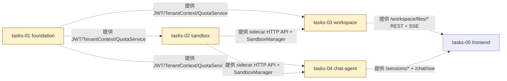

# Tasks 总览

> 关联 [spec.md](../spec.md) · [plan-00 ~ 05](../plan/)
> 一个模块一份 tasks 文件，**每条 task 独立可开发可验证**，缺别人就 mock。

---

## 0. 阅读这份总览的目的

回答 3 个问题：

1. **现在该做哪份 tasks？** → §1 阶段顺序 + §2 早期解锁清单
2. **我做的模块缺别的模块怎么办？** → §3 Mock 策略
3. **每条 task 怎么写、怎么测？** → §4 通用节奏

---

## 1. 模块 tasks 文件清单

| 模块 | 文件 | 关联 plan |
|------|------|----------|
| Foundation（认证 / 配额 / RLS） | [tasks-01-foundation.md](./tasks-01-foundation.md) | plan-01 |
| Sandbox + agent-runner | [tasks-02-sandbox.md](./tasks-02-sandbox.md) | plan-02 |
| Workspace 文件服务 | [tasks-03-workspace.md](./tasks-03-workspace.md) | plan-03 |
| Chat / Agent / 记忆 / RAG | [tasks-04-chat-agent.md](./tasks-04-chat-agent.md) | plan-04 |
| 前端 | [tasks-05-frontend.md](./tasks-05-frontend.md) | plan-05 |

> 不再有一份"巨型 tasks.md"。每个模块的人**只看自己那份**，照着做就行。

---

## 2. 推荐做事顺序（单人 / 小团队）

### 单人推进

```
foundation 跑通基础 → 各模块按需开工，无强串行
具体：
  tasks-01 §1（DDL + JWT + RLS 骨架）
    ↓ 完成
  随便挑一份模块 tasks 接着干（推荐 tasks-02 / tasks-04 / tasks-05 任选）
```

### 多人并行

| 周次 | 谁做什么 |
|------|--------|
| W1 | A 做 tasks-01 全部；B 做 tasks-02 早期产出（OpenAPI + Stub）；C 做 tasks-05 早期（骨架 + mock） |
| W2 | A 完成 → 转 tasks-04；B 继续 tasks-02；C 继续 tasks-05 mock |
| W3+ | A/B 并行，C 跟随集成 |

---

## 3. Mock 策略（缺别人怎么开工）

> 核心原则：**永远不要等别的模块**。跨模块依赖在**测试代码里**用 mock 顶替，直到对方真的交付出 API。

### 3.1 三条铁律（先看这个）

1. **mock 只活在测试代码里**——`src/test/...`、`*.test.ts`、`src/mocks/`（前端 dev only）。
   - **禁止**在 `src/main/...` 写 stub bean、不要靠 `@Profile("dev-stub")` 当 "运行时桩"。
   - 例外：前端 MSW 因技术限制必须在主包入口加载，但要用 `if (import.meta.env.DEV && VITE_ENABLE_MOCK)` 守卫，生产构建自动 tree-shake。
2. **mock 必须对齐契约**——以对方 OpenAPI / Java 接口签名为底，禁止凭空假设字段。契约统一放 `docs/openapi/`（见 §3.3）。
3. **mock 切真接口零成本**——业务代码（main）始终只依赖接口；测试切换 fake / 真实只改 `@Import` 或 wireMock 启用与否，不改业务实现。

### 3.2 缺谁、用什么 mock、放哪里

| 缺谁 | 测试代码里用什么 | 放在哪里 |
|------|-------------|---------|
| **缺 foundation（鉴权 / TenantContext）** | `@BeforeEach TenantContext.runAs(fakeUid, ...)` + `@WithMockUser` | 各模块 `src/test/.../support/FakeTenantConfig.java` |
| **缺 sandbox（SandboxManager）** | `FakeSandboxManager`：内存 map + 临时目录假装 workspace | `module-sandbox/src/test/.../support/FakeSandboxManager.java`，通过 **maven test-jar**（`<classifier>tests</classifier>`）共享给下游测试 |
| **缺 sandbox（sidecar HTTP API）** | WireMock，stub 数据按 `docs/openapi/sidecar.yaml` 的 examples 返 | 消费模块 `src/test/resources/wiremock/sidecar/` |
| **缺 workspace（文件 REST）** | WireMock + 上面的 sidecar.yaml | 各模块 `src/test/resources/wiremock/workspace/` |
| **缺 chat-agent（对话 SSE）** | 集成测试里直接 `applicationEventPublisher` 发事件 / 用 OkHttp MockWebServer 流式 mock | `src/test/.../support/MockSseServer.java` |
| **缺 LLM** | `EchoChatModel`：实现 Spring AI `ChatModel`，把输入逐字 emit 回来 | `module-chat-agent/src/test/.../support/EchoChatModel.java`，test-jar 共享 |
| **缺前端** | 后端用 RestAssured / MockMvc 跑验收；不必等 UI | 后端集成测试 |
| **缺后端（前端开发）** | MSW（Mock Service Worker）拦截 axios + 本地 mock SSE server | `ai-agent-frontend/src/mocks/`，仅 dev 模式启用 |

> **test-jar 共享桩** 的设法（Maven 简版）：模块 A 的 `pom.xml` 配 `maven-jar-plugin` 多 execution 同时打 `tests-classifier` jar；模块 B 在 `<scope>test</scope>` 加 `<classifier>tests</classifier>` 引入。这是 Spring 项目共享测试支撑代码的标准做法。

### 3.3 契约文件统一存放（mock 的唯一底座）

```
docs/openapi/
├── sidecar.yaml         ← plan-02 团队维护（T2.1 产出）
├── foundation.yaml      ← plan-01 团队维护
├── workspace.yaml       ← plan-03 团队维护（T3.13）
├── chat.yaml            ← plan-04 团队维护（T4.27）
└── sse-events.json      ← SSE 事件 JSON Schema（plan-03/04 共建）
```

**任何 task 写完接口都要更新这里的 yaml**——这是别人 mock 你的唯一依据。

---

## 4. 每条 task 的通用节奏（请所有人遵守）

### 4.1 Task 字段格式

每条 task 在自己模块的 tasks 文件里都长这样：

```markdown
### T1.5 任务名（动词+对象）
**前置**：本模块 T1.4
**产出**：1–2 句话说清楚交付物（业务代码）
**工作**：
- 具体动作 1
- 具体动作 2
**测试 Mock**：（仅当本 task 的测试依赖别的模块时填，否则跳过）
- 缺哪个模块 → 在测试里用什么替代（FakeXxx / WireMock / @MockBean ...）
**测试**：（必填，与"工作"等重要）
- 单测：xxx
- 集成测试：xxx（点出关键断言）
**完成定义（DoD）**：
- [ ] 业务代码完成
- [ ] 单测通过 + 覆盖率 ≥ N%
- [ ] 集成测试通过
- [ ] 接口签名同步到 docs/openapi/（若改了对外接口）
```

> 注意"测试 Mock"和"测试"的区别：**Mock 是测试时的工具**（缺别人就 mock），**测试是 task 的必备产出**（没测试 = task 没完成）。

### 4.2 一条 task 的开发节奏

```
1. 拉新分支（feat/<module>-<task-id>）
2. 写测试（红）
3. 写实现（绿）
4. 重构 / 加日志 / 配置 / 文档
5. 自测：mvn verify 或 npm test
6. 合并（PR）→ 立刻开下一条
```

**不要同时做 2 个 task**。一次只做一条，做完合并再做下一条。

### 4.3 一次 task 的工作量

- 单条 task ≈ 半天到一天可完成
- 超过两天 → **拆**（说明 task 颗粒度太粗，回到 plan 重审）

---

## 5. 跨模块依赖与契约——总图



**黄色节点都可以被 mock**——也就是说任何一个模块都不必等任何模块。

---

## 6. 早期解锁清单（W1 必交付，否则别人就被卡）

| 谁 | 必须 W1 交付 | 解锁谁 |
|----|-----------|------|
| foundation | T1.1 用户 DDL + T1.3 JwtIssuer + T1.5 TenantContext | 所有模块 |
| sandbox | T2.1 sidecar OpenAPI 草案 + T2.2 InMemoryStub | tasks-03、tasks-04 |
| workspace | T3.13 OpenAPI 草案 | tasks-05 |
| chat-agent | T4.27 OpenAPI / SSE schema 草案 | tasks-05 |
| frontend | T5.1 工程骨架 + T5.24 MSW mock 模式 | 自己解锁，可独立验证 |

---

## 7. 如何使用本套文档

| 你是谁 | 你看哪些文件 |
|--------|-----------|
| 项目管理 / 决策者 | spec.md + plan-00 + 本文 |
| 后端开发（任一模块） | 本模块 plan + 本模块 tasks |
| 前端开发 | plan-05 + tasks-05；引用 plan-01/03/04 的 OpenAPI |
| QA / 验收 | spec §16 + 各模块 tasks 的 DoD 清单 |

---

## 8. 关于"先开发再测试 vs TDD"

我们要求每条 task：

- **测试先行**：写实现前先写测试（红）
- **小步快走**：一条 task 一个 PR，PR 必带测试，不允许"先合再补测试"
- **测试金字塔**：单测多 / 集成测试少 / E2E 只在 Stage 6 跑

这个不是建议，是硬约束。

---

## 9. 当 task 太重时怎么办

- 你在某条 task 上卡了超过半天 → **拆**
- 拆完写回对应的 `tasks-XX-*.md`（你的同事看得到的位置）
- 在 PR 描述里写明"本 PR 拆自 TX.Y 的子集"

不要忍痛把大 task 一次做完——这会让代码评审、回滚、并行都崩。
