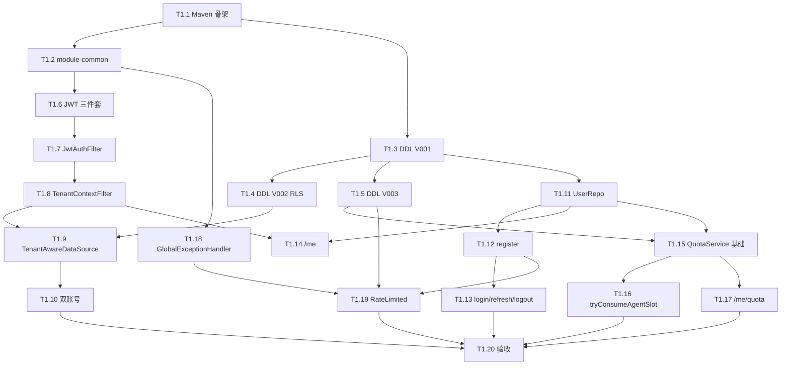

# Tasks-01 Foundation（认证 / 多租户 / 配额）

> 关联 [plan-01-foundation.md](../plan/plan-01-foundation.md) · [tasks-00-overview.md](./tasks-00-overview.md)
>
> **本模块是所有模块的底座**——其他人能否开工取决于 §0.3 的"早期解锁交付物"。

---

## 0. 模块开发指引

### 0.1 本模块完全独立

foundation 没有上游模块依赖，**不需要 mock 任何东西**。
所有 task 直接依赖 PostgreSQL（Testcontainers）。

### 0.2 数据库准备

- 开发环境：`docker-compose.yml` 已起 `postgres:16` 在 5432 端口（项目根目录的 `PostgreData/`）；
- 集成测试：用 Testcontainers `postgres:16` 镜像；
- **两个 DB 账号**：`manus_app`（受 RLS）、`manus_admin`（BYPASSRLS）。开发期可以暂时都用 `postgres` 超级用户跑通，T1.10 切换到双账号。

### 0.3 早期解锁交付物（W1 必须给出）

下游模块在 mock 这些之前需要先看到契约：

| 交付物 | 在哪个 task | 给谁解锁 |
|--------|-----------|---------|
| `TenantContext` Java 类签名 | T1.2 | 所有模块（写测试时用 `TenantContext.runAs`） |
| `JwtIssuer` + 一个能签 token 的 CLI/工具方法 | T1.6 | 所有人集成测试时用 |
| `QuotaService` 接口（默认实现先返回 stub 值） | T1.15 | plan-04 chat-agent |

### 0.4 节奏

20 条 task，按顺序做。每条预估半天到一天。一条 task 一个 PR。

---

## 1. 工程骨架（Stage A）

### T1.1 创建 `module-foundation` 与 `module-common` Maven 子模块
**前置**：项目根 `pom.xml` 已经是 `<packaging>pom</packaging>`（若没有，本 task 改造）
**产出**：两个空的子模块加入 reactor，能 `mvn -pl module-foundation -am package` 跑通
**工作**：
- 根 pom 加 `<modules><module>module-common</module><module>module-foundation</module></modules>`
- 各子模块 pom 声明 `<parent>` 与 `spring-boot-starter-web/jdbc/validation/security` 等依赖
- 每个子模块都建 `src/main/java/com/manus/aiagent2/{common,foundation}/`
**测试**：`mvn -pl module-foundation -am clean package` 通过
**DoD**：
- [ ] reactor 编译通过
- [ ] CI 脚本能识别新模块

### T1.2 `module-common`：基础工具类
**前置**：T1.1
**产出**：`TenantContext` / `BusinessException` / `ApiResponse<T>` / `ErrorCodes` 常量类
**工作**：
- `TenantContext`：`ThreadLocal<UUID>` + `currentUserId()` / `requireCurrentUserId()` / `runAs(uid, runnable)` / `clear()`
- `BusinessException(String code, String msg)` + `ApiResponse<T> { code, message, data, traceId }`
- `ErrorCodes` 常量类：先放 plan-01 §1.4 的 10 个码
**测试**：
- 单测：`runAs` 必须在 finally 还原原值；嵌套 `runAs` 行为正确
- 单测：`requireCurrentUserId` 没设置时抛 `AUTH_TOKEN_INVALID`
**DoD**：
- [ ] 单测通过、覆盖率 ≥ 90%
- [ ] 这两个类 javadoc 完整（供其他模块阅读）

---

## 2. DDL（Stage B）

### T1.3 Flyway V001：用户 / Refresh / Plan / Audit
**前置**：T1.1
**产出**：`V202605260001__core_users.sql` 跑通
**工作**：
- 把 plan-01 §4 的 V001 SQL 原样落地（含 `CREATE EXTENSION pgcrypto, vector`）
- `INSERT INTO plan_tier` 插入 `free` 一行
**测试**：
- Testcontainers 起 PG，跑 Flyway，断言 4 张表都存在
- 断言 `plan_tier` 有且只有 `free` 一行
**DoD**：
- [ ] Flyway 跑通无 warning
- [ ] 验证脚本：`docker exec postgres psql -U postgres -d manus -c "\dt"` 列出 4 张表

### T1.4 Flyway V002：RLS 策略与自检视图
**前置**：T1.3
**产出**：`V202605260002__rls_policies.sql`
**工作**：
- `ALTER TABLE refresh_token ENABLE ROW LEVEL SECURITY` + policy
- 创建 `__rls_health` 视图
- **注意**：`user_account` 不开 RLS（注册时还没上下文）
**测试**：
- 集成测试：用 manus_app 账号 `SET app.current_user_id = '...'` 再插入 / 查询 refresh_token
- 不 SET 上下文时查询应返回 0 行
**DoD**：
- [ ] RLS 行为符合预期
- [ ] `SELECT * FROM __rls_health` 工作

### T1.5 Flyway V003：限流表 + 使用量日表
**前置**：T1.3
**产出**：`V202605260003__quota_tables.sql`
**工作**：
- `rate_limit_counter`（不开 RLS，注释清楚）
- `usage_metric_daily`（开 RLS）
**测试**：Testcontainers 跑迁移；断言表存在 + RLS 配置正确
**DoD**：
- [ ] 表结构 100% 对齐 plan-01 §4

---

## 3. JWT（Stage C）

### T1.6 `JwtProperties` + `JwtIssuer` + `JwtVerifier`
**前置**：T1.2
**产出**：能签发、校验 access / refresh token 的两个 bean
**工作**：
- `JwtProperties`：`jwtSecret`、`accessTtl(PT15M)`、`refreshTtl(P30D)`；启动时校验 secret ≥ 64 byte 否则抛 `IllegalStateException`
- `JwtIssuer.issueAccess(userId, role)` / `issueRefresh(userId, jti)`
- `JwtVerifier.verify(token)` → `JwtClaims { userId, role, jti, expiry }`；过期抛 `AUTH_TOKEN_EXPIRED`，签名错抛 `AUTH_TOKEN_INVALID`
- 实现使用 `jjwt` 库（spring-boot-starter 不自带，pom 加依赖）
**测试**：
- 单测：签发的 token 能验证通过
- 单测：过期 token 抛对应异常
- 单测：篡改 payload 抛 `AUTH_TOKEN_INVALID`
**DoD**：
- [ ] 单测覆盖签发 / 校验 / 过期 / 篡改 4 种场景
- [ ] 提供一个 main 方法 / test util `JwtCliTool` 可手动签 token（供其他模块 W1 联调用）

### T1.7 `JwtAuthFilter`
**前置**：T1.6
**产出**：`OncePerRequestFilter`，从 `Authorization: Bearer xxx` 解析并放入 SecurityContext
**工作**：
- `/auth/*` + `/actuator/health` 白名单跳过
- 解析失败：写出 `ApiResponse{code: AUTH_TOKEN_INVALID, ...}` 401，不进 SecurityFilterChain
- 解析成功：`UsernamePasswordAuthenticationToken(userId, null, [ROLE_USER|ROLE_ADMIN])`
**测试**：
- MockMvc：白名单 401 不触发；带合法 Bearer 200；带过期 token 返回 `AUTH_TOKEN_EXPIRED`
**DoD**：
- [ ] 路由白名单与权限映射对齐
- [ ] 错误响应格式与 `ApiResponse` 一致

### T1.8 `TenantContextFilter`
**前置**：T1.7
**产出**：把 Security 里的 userId 同步写入 `TenantContext`，请求结束 `clear()`
**工作**：
- 顺序：`JwtAuthFilter` → `TenantContextFilter` → 其他
- finally 必须 `TenantContext.clear()`，避免线程池污染
**测试**：
- MockMvc 集成：业务 Controller 读 `TenantContext.currentUserId()` 等于 JWT 的 sub
- 请求结束后立刻在同线程读 `TenantContext.currentUserId()` 应为 null
**DoD**：
- [ ] Filter 顺序正确（Order 注解）
- [ ] 测试断言 clear 行为

---

## 4. 多租户 DataSource（Stage D）

### T1.9 `TenantAwareDataSource`
**前置**：T1.8 + T1.4
**产出**：每次 borrow 连接前 `SET app.current_user_id = '<uuid>'`；无上下文则 `RESET`
**工作**：
- 实现 plan-01 §2.3 的 Connection 包装
- 用 `LazyConnectionDataSourceProxy` 包 Hikari
- 暴露为 Primary `DataSource` bean
**测试**：
- Testcontainers 集成测试：写一段 jdbcTemplate 查 `__rls_health`，无 `TenantContext` 时返回 null，`runAs` 包裹后返回 UUID
- 关键：在线程池场景下（@Async）连接 borrow 行为正确（手测 + 单测）
**DoD**：
- [ ] RLS 自检测试通过
- [ ] 性能验证：每次 borrow 增加的 SET 开销 ≤ 1ms（用 JMH 简版抽样即可）

### T1.10 双 DB 账号配置
**前置**：T1.9
**产出**：app 路由用 `manus_app`，admin 路由 / 后台任务用 `manus_admin`（BYPASSRLS）
**工作**：
- `application.yml` 增加 `spring.datasource.admin.*`
- 配两个 DataSource bean：`@Qualifier("appDataSource")`、`@Qualifier("adminDataSource")`
- 默认 Primary 是 app
- 提供 `@AdminDb` 标记注解（或一个 `AdminJdbcTemplate` bean），后台任务用它
- 运维脚本：在 `scripts/db/create-users.sql` 写好 `CREATE ROLE manus_app ...` / `CREATE ROLE manus_admin ... BYPASSRLS`
**测试**：
- 集成测试：用 admin bean 直查 refresh_token 不需 SET 上下文也能返回全部行
- 用 app bean 必须 SET 上下文才能查
**DoD**：
- [ ] 两套账号生效
- [ ] 文档（README 一段）：开发者如何在本机切两套账号

---

## 5. 注册 / 登录 / Refresh / 登出（Stage E）

### T1.11 `UserAccount` 实体 + `UserRepository`
**前置**：T1.3
**产出**：JPA / JdbcTemplate（项目里目前是哪个就跟哪个，**不要混用**）实现的 user CRUD
**工作**：
- `UserAccount` 字段对齐 V001 DDL
- `UserRepository.findByEmail` / `insert` / `updateStatus`
**测试**：
- Repository 集成测试：插入 + 查找 + 唯一约束触发
**DoD**：
- [ ] CRUD 覆盖

### T1.12 `AuthService.register` + `AuthController.register`
**前置**：T1.11
**产出**：`POST /auth/register`
**工作**：
- `BCryptPasswordEncoder(12)`
- 密码强度校验：≥ 8、含字母+数字（封装 `PasswordPolicy` 工具类）
- 邮箱重复抛 `USER_EMAIL_TAKEN`(409)
- 注册成功 audit_log 一行（action="auth.register"）
- 限流：同 IP 5/min（暂时硬编码，T1.19 切换到 `@RateLimited`）
**测试**：
- MockMvc：注册成功 201、邮箱已存在 409、弱密码 400
**DoD**：
- [ ] 三个错误码都能命中
- [ ] audit_log 有记录

### T1.13 `AuthService.login / refresh / logout`
**前置**：T1.12 + T1.6
**产出**：`POST /auth/login` `/auth/refresh` `/auth/logout`
**工作**：
- login：校密码 → 签 access + refresh（refresh 落 `refresh_token` 表）
- refresh：查 refresh_token，状态必须 active → 标记旧的 `used`，签新 token（旋转）
- logout：把传入 refreshToken 对应的 jti 标 `revoked`
- 密码错抛 `AUTH_BAD_CREDENTIALS`；refresh 被 used / revoked 抛 `AUTH_REFRESH_REVOKED`
**测试**：
- MockMvc：登录成功；密码错 401；refresh 旋转后旧 token 不能再用
- 同一 refresh 并发 refresh 两次：仅一个成功（用 `FOR UPDATE` 行锁）
**DoD**：
- [ ] 旋转与并发安全均通过
- [ ] refresh_token 表状态机正确

---

## 6. 用户信息 / 配额（Stage F）

### T1.14 `UserController /me`
**前置**：T1.8 + T1.11
**产出**：`GET /me`
**工作**：返回当前用户 id / email / role / planTier / 时间戳
**测试**：MockMvc 带 JWT 返回正确；不带 JWT 401
**DoD**：
- [ ] 响应格式同 plan-01 §5

### T1.15 `QuotaService` 基础实现（getQuota / recordToken / recordDisk）
**前置**：T1.5 + T1.11
**产出**：`QuotaService` 接口 + `QuotaServiceImpl`（先实现 3 个方法）
**工作**：
- `getQuota(userId)`：join `user_account` + `plan_tier` 拿到 limits；usage 从 `usage_metric_daily` 当天聚合
- `recordTokenUsage(userId, tokens)`：upsert `usage_metric_daily(metric='llm_tokens_total')`
- `recordDiskUsage(userId, bytes)`：upsert `usage_metric_daily(metric='disk_bytes_max', value=GREATEST(value, ?))`
- `tryConsumeAgentSlot` / `releaseAgentSlot` 先抛 `UnsupportedOperationException`（T1.16 实现）
**测试**：
- 集成：调用 record → 查 usage_metric_daily 命中
- getQuota 返回 limits 正确（free 套餐）
**DoD**：
- [ ] 接口给下游可用
- [ ] 单元测试覆盖 upsert 逻辑

### T1.16 `QuotaService.tryConsumeAgentSlot / releaseAgentSlot`
**前置**：T1.15
**产出**：并发安全的占槽 / 放槽
**工作**：
- 实现 plan-01 §7.2 的 SQL 逻辑（在 `chat_session` 表上 `FOR UPDATE`）
- **依赖外部模块的表**：`chat_session.running_agent_count` 由 plan-04 创建。**本模块用 Flyway baseline 在 V004 也建一个最小版表**（仅 `id, user_id, running_agent_count`），让 plan-04 后续 ALTER 扩字段
- 配置项 `manus.quota.max-concurrent-agents` 从 `plan_tier.max_concurrent_agents` 优先取
**测试**：
- Testcontainers 集成：起 5 个线程并发 tryConsume，断言只有 3 次成功
- release 后再 try 应该成功
**Mock**：plan-04 还没建 chat_session？没事——本 task 自己建好最小版表（注 plan-04 加字段不冲突）
**DoD**：
- [ ] 并发安全测试通过
- [ ] 复用 plan-04 的表后无需重写

### T1.17 `QuotaController /me/quota`
**前置**：T1.15
**产出**：`GET /me/quota` 返回 plan-01 §5 的 JSON
**工作**：调 `QuotaService.getQuota` + 拼 usage（sessionsActive 暂从 mock 或 0，等 plan-04 接入）
**Mock**：
- `sessionsActive` 临时返回 0（评论标 TODO，等 plan-04 接入）
- `agentsRunningNow` 同上
**测试**：MockMvc happy path
**DoD**：
- [ ] 响应字段全
- [ ] TODO 注释明确指向 plan-04 task 编号

---

## 7. 通用框架（Stage G）

### T1.18 `GlobalExceptionHandler` + 错误码登记
**前置**：T1.2
**产出**：`@RestControllerAdvice` 统一异常 → `ApiResponse` + HTTP code
**工作**：
- 拦 `BusinessException`（按 code 映射 HTTP，维护 `code → http` 静态表）
- 拦 `MethodArgumentNotValidException`（参数校验）→ `VALIDATION_ERROR`(400)
- 拦未知异常 → `INTERNAL_ERROR`(500)，日志带 traceId
- 在 `module-common` 加一份 `docs/errorcodes.md`（自动从代码生成可选，先手维）
**测试**：MockMvc 触发各类异常返回格式正确
**DoD**：
- [ ] 错误响应统一
- [ ] 错误码与 plan-01 §1.4 完全对齐

### T1.19 `@RateLimited` 注解 + AOP 拦截
**前置**：T1.5 + T1.18
**产出**：方法上加 `@RateLimited(key="...", limit=5, window=PT1M)` 即生效
**工作**：
- AOP 切面：拼 bucket_key（支持 SpEL，如 `#root.target.someMethod` 或 `'login:' + #email`）
- 滑窗算法：upsert 当前分钟桶 + sum 近 N 桶；超限抛 `RATELIMIT_EXCEEDED`
- 后台 `@Scheduled` 每 10min 删 `window_start < now() - 1day`
- 把 T1.12 注册接口的"硬编码 5/min"切到 `@RateLimited`
**测试**：
- 集成：6 次连续请求第 6 次返回 429
- 等窗口过后又能成功
**DoD**：
- [ ] 注解生效
- [ ] 注册接口已切换

---

## 8. 验收（Stage H）

### T1.20 端到端验收测试
**前置**：T1.1 ~ T1.19 全部完成
**产出**：`module-foundation` 完整集成测试套 `FoundationE2ETest`
**工作**：
- 场景 1：注册 → 登录 → /me → /me/quota
- 场景 2：过期 access → 401 → /auth/refresh → 用新 access → 200
- 场景 3：两个用户并发查询 refresh_token，RLS 各自隔离
- 场景 4：并发 5 个线程 tryConsumeAgentSlot，断言成功数 = 3
- 场景 5：注册同 IP 6 次第 6 次 429
**DoD**：
- [ ] 5 个场景 100% 通过
- [ ] 输出测试报告（surefire HTML）
- [ ] plan-01 §9 验收清单全打勾
- [ ] **本模块完结**，可以告知 plan-02/03/04 接入

---

## 9. 任务依赖图

---

## 10. 早期解锁里程碑（W1 重点）

| Day | 完成 | 解锁谁 |
|-----|------|------|
| 1–2 | T1.1 ~ T1.2 | 所有模块拿到 `TenantContext` 与 `BusinessException` 类签名 |
| 2–3 | T1.6 + T1.7 + T1.8 | 任何人能签 token 并跑通带认证接口 |
| 3–5 | T1.9 ~ T1.13 | 用户能注册登录，下游写测试不再需要假 JWT |
| 1 周 | 全 20 条完成 | foundation 整模块交付，进入维护模式 |
