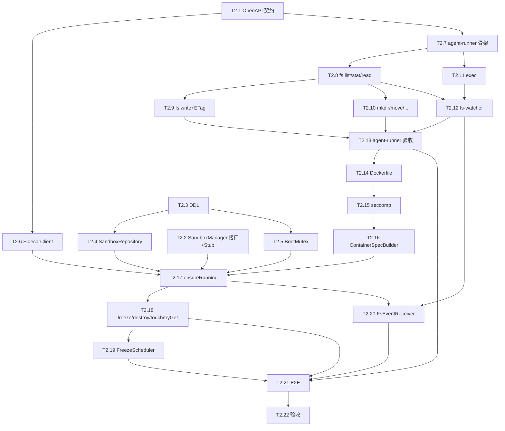

# Tasks-02 Sandbox + agent-runner

> 关联 [plan-02-sandbox.md](../plan/plan-02-sandbox.md) · [tasks-00-overview.md](./tasks-00-overview.md)
>
> **本模块对下游的关键产出 = sidecar HTTP API 契约**——W1 必先冻结（T2.1），下游 plan-03/04 据此 mock。

---

## 0. 模块开发指引

### 0.1 写测试时如何 mock 上游

| 依赖 | 来源 | 测试里的 mock 手法 |
|------|------|---------------|
| `TenantContext` / `QuotaService` | foundation T1.2 / T1.15 | `TenantContext.runAs(fakeUid, ...)`；`@MockBean QuotaService quotaService` |
| `user_account` 表 | foundation T1.3 | Testcontainers 起 PG 后手动 `INSERT INTO user_account` 一行（测试 fixture） |
| Docker daemon | 系统 | 单测全部 mock docker-java（`Mockito.mock(DockerClient.class)`）；集成测试要么用宿主 docker（@Tag("docker")），要么用 Testcontainers DinD |

### 0.2 我给下游什么（让他们写测试时 mock 我）

| 产出 | 谁消费 | 下游测试时如何用 |
|------|------|----------------|
| `SandboxManager` Java 接口 | plan-04 chat-agent | 下游测试 `@Import(FakeSandboxManager.class)`，FakeSandboxManager 由我在 **test-jar** 里提供 |
| `FakeSandboxManager` 测试桩（src/test 路径下，不进生产包） | plan-03 / plan-04 测试 | 通过 maven `<classifier>tests</classifier>` 引入 |
| sidecar HTTP API 契约（OpenAPI yaml） | plan-03 / plan-04 | 下游测试用 WireMock 按 `docs/openapi/sidecar.yaml` examples stub |
| `SandboxFsEvent` Spring 事件 | plan-03 workspace | 下游测试直接 `applicationEventPublisher.publishEvent(...)` 自己发 |

### 0.3 W1 必交付（解锁下游）

| 交付 | task | 紧急程度 |
|------|------|---------|
| `docs/openapi/sidecar.yaml`（覆盖 §3 全部 endpoint） | T2.1 | 最高 |
| `SandboxManager` 接口 + `FakeSandboxManager` 测试桩（test-jar） | T2.2 | 最高 |
| Sandbox 镜像最小可运行版本（健康检查通） | T2.7 ~ T2.10 | 第二优先 |

### 0.4 节奏

22 条 task，分两条线并行：
- **线 A（agent-runner 子模块）**：T2.1 + T2.7 ~ T2.13（含 fs / exec / watcher / 镜像）
- **线 B（module-sandbox 后端）**：T2.2 ~ T2.6 + T2.14 ~ T2.22

两线可以由两个人并行做，不互卡。

---

## 1. 契约先行（W1 解锁）

### T2.1 撰写 sidecar OpenAPI 契约
**前置**：仅依赖 plan-02 §3 文本
**产出**：`docs/openapi/sidecar.yaml`（OpenAPI 3.0）
**工作**：
- 把 plan-02 §3.1 / 3.2 / 3.3 / 3.4 所有 endpoint 翻成 yaml
- 定义所有 schema：`FsListItem` / `FsStat` / `WriteResponse` / `ExecRequest` / `ExecEvent` / `FsEventBatch` / `ApiError`
- `securitySchemes`：`X-Manus-Token` apiKey
- 给每个 endpoint 提供 ≥ 1 个 example
- 在 `docs/openapi/README.md` 写一段"如何用此 yaml 起 WireMock / openapi-generator"
**测试**：`npx @stoplight/spectral lint sidecar.yaml` 0 error
**DoD**：
- [ ] yaml 通过 lint
- [ ] examples 完整
- [ ] **通知 plan-03/04 团队可以开始 mock 接入**

### T2.2 `SandboxManager` 接口 + `FakeSandboxManager` 测试桩
**前置**：foundation T1.2 提供 `TenantContext`
**产出**：`module-sandbox` 子模块 + 业务接口 + **测试支撑库（test-jar）**
**工作**：
- 新建 `module-sandbox` Maven 子模块，加入 reactor
- **主代码 (src/main)**：仅写 `SandboxManager` 接口 + `SandboxHandle` record（plan-02 §1.1 原文），**不要**在 main 里放任何 Stub/Fake
- **测试代码 (src/test)**：写 `FakeSandboxManager`（`com.manus.aiagent2.sandbox.testsupport`）：
  - 内存 map 维护 user→handle 状态
  - `ensureRunning`：用临时目录建 fakeWorkspace；返回 `sidecarBaseUrl = http://localhost:0`
  - `tryGet/freeze/destroy/touch`：内存语义
  - 纯 Java，不依赖 Docker
- **配置 maven-jar-plugin** 多 execution 同时打 `tests-classifier` jar，让 plan-03/04 测试时 `<scope>test</scope> <classifier>tests</classifier>` 引入
**测试**：
- 单测：FakeSandboxManager 自身行为（幂等、map 状态、freeze→ensureRunning 复用）
- 单测：业务接口 `SandboxManager` 的 javadoc 契约用 `FakeSandboxManager` 验证（一份 `SandboxManagerContractTest` 抽象类，将来真实实现继承同一份契约测试）
**DoD**：
- [ ] 主代码只暴露接口（无 Fake 类污染）
- [ ] test-jar 能被下游模块通过 maven classifier 引入
- [ ] 下游模块测试中 `@Import` FakeSandboxManager 通过

---

## 2. 数据层（Stage B）

### T2.3 Flyway V101：sandbox + workspace 表
**前置**：foundation T1.3 已建 user_account
**产出**：`V202605260101__sandbox.sql`
**工作**：
- 落 plan-02 §5 的两张表 + RLS 策略
- foundation 用户注册时插入 `workspace` 一行的 hook 由 plan-01 团队加（开 issue）；当前 task 提供 `WorkspaceProvisionService.provisionFor(userId)`供 foundation 调用
**测试**：Testcontainers 跑迁移；插入两行不同 user 的 sandbox 行，验证 RLS 隔离
**DoD**：
- [ ] 表 + RLS 都生效
- [ ] `WorkspaceProvisionService.provisionFor(userId)` 写 workspace 行 + 调 docker volume create 占位

### T2.4 `SandboxRepository`
**前置**：T2.3
**产出**：基于 jdbcTemplate 的 CRUD + 状态机更新
**工作**：
- `findByUserId(uid)` / `upsert(...)` / `updateStatus(uid, newStatus)` / `markActive(uid)` / `findIdleForFreeze(threshold)`
- `findIdleForFreeze` 用 admin 数据源（绕 RLS）扫描所有用户
**测试**：CRUD 测试 + 并发 updateStatus（行锁）
**DoD**：
- [ ] 所有方法覆盖单测

### T2.5 `BootMutex`（PG advisory lock）
**前置**：T2.3
**产出**：基于 `pg_try_advisory_xact_lock` 的事务级互斥
**工作**：
- `tryLock(String key)` 在当前事务有效
- 提供 `withBootLock(userId, Supplier<T>)`：开新事务（REQUIRES_NEW）+ 尝试拿锁；拿不到抛 `SANDBOX_BUSY`
**测试**：
- 并发集成：10 个线程同 userId 调 `withBootLock`，断言仅 1 个进入 critical section
**DoD**：
- [ ] 并发测试通过

---

## 3. SidecarClient（Stage C，后端→sidecar）

### T2.6 `SidecarClient`：fs / exec / health
**前置**：T2.1（OpenAPI 契约）
**产出**：基于 `WebClient` 或 `RestClient` 的客户端，方法签名对齐 yaml
**工作**：
- `list / read / write / stat / mkdir / move / copy / delete / zip`
- `execRun / execStream(返回 Flux<ExecEvent>) / execCancel`
- `health()` 用于 ensureRunning 后轮询
- 统一带 `X-Manus-Token` Header
- 错误响应解析成 `BusinessException`（保留 sidecar 原 code）
**Mock**：
- 单测用 WireMock 起一个假的 sidecar，按 OpenAPI examples 返
**测试**：
- 单测覆盖每个方法 happy path + 4xx 错误转换
- 单测：write 带 If-Match 409 抛 `FILE_CONFLICT`
**DoD**：
- [ ] WireMock 覆盖率 100% endpoint
- [ ] 真实集成测试在 T2.20 跑

---

## 4. agent-runner 子模块（线 A）

### T2.7 新建 `agent-runner` Spring Boot 子模块
**前置**：T2.1
**产出**：`agent-runner/` 子模块加入 reactor
**工作**：
- 独立 Spring Boot 应用，可 `mvn -pl agent-runner package` 出 fat jar
- 监听 `0.0.0.0:8642`
- `InternalTokenFilter`：所有请求校验 `X-Manus-Token`（白名单 `/healthz`）
- `/healthz` 返 `{"status":"UP"}`
- `/info` 返 `{"image":"manus/sandbox:1.0.0","tz":"UTC",...}`
**测试**：MockMvc：401 没 token / 200 带 token
**DoD**：
- [ ] fat jar 可独立启动
- [ ] 两个 endpoint 工作

### T2.8 `agent-runner` 文件 API：list / stat / read
**前置**：T2.7
**产出**：`/fs/list` `/fs/stat` `/fs/read`
**工作**：
- 工作目录基础 `/workspace`；所有 path 必须以 `/` 开头并被规范化（防 `..`）
- `EtagService`：`hex(sha256(mtime_ns + size + path)).substring(0,16)`
- `list` 分页（offset + limit）；隐藏 `.trash` 目录
- `read` 流式输出 + `ETag` 响应头
**测试**：
- MockMvc + 临时目录：list 返回正确条目数；read 返回内容 + ETag
- 路径越权（`../etc/passwd`）返回 400
**DoD**：
- [ ] 三个 endpoint 行为对齐 OpenAPI
- [ ] 路径越权防御覆盖单测

### T2.9 `agent-runner` 文件 API：write + 乐观锁
**前置**：T2.8
**产出**：`/fs/write` 支持 `If-Match`
**工作**：
- 不带 If-Match：覆盖写，返回新 ETag
- 带 If-Match：先 stat 比对当前 etag；不等抛 409 `FILE_CONFLICT` + 当前 etag
- 写完触发 `FsWatcher` 标 actor（见 T2.11）
**测试**：
- 同一文件并发 2 个 If-Match 写：仅 1 个 200，1 个 409
- 不带 If-Match 强写成功
**DoD**：
- [ ] 乐观锁语义 100% 对齐 plan-02 §3.2

### T2.10 `agent-runner` 文件 API：mkdir / touch / move / copy / delete / zip
**前置**：T2.8
**产出**：剩余 fs endpoint
**工作**：
- `delete`：默认软删到 `/workspace/.trash/` 同名+时间戳；`hard=true` 直接删
- `move/copy`：`overwrite=false` 时目标存在抛 `FILE_ALREADY_EXISTS`
- `zip`：流式输出，跳过 `.trash`
**测试**：
- 各 endpoint happy path
- 软删后能在 `.trash` 找到
- zip 解压后内容一致
**DoD**：
- [ ] 全部 endpoint 通过 OpenAPI 契约校验

### T2.11 `agent-runner` 命令执行：/exec/run + /exec/stream + cancel
**前置**：T2.7
**产出**：执行容器内 shell 命令
**工作**：
- 用 `ProcessBuilder` 起子进程；`cwd` 限定 `/workspace` 子目录；环境变量白名单
- `/exec/run` 同步返回 `{exitCode, stdout, stderr, durationMs}`，超时 kill
- `/exec/stream` SSE，事件 `stdout` / `stderr` / `exit`；维护 `execId` 内存 map
- `/exec/cancel` 对 execId 调 `process.destroyForcibly`
- exec 期间在线程上下文挂当前 `sessionId`，供 watcher 取
**测试**：
- 单测：`echo hello` 输出正确；`sleep 10 + timeoutMs=200` 被 kill
- SSE 测试：`for i in 1..5; do echo $i; sleep 0.1; done` 收到 5 个 stdout + 1 个 exit
- cancel 集成：跑 `sleep 30` 然后 cancel，500ms 内进程终止
**DoD**：
- [ ] 三个 endpoint 全跑通
- [ ] cancel 行为可靠

### T2.12 `agent-runner` fs-watcher + push client
**前置**：T2.8 + T2.11
**产出**：监听 `/workspace` 变更并 200ms debounce 后批量推后端
**工作**：
- Java `WatchService` 注册递归监听
- 内存 buffer + 200ms 定时 flush
- `BackendPushClient`：POST `${MANUS_BACKEND_URL}/internal/sandbox/{userId}/fs-events`，带 `X-Manus-Internal-Token`
- 失败重试 3 次（指数退避）；3 次都失败丢弃（v1 简化）
- actor 来源：
  - `/fs/write` 入口写入时 sidecar 把"刚写的 path + sessionId"塞 ConcurrentHashMap，watcher 触发后查表
  - `/exec/*` 期间打 sessionId 标，watcher 取
  - 都没命中 → `actor.type=external`
**Mock**：
- 单测后端用 WireMock stub `/internal/.../fs-events` 返 200
**测试**：
- 写 100 个文件 → 后端 ≤ 5 个 batch 事件
- write 通过 `/fs/write` → actor 为 user/agent（取决于 Header）
**DoD**：
- [ ] 推送可靠（失败重试有日志）
- [ ] actor 来源识别准确率 ≥ 95%（误差仅来自竞态）

### T2.13 `agent-runner` 单元 / 集成测试通过 + jar 可启动
**前置**：T2.7 ~ T2.12
**产出**：`mvn -pl agent-runner verify` 全绿；fat jar 启动后 `/healthz` 200
**工作**：
- 整理 README：本地起方法、必填环境变量
**DoD**：
- [ ] CI 通过
- [ ] 启动文档清晰

---

## 5. Sandbox 镜像（线 A 收尾）

### T2.14 编写 `manus/sandbox` Dockerfile
**前置**：T2.13
**产出**：`docker/sandbox/Dockerfile`，构建出 `manus/sandbox:1.0.0`
**工作**：
- 基础镜像：`eclipse-temurin:21-jre-jammy`
- 安装常用工具：`bash, coreutils, curl, git, python3, pip, nodejs, npm`（按需精简）
- 创建用户 `sbx (uid=1000)`，工作目录 `/workspace`
- `COPY agent-runner-*.jar /opt/agent-runner/app.jar`
- `ENTRYPOINT ["java","-jar","/opt/agent-runner/app.jar"]`
- 添加 `HEALTHCHECK curl -fs http://localhost:8642/healthz`
**测试**：`docker build` 成功 + `docker run --rm` 起来后 `/healthz` 200
**DoD**：
- [ ] 镜像 ≤ 600MB
- [ ] 启动后 5s 内健康

### T2.15 seccomp profile + 安全加固
**前置**：T2.14
**产出**：`docker/sandbox/seccomp.json` + 容器内安全自检
**工作**：
- 从 docker default seccomp 出发，关掉 `mount/umount/setns/unshare/clone3/keyctl/bpf` 等
- 写 `scripts/sandbox-security-check.sh`：在容器内跑 `whoami / id / mount` 等验证非 root、cap-drop、no-new-privileges、read-only 都生效
**测试**：
- 用 T2.16 的 ContainerSpecBuilder 起容器，跑 check 脚本，断言全部预期
**DoD**：
- [ ] seccomp 阻止越权
- [ ] 自检脚本通过

---

## 6. SandboxManager 真实实现（线 B）

### T2.16 `ContainerSpecBuilder` + `DockerNetworkBootstrap`
**前置**：T2.14 + foundation T1.2
**产出**：把 plan-02 §2.2 的 docker run 翻译成 docker-java `CreateContainerCmd`
**工作**：
- `DockerNetworkBootstrap`：启动时 `docker network create manus-sandbox-net`（已存在则跳过）
- `ContainerSpecBuilder.build(userId, image)`：包含 name/hostname/user/capDrop/securityOpt/network/readOnly/tmpfs/volume/cpus/memory/pidsLimit/env
- pom 加 `docker-java` 依赖
**Mock**：docker-java 客户端用 `DockerClientFactory` 或 mock 测试
**测试**：单测断言 builder 生成的 CreateContainerCmd 各字段正确
**DoD**：
- [ ] 字段对齐 plan-02 §2.2
- [ ] 网络 bootstrap 幂等

### T2.17 `DockerSandboxManager.ensureRunning`
**前置**：T2.4 + T2.5 + T2.6 + T2.16
**产出**：完整 ensureRunning 逻辑
**工作**：
- 实现 plan-02 §6.1 状态机
- 三个分支：running 复用 / frozen `docker start` / absent 新建
- 启动后轮询 sidecar `/healthz`，超时（30s）抛 `SANDBOX_BOOT_FAILED`
- 启动成功写 DB（container_id / sidecar_url / status=running / started_at）
- 全局活跃 sandbox 上限：count(status='running') ≥ `max-active` 抛 `SANDBOX_QUOTA_EXCEEDED`
**Mock**：
- 单测全部 mock docker-java + SidecarClient
**测试**：
- 单测：三种 status 分支
- 单测：boot 超时
- 单测：超限抛错
**DoD**：
- [ ] 三个分支单测覆盖
- [ ] 超限边界正确

### T2.18 `DockerSandboxManager.freeze / destroy / touch / tryGet`
**前置**：T2.17
**产出**：完整 SandboxManager 实现
**工作**：
- `freeze`：`docker stop` + DB `status=frozen`，保留卷
- `destroy`：`docker rm -f` + `docker volume rm ws-<userId>` + DB `status=destroyed`
- `touch`：`UPDATE sandbox SET last_active_at = now()`
- `tryGet`：仅查 DB，不启动
**测试**：单测每个方法
**DoD**：
- [ ] 四方法行为对齐 plan-02 §1.1 注释

### T2.19 `FreezeScheduler`
**前置**：T2.18 + foundation T1.16（确认 `running_agent_count`）
**产出**：每 5 min 扫描冷冻
**工作**：
- 用 admin 数据源（绕 RLS）扫 `sandbox` join `chat_session`
- 条件：`status='running' AND last_active_at < now() - 12h AND NOT EXISTS (running_agent_count > 0)`
- 对命中行调 `freeze(userId)`
- 上报 metric `sandbox.frozen.count`
- 同步调 `QuotaService.recordDiskUsage(userId, volumeSize)`
**Mock**：foundation T1.16 没好之前，`running_agent_count` 字段假定为 0（chat_session 表 T1.16 已创建最小版）
**测试**：
- 集成：手工把 last_active_at 设为 13h 前，跑一次任务，断言 status=frozen
**DoD**：
- [ ] 定时任务工作
- [ ] metric 上报

### T2.20 `FsEventReceiverController` + 事件转发
**前置**：T2.17 + T2.12
**产出**：`POST /internal/sandbox/{userId}/fs-events` 接收 sidecar 上报
**工作**：
- 校验 `X-Manus-Internal-Token`
- 解析 batch
- `applicationEventPublisher.publishEvent(new SandboxFsEvent(userId, payload))`
- 此 endpoint 不走业务 JWT 鉴权（专门白名单）
**测试**：MockMvc：错误 token 401；正确 token 200；事件被发出（用 `@RecordApplicationEvents`）
**DoD**：
- [ ] 事件能被 plan-03 订阅器收到
- [ ] 安全：JWT 白名单 + 内部 token 校验

---

## 7. 集成与验收（Stage Z）

### T2.21 端到端集成：真实 Docker 起 sandbox 跑文件 + 命令
**前置**：T2.13 + T2.17 + T2.20
**产出**：`SandboxIntegrationE2ETest`（需要 docker daemon，CI 标签 @Tag("docker")）
**工作**：
- 场景 1：`ensureRunning(uid1)` → SidecarClient.list("/") 返回 0 条
- 场景 2：SidecarClient.write("/a.txt") → fs-event 在 2s 内被后端收到
- 场景 3：SidecarClient.exec("echo hi") → 输出 hi
- 场景 4：`freeze(uid1)` → `ensureRunning(uid1)` 恢复后内容还在
- 场景 5：30 个 user 并发 ensureRunning 不会产生孤儿容器（最终 docker ps -a 数量正确）
**DoD**：
- [ ] 5 个场景跑通
- [ ] 测试产生的容器/卷全部清理

### T2.22 安全验收 + 文档
**前置**：T2.21
**产出**：
- 安全自检报告（执行 T2.15 脚本）
- `module-sandbox` README：架构图 / 配置项 / 排错指南
- 更新 `docs/openapi/sidecar.yaml` 至最终版（与代码 100% 一致）
**DoD**：
- [ ] 安全自检全绿
- [ ] OpenAPI 与实现无 drift（写一个 `OpenApiDiffTest` 用 swagger-parser 校验）
- [ ] **本模块完结**，通知 plan-03/04 切真实接口

---

## 8. 任务依赖图

---

## 9. 早期解锁里程碑

| Day | 完成 | 解锁谁 |
|-----|------|------|
| Day 1 | T2.1 OpenAPI 草案 | plan-03 / plan-04 开始用 WireMock 集成 |
| Day 1–2 | T2.2 接口 + Stub | plan-04 chat-agent 起对话不再需要真容器 |
| W2 中 | T2.13 agent-runner 可跑 + T2.14 镜像 | plan-03 真集成测试 |
| W3 末 | T2.22 全部完成 | 项目可切真实 sandbox 上线 |
