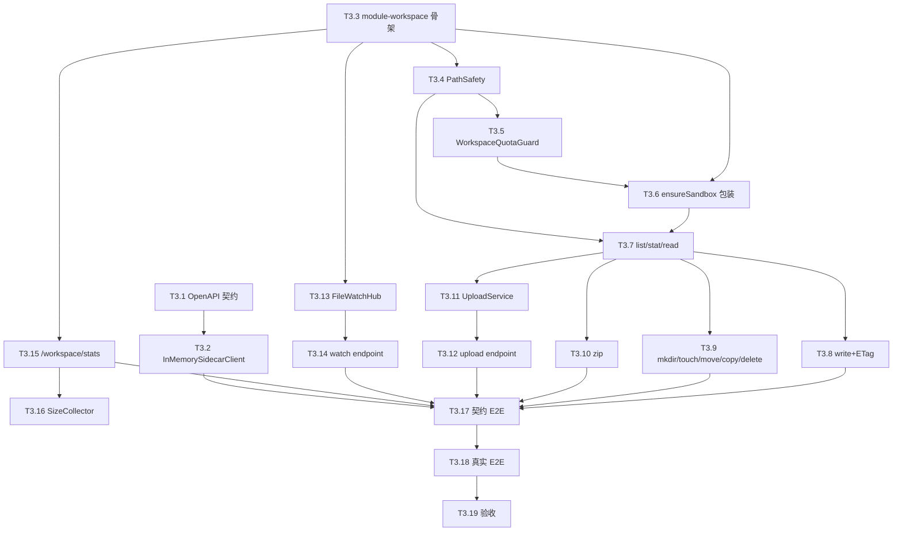

# Tasks-03 Workspace 文件服务

> 关联 [plan-03-workspace.md](../plan/plan-03-workspace.md) · [tasks-00-overview.md](./tasks-00-overview.md)
>
> **本模块对下游的关键产出 = `/workspace/files/*` REST + SSE 契约**（T3.1 早交付）。

---

## 0. 模块开发指引

### 0.1 写测试时如何 mock 上游

| 依赖 | 来源 | 测试里的 mock 手法 |
|------|------|---------------|
| `SandboxManager.ensureRunning / touch` | plan-02 T2.2 | 引入 plan-02 test-jar 后 `@Import(FakeSandboxManager.class)` |
| `SidecarClient`（fs/*） | plan-02 T2.6 | **本模块的 `FakeSidecarClient` 测试桩**（T3.2 交付）：用临时目录实现完整 fs 语义；与 WireMock 二选一，FakeSidecarClient 更适合单测，WireMock 更适合契约测试 |
| `SandboxFsEvent` Spring 事件 | plan-02 T2.20 | 测试 `applicationEventPublisher.publishEvent(...)` 自己发 |
| `TenantContext` / `QuotaService` | foundation T1.2 / T1.15 | `TenantContext.runAs(...)`；`@MockBean QuotaService` |

### 0.2 我给下游什么（前端写测试时如何用）

| 产出 | 谁消费 | 测试里如何 mock |
|------|-------|---------|
| `/workspace/files/*` REST OpenAPI（T3.1） | plan-05 前端 | 前端 MSW 拦截 axios，按 yaml examples 返；MSW 仅在 dev 模式启用，生产构建剔除 |
| `/workspace/files/watch` SSE schema | plan-05 前端 | 前端 dev 起一个本地 mock SSE server（Express + EventSource polyfill），生产构建不打包 |

### 0.3 W1 必交付

| 交付 | task |
|------|------|
| `docs/openapi/workspace.yaml`（REST + SSE schema） | T3.1 |
| `FakeSidecarClient` 测试桩（让本模块测试不依赖 plan-02 实现） | T3.2 |

### 0.4 节奏

19 条 task。可以与 plan-02 并行——本模块用 InMemorySidecarClient 立刻能跑起来，等 plan-02 交付真实 SidecarClient 时只改 bean 装配。

---

## 1. 契约 & 解耦

### T3.1 撰写 OpenAPI + SSE 契约
**前置**：plan-03 §1 文本 + plan-02 T2.1 sidecar.yaml 已交付
**产出**：`docs/openapi/workspace.yaml`（REST）+ `docs/openapi/sse-events.json`（事件 JSON Schema）
**工作**：
- 把 plan-03 §1.1 所有 endpoint 写 OpenAPI 3.0
- 共享 schema：`FsListItem` / `FsStat` 直接从 sidecar.yaml `$ref` 引（保持类型一致）
- SSE 事件 schema 用 JSON Schema 单独写一份（OpenAPI 对 SSE 支持差）
- `securitySchemes: bearerAuth`
**测试**：`spectral lint` 0 error
**DoD**：
- [ ] yaml lint 通过
- [ ] 类型与 sidecar.yaml 一致（无 drift）
- [ ] **通知 plan-05 前端可以开始 mock**

### T3.2 `FakeSidecarClient` 测试桩
**前置**：plan-02 T2.1 sidecar.yaml（接口已冻结）
**产出**：**仅在 src/test 路径**的内存版 SidecarClient，通过 test-jar 共享
**工作**：
- 放在 `module-workspace/src/test/.../testsupport/FakeSidecarClient.java`（不进生产包）
- 用 `Map<UUID, Map<String, byte[]>>` + 元数据 map 模拟 sandbox 文件系统
- 实现 SidecarClient 全部方法（list / read / write / mkdir / move / copy / delete / stat / zip / exec*）
  - exec 简单返"echo 命令本身"即可（chat-agent 模块再深化）
- 写入时通过测试用的 ApplicationEventPublisher 发 SandboxFsEvent
- 配 maven-jar-plugin 输出 tests-classifier，让 plan-04 测试时也能引入
**测试**：FakeSidecarClient 自身的单测：fs 各方法 + 事件触发
**DoD**：
- [ ] 100% 方法覆盖 SidecarClient 接口
- [ ] 不污染生产代码（grep main 路径无 FakeSidecarClient 引用）
- [ ] 下游 plan-04 测试可通过 maven classifier 引入

---

## 2. 工程骨架 & 数据层

### T3.3 创建 `module-workspace` 子模块
**前置**：foundation T1.1 已建 reactor
**产出**：`module-workspace` 加入 reactor，依赖 module-common + module-foundation + module-sandbox
**工作**：
- pom + 包目录骨架（plan-03 §3）
- `WorkspaceProperties`（plan-03 §6 配置项）
**DoD**：
- [ ] `mvn -pl module-workspace -am package` 通过

### T3.4 `PathSafety` 工具类（放 module-common）
**前置**：foundation T1.2 已建 module-common
**产出**：`com.manus.aiagent2.common.fs.PathSafety`
**工作**：
- 完整实现 plan-03 §2.2
- 拓展：拒绝 `..`、空字节、`/workspace/.trash` 路径直接访问、Windows 风格反斜杠
- 输出永远以 `/workspace` 开头
**测试**：单测覆盖：
- `/foo` → `/workspace/foo`
- `/../etc/passwd` → 抛 `FILE_PATH_OUTSIDE_WORKSPACE`
- `/foo/../bar` → `/workspace/bar`
- URL 编码 `%2e%2e` → 抛
- 空 / null → `/workspace`
- 含 `\x00` → 抛
**DoD**：
- [ ] 单测 ≥ 10 个用例 100% 通过
- [ ] 文档说明可被 plan-04 复用

### T3.5 `WorkspaceQuotaGuard`
**前置**：foundation T1.15 `QuotaService.getQuota`；plan-02 T2.3 `workspace` 表
**产出**：写入前调用，超额抛 `FILE_QUOTA_EXCEEDED`
**工作**：
- `check(userId, deltaBytes)` 查 `workspace.size_bytes + delta > quota_bytes`
- 优化：用本地缓存（5s TTL）避免每次写都查 DB
**Mock**：
- foundation 没好时，`QuotaService.getQuota` 直接 mock 返回固定 quota
**测试**：单测临界值
**DoD**：
- [ ] 临界值正确（>=) 与 (<) 边界）

---

## 3. REST 基础操作（Stage C）

### T3.6 `FileService.ensureSandbox + touch` 包装
**前置**：T3.3 + plan-02 T2.2 SandboxManager 接口
**产出**：所有 fs 操作前的统一前置：`ensureRunning + touch`
**工作**：
- `<T> T withSandbox(UUID userId, Function<SandboxHandle, T> action)`
- Lambda 内可直接调 SidecarClient
**测试**：单测断言 ensureRunning 与 touch 都被调用
**DoD**：
- [ ] 切面统一

### T3.7 `WorkspaceFilesController.list / stat / read`
**前置**：T3.6 + T3.4
**产出**：3 个 endpoint
**工作**：
- `GET /workspace/files?path=&offset=&limit=`：PathSafety + 调 SidecarClient.list → 返回 `ApiResponse`
- `GET /workspace/files/stat?path=`
- `GET /workspace/files/raw?path=`：流式 + ETag 透传；超过 `online-edit-max` 加 `Content-Disposition: attachment`
**测试**：
- MockMvc + InMemorySidecarClient 集成：list / stat / read happy
- 大文件强制下载
- 路径越权 403
**DoD**：
- [ ] OpenAPI 与代码字段一致
- [ ] ETag 透传（不重算）

### T3.8 `WorkspaceFilesController.write`（PUT raw + 乐观锁）
**前置**：T3.7
**产出**：`PUT /workspace/files/raw?path=`
**工作**：
- Header：`If-Match` 透传给 sidecar；`X-Actor-Type: user` 强制（agent 写不走本模块）
- body 大小校验：> `online-edit-max` 直接 413
- 调 WorkspaceQuotaGuard
- 调 SidecarClient.fsWrite
- sidecar 返 409 时：再调 SidecarClient.fsRead 拿最新内容 + 当前 etag → 返回前端 `{code:FILE_CONFLICT, currentEtag, currentContent}`
**测试**：
- happy 200 + 新 ETag
- 409 冲突响应体包含 currentEtag + currentContent
- 413 大文件
- 429 配额
**DoD**：
- [ ] 5 个状态码全覆盖

### T3.9 `WorkspaceFilesController.mkdir / touch / move / copy / delete`
**前置**：T3.7
**产出**：5 个 endpoint
**工作**：直接转 SidecarClient 对应方法；body 参数对齐 plan-03 §1.1
**测试**：每个 happy + 1 个错误（`FILE_ALREADY_EXISTS` / `FILE_NOT_FOUND`）
**DoD**：
- [ ] 5 个 endpoint 工作

### T3.10 `WorkspaceFilesController.zip`
**前置**：T3.7
**产出**：`GET /workspace/files/zip?path=` 流式下载
**工作**：透传 SidecarClient.zipStream；响应头 `Content-Type: application/zip` + `Content-Disposition: attachment; filename=workspace-<userId>-<ts>.zip`
**测试**：下载后能解压 + 内容一致（小数据集）
**DoD**：
- [ ] 流式不爆内存（用 5MB 文件验证）

---

## 4. 上传分片（Stage D）

### T3.11 `UploadService` + `ChunkBuffer`
**前置**：T3.7
**产出**：分片上传的核心服务
**工作**：
- `startUpload(userId, path, totalSize)` → 生成 `uploadId`；建临时目录 `/tmp/upload/<userId>/<uploadId>/`
- `acceptChunk(uploadId, chunkIndex, bytes, contentRange)`：落临时文件
- `finishUpload(uploadId)`：合并所有 chunk → SidecarClient.fsWrite → 删临时目录
- `cancelUpload(uploadId)`：删临时目录
- 校验：总大小 ≤ `manus.workspace.upload-max`；分片大小 ≤ `upload-chunk-size`
- 单文件超时（30 min）后台清理
**测试**：单测 chunk 顺序乱序合并；并发 4 chunk 安全；超时清理
**DoD**：
- [ ] 多分片合并字节一致

### T3.12 `WorkspaceFilesController.upload`
**前置**：T3.11
**产出**：`POST /workspace/files/upload` multipart
**工作**：
- 不带 `Content-Range` → 走小文件直传（< 16MB）
- 带 `Content-Range: bytes start-end/total` → 走 UploadService
- 返回 `{uploadId, received, total}` 或 `{path, etag}`（完成）
**测试**：
- 小文件直传 happy
- 大文件分片（3 片）完成
- 中途调 `DELETE /workspace/files/upload/{uploadId}` 取消
**DoD**：
- [ ] 两种模式都工作

---

## 5. SSE 文件监听（Stage E，核心难点）

### T3.13 `FileWatchHub`：进程内多路 SSE
**前置**：T3.3 + plan-02 T2.20（事件源；前期可 mock）
**产出**：核心 SSE 多路扇出组件
**工作**：
- `Map<UUID, Set<SseEmitter>>`
- `subscribe(userId)`：建 SseEmitter（30 min 超时）→ 注册到 map → 立刻发 `snapshot` 事件
- `unsubscribe(userId, emitter)`：在 emitter.onCompletion / onError / onTimeout 触发
- `@EventListener SandboxFsEvent`：对每个 emitter 发送对应事件；IO 异常时清理
- 每用户连接上限：`max-connections-per-user=5`（plan-03 §6）
- 心跳：每 15s 发 `:heartbeat`（避免代理切连）
**测试**：
- 单测：订阅 3 个 emitter，发布事件，3 个都收到
- 第 6 个连接被拒（429 `RATELIMIT_EXCEEDED` 或自定义码 `WATCH_TOO_MANY_TABS`）
- emitter IO 异常自动清理
**DoD**：
- [ ] 多 tab 扇出工作
- [ ] 上限生效

### T3.14 `WorkspaceWatchController` + 重连 snapshot
**前置**：T3.13
**产出**：`GET /workspace/files/watch` SSE endpoint
**工作**：
- 解析 `Last-Event-ID`（可选）
- 调 `FileWatchHub.subscribe`
- 首事件：`event: snapshot data: {"reason":"initial"}`（首次）或 `{"reason":"reconnect"}`（带 Last-Event-ID）
**测试**：
- 集成：手动 EventSource 客户端连上 → 触发 SidecarClient.write → 收到 modified 事件
- 断线重连 → snapshot 事件
**DoD**：
- [ ] SSE 工作
- [ ] 重连语义符合 plan-03 §5.3

### T3.15 `WorkspaceStatsController`
**前置**：T3.3 + plan-02 T2.3 workspace 表
**产出**：`GET /workspace/stats`
**工作**：返回 `{ sizeBytes, quotaBytes, sandboxStatus, lastActiveAt }`
- sandboxStatus 从 sandbox 表读
**Mock**：sandbox 表没就绪时返回 `{status:"absent"}`
**测试**：MockMvc happy
**DoD**：
- [ ] 字段完整

---

## 6. 配额采集后台任务

### T3.16 `WorkspaceSizeCollector` 定时任务
**前置**：T3.15 + plan-02 T2.19 FreezeScheduler（同周期跑）
**产出**：每 30 min 扫描 active sandbox，调 SidecarClient.statRoot → 更新 `workspace.size_bytes` + 调 `QuotaService.recordDiskUsage`
**工作**：
- 用 admin 数据源跨用户扫描
- 只采 status='running' 的 sandbox
**Mock**：
- foundation T1.15 没好时 recordDiskUsage 用 mock
**测试**：集成：手动 sidecar 写一个 1MB 文件 → 跑一次任务 → workspace.size_bytes ≥ 1MB
**DoD**：
- [ ] 上报准确
- [ ] 不阻塞主线程

---

## 7. 集成与验收（Stage Z）

### T3.17 端到端契约测试套（脱离真实 Docker）
**前置**：T3.1 ~ T3.14 + T3.2（InMemorySidecarClient）
**产出**：`WorkspaceContractE2ETest`，在 InMemorySidecarClient 下跑完所有 REST + SSE
**工作**：
- 12 个场景对齐 plan-03 §7 测试表
- 用 MockMvc + Spring 内置 EventSource 客户端
**DoD**：
- [ ] 12 个场景全过
- [ ] 不依赖 Docker

### T3.18 真实集成测试（依赖 plan-02 真实交付）
**前置**：T3.17 + plan-02 T2.21（真实 sidecar 可用）
**产出**：`WorkspaceRealSandboxE2ETest`（@Tag("docker")）
**工作**：
- 真起 sandbox → 调 `/workspace/files/raw` 写入 → SSE 收到 modified 事件
- 上传 50MB 文件分片 → sidecar 内 ls -l 一致
- 配额超额 → 429
- 路径穿越 → 403
**DoD**：
- [ ] 全过
- [ ] 资源清理

### T3.19 验收 + 文档同步
**前置**：T3.18
**产出**：
- 完结 OpenAPI（与代码 100% 一致），写 `OpenApiContractTest`
- README：本模块架构 / 配置 / 调用示例 / 排错
**DoD**：
- [ ] plan-03 §8 验收清单全打勾
- [ ] **通知 plan-05 前端切真实接口**

---

## 8. 任务依赖图

---

## 9. 早期解锁里程碑

| Day | 完成 | 解锁谁 |
|-----|------|------|
| Day 1 | T3.1 OpenAPI 草案 | plan-05 前端开始 MSW mock |
| Day 2–3 | T3.2 InMemorySidecarClient + T3.3 + T3.4 | 本模块独立可跑 |
| W2 末 | T3.17 契约 E2E | 前端可以联调（哪怕 sandbox 真实未到位） |
| W3 中 | T3.18 真实 E2E | 配合 plan-02 完结 |
