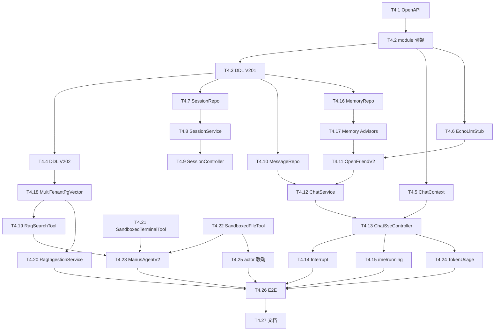

# Tasks-04 Chat / Agent / 记忆 / RAG

> 关联 [plan-04-chat-agent.md](../plan/plan-04-chat-agent.md) · [tasks-00-overview.md](./tasks-00-overview.md)
>
> **本模块是业务核心**，但**契约可以早冻结让前端先开工**（T4.1）。

---

## 0. 模块开发指引

### 0.1 我依赖什么 → 怎么 mock

| 依赖 | 来源 | mock 策略 |
|------|------|---------|
| `TenantContext` | foundation T1.2 | 测试 `TenantContext.runAs(uid, ...)` |
| `QuotaService.tryConsumeAgentSlot/release/recordToken` | foundation T1.15+T1.16 | `Mockito.mock(QuotaService.class)`；返回 true 即可跑通 |
| `SandboxManager.ensureRunning/touch` | plan-02 T2.2 | InMemorySandboxManagerStub |
| `SidecarClient.execRun/execStream/fsRead/fsWrite` | plan-02 T2.6 | InMemorySidecarClient（plan-03 T3.2 已交付）；本模块也可直接复用 |
| DashScope LLM | 阿里云 | 单测全部 mock `ChatClient`；集成测试用 `EchoLlmStub`（一个回环 LLM，返回输入） |
| PgVector | 项目已有 | 复用现有 `PgVectorVectorStoreConfig`；测试用 Testcontainers PG + pgvector |

### 0.2 我给下游什么

| 产出 | 谁消费 | 形式 |
|------|-------|------|
| `/sessions/*` + `/chat/sse` OpenAPI | plan-05 前端 | yaml + SSE JSON Schema（T4.1） |
| 一份能跑 echo 对话的最小后端（normal 模式 stub LLM） | plan-05 | T4.13 完成后前端可端到端联调 |

### 0.3 W1 必交付

| 交付 | task |
|------|------|
| `docs/openapi/chat.yaml` + SSE 事件 schema | T4.1 |
| `EchoLlmStub` 让前端不用真 LLM 也能跑 | T4.6 |

### 0.4 节奏

26 条 task，分成五个阶段。建议单人按阶段顺序做；如果两人并行，一人做 §4 工具/记忆/RAG，另一人做 §1+§2+§3 SSE + Session CRUD。

---

## 1. 契约 & 模块骨架（Stage A）

### T4.1 撰写 chat OpenAPI + SSE 事件 schema
**前置**：plan-04 §1 文本
**产出**：`docs/openapi/chat.yaml` + `docs/openapi/sse-events.json`（追加 chat 事件）
**工作**：
- 所有 `/sessions/*` REST endpoint
- `/chat/sse` 用 description 描述事件类型；事件 schema 放 sse-events.json
- 错误码全部入 yaml `responses`
**测试**：spectral lint 0 error
**DoD**：
- [ ] yaml lint
- [ ] 通知 plan-05 前端开始 mock

### T4.2 创建 `module-chat-agent` 子模块
**前置**：foundation T1.1 + plan-02 sandbox 接口（T2.2 stub）
**产出**：`module-chat-agent` 加入 reactor，依赖 module-common + foundation + sandbox
**工作**：
- pom + 包目录骨架（plan-04 §3）
- `ChatProperties`
- 引入 spring-ai-starter-dashscope + pgvector-store 等依赖
**DoD**：
- [ ] mvn -pl module-chat-agent -am package 通过

### T4.3 Flyway V201：会话 + 消息 + 记忆 + agent_run
**前置**：T4.2 + foundation T1.3
**产出**：`V202605260201__chat_session.sql`
**工作**：
- 落 plan-04 §4 的 5 张表 + RLS（注意：foundation T1.16 已建过最小版 `chat_session`，本 migration 要兼容——用 `ALTER TABLE chat_session ADD COLUMN IF NOT EXISTS ...` 把剩余字段补齐）
**测试**：Testcontainers + RLS 隔离测试
**DoD**：
- [ ] 5 张表 + RLS 都对
- [ ] 与 foundation T1.16 不冲突

### T4.4 Flyway V202：RAG kb_doc
**前置**：T4.3
**产出**：`V202605260202__rag_kb.sql` + vector_store RLS POLICY（运维脚本）
**工作**：
- 落 kb_doc 表
- 写 `scripts/db/enable-vector-rls.sql`：第一次跑应用让 PgVector 自建 vector_store 后，手动执行此脚本加 POLICY
**测试**：vector_store 表存在后跑 RLS 脚本验证过滤
**DoD**：
- [ ] kb_doc + RLS
- [ ] vector_store RLS 文档化

### T4.5 `ChatContext` ThreadLocal
**前置**：T4.2
**产出**：与 TenantContext 并列的 ChatContext
**工作**：`set/get/clear/runWith(sessionId, runnable)`；进入 `/chat/sse` 时设置；filter 末尾 clear
**测试**：单测 + finally clear
**DoD**：
- [ ] 与 TenantContext 兼容

---

## 2. 会话 CRUD（Stage B）

### T4.6 `EchoLlmStub` + ChatClient 工厂
**前置**：T4.2
**产出**：`@Profile("dev-stub")` 的假 LLM，返回 "echo: <input>" 流式
**工作**：
- 实现 Spring AI `ChatModel` 接口（最小子集）
- 流式 chunk 拆分输入文本逐字 emit
- 提供 `ChatClientFactory.create(profile)`：profile=stub 用 Echo，profile=real 用 DashScope
**Mock**：本身就是 mock
**测试**：单测对接 ChatClient → 流式输出"echo: hi"
**DoD**：
- [ ] 前端用此 stub 能跑通完整对话 UI

### T4.7 `ChatSessionRepository` + 实体
**前置**：T4.3
**产出**：会话 CRUD repository
**工作**：findByUserOrderByLastActiveAtDesc / insert / update / archive / softDelete
**测试**：CRUD + 分页
**DoD**：
- [ ] 全方法覆盖

### T4.8 `SessionService` + 套餐校验
**前置**：T4.7 + foundation T1.15（getQuota）
**产出**：会话创建/重命名/归档/删除业务逻辑
**工作**：
- create：检查 `count(status='active') < plan.max_sessions`，否则 `SESSION_LIMIT_REACHED`
- archive：status='archived'，但保留所有消息
- delete：软删（status='deleted'），不动 workspace（plan-04 §0）
**Mock**：foundation 没就绪时 max_sessions=50 硬编码
**测试**：4 个操作 + 上限触发
**DoD**：
- [ ] 套餐校验生效

### T4.9 `SessionController`
**前置**：T4.8
**产出**：6 个 REST endpoint（GET / POST / GET id / PATCH / DELETE / GET messages）
**工作**：对齐 OpenAPI；分页支持
**测试**：MockMvc 全方法
**DoD**：
- [ ] 与 yaml 一致

---

## 3. 对话核心 SSE（Stage C，最难）

### T4.10 `ChatMessageRepository`
**前置**：T4.3
**产出**：消息持久化
**工作**：insertUser / insertAssistant / insertTool / pageByCursor
**测试**：插入 + 分页 + RLS
**DoD**：
- [ ] CRUD

### T4.11 `OpenFriendV2`（normal/thinking 模式）
**前置**：T4.6 + foundation T1.2
**产出**：改造自现有 `OpenFriend`：去掉单例 chatMemoryStore，按 (userId, sessionId) 取记忆；新建 ChatClient.Prompt
**工作**：
- 迁移现有代码到 `module-chat-agent.agent.OpenFriendV2`
- 注入 `MultiTenantPgVectorConfig`（T4.18 提供，先用 stub）
- 注入 `MemoryRepository`（T4.16 提供，先用 stub）
- 暴露 `Flux<ChatStreamEvent> doChatByStream(userId, sessionId, message, thinking)`
**Mock**：T4.16 / T4.18 没好之前用空实现
**测试**：单测：发 "hi" 收到 echo 流
**DoD**：
- [ ] 与现有功能对齐
- [ ] 多租户上下文注入

### T4.12 `ChatService` 编排 + `agent_run` 审计
**前置**：T4.11 + T4.10
**产出**：把 OpenFriendV2 接入 chat_message 入库 + agent_run 审计
**工作**：
- 进入 → INSERT chat_message(role=user) + INSERT agent_run(status=running)
- 流式产出消息 delta → 缓冲 → done 时 INSERT chat_message(role=assistant)
- 失败 → UPDATE agent_run(status=failed)
**测试**：集成：发 "hi" → DB 2 条 message + 1 条 agent_run completed
**DoD**：
- [ ] 持久化无遗漏

### T4.13 `ChatSseController` + `/chat/sse` SSE
**前置**：T4.12 + foundation T1.16 (tryConsumeAgentSlot)
**产出**：完整对话 endpoint
**工作**：
- 进入：解析 sessionId / message → `quotaService.tryConsumeAgentSlot`（失败 429）
- ChatContext.set(sessionId)
- 调 ChatService → 转 SSE 事件流（plan-04 §1.2）
- doFinally：`quotaService.releaseAgentSlot` + ChatContext.clear
- 异常：发 `event: error data: {code, message}`
**测试**：
- 集成：normal 模式收到 message + done 事件
- 并发 4 个 SSE（同用户）第 4 个 429
**DoD**：
- [ ] 三种事件正确（message / done / error）
- [ ] 并发流控生效
- [ ] **前端可联调**

### T4.14 `InterruptService` + `/chat/interrupt` + `/chat/regenerate`
**前置**：T4.13
**产出**：中断 + 重新生成
**工作**：
- ConcurrentMap `(userId,sessionId) → Disposable`
- interrupt：dispose() + 调 SidecarClient.execCancel（若有 active execId）
- regenerate：拿最近一条 assistant message → 删 → 重新跑（复用 ChatService）
**测试**：长 echo 任务中按 interrupt，2s 内 Flux 结束；DB agent_run.status=interrupted
**DoD**：
- [ ] 中断及时
- [ ] 资源释放

### T4.15 `RunningController` `/me/running`
**前置**：T4.13
**产出**：返回当前用户有 `running_agent_count > 0` 的 sessions
**工作**：从 chat_session 查 + 简单 join 拿当前消息预览
**测试**：MockMvc happy
**DoD**：
- [ ] 返回字段对齐 plan-04 §1.1

---

## 4. 记忆 + 工具 + RAG（Stage D）

### T4.16 `MemoryRepository`（短期 + 长期，PG 持久化）
**前置**：T4.3
**产出**：替换原 `VisualizedMemoryManager` 的文件版
**工作**：
- `chat_short_memory`：upsert `(session_id, payload jsonb)`
- `user_long_memory`：upsert `(user_id, payload jsonb)`
- 短期窗口大小：`manus.chat.short-memory-window=30` 滚动
**测试**：upsert + 读取
**DoD**：
- [ ] 替换文件版
- [ ] 满 window 自动剔除最旧

### T4.17 `SessionShortTermMemoryAdvisor` + `UserLongTermMemoryAdvisor`
**前置**：T4.16
**产出**：Spring AI Advisor：调 LLM 前注入记忆，回调后写记忆
**工作**：
- 改造现有 `VisualizedMemoryAdvisor` 到这两个 Advisor
- before：getCurrent → 注入到 prompt
- after：拿 LLM 输出 → MemoryRepository.upsert
**测试**：单测 + 模拟一次对话验证 prompt 中含历史 / DB 有新记忆
**DoD**：
- [ ] Advisor 拼装入 OpenFriendV2

### T4.18 `MultiTenantPgVectorConfig` + RAG filter 注入
**前置**：T4.4 + foundation T1.2
**产出**：复用现有 PgVectorVectorStoreConfig 思路，注入 userId/sessionId 过滤
**工作**：
- 写一个 `MultiTenantVectorStore` 装饰器：
  - similaritySearch：自动加 `metadata.userId == currentUser` + scope/sessionId 过滤
  - add：自动给 Document 加 `userId/scope/sessionId` metadata
- 装配为 `@Primary` Bean
**测试**：写 B 用户的 chunk，A 用户搜索不到（RLS + 表达式双保险）
**DoD**：
- [ ] 多租户过滤生效
- [ ] 与现有 RAG 调用兼容

### T4.19 `RagSearchTool` 改造
**前置**：T4.18
**产出**：Agent 工具：检索用户私有知识库
**工作**：复用现有 `RagSearchTool` 包装；走 MultiTenantVectorStore
**测试**：在 super 模式跑一次包含 RAG 工具的对话，断言被调用
**DoD**：
- [ ] 工具可调用

### T4.20 `RagIngestionService` + 用户上传文档接入
**前置**：T4.18 + plan-03 T3.12（上传通道）
**产出**：用户在 workspace 放文档 / 点击"加入知识库" → 切块 → 向量化 → kb_doc + vector_store
**工作**：
- REST：`POST /me/kb/docs` body `{path}` → 异步 ingest
- 异步线程：用 Spring AI `TokenTextSplitter` + DashScope embedding
- 失败标 `kb_doc.status=failed`
**Mock**：embedding 在测试用 stub（固定向量）
**测试**：上传 1 MB 文本 → 触发 ingest → kb_doc.status=ready + vector_store 有 chunk
**DoD**：
- [ ] 端到端 ingest
- [ ] 错误恢复

### T4.21 `SandboxedTerminalTool`
**前置**：plan-02 T2.6 SidecarClient
**产出**：Agent 工具：在 sandbox 内跑 shell
**工作**：
- 注入 SandboxManager + SidecarClient
- 工具 run(cmd) → ensureRunning → execRun(handle, cmd, sessionId=ChatContext.get())
- 超时 30s 默认（可配）
**Mock**：用 plan-03 的 InMemorySidecarClient
**测试**：单测 + 集成：跑 echo hi 返回 "hi"
**DoD**：
- [ ] 工具能注册到 ChatClient

### T4.22 `SandboxedFileTool`
**前置**：T4.21
**产出**：Agent 工具：读 / 写 / 列文件，全部经 sidecar
**工作**：3 个 @Tool：read_file / write_file / list_files
**测试**：单测 + 集成
**DoD**：
- [ ] 全部经 sidecar，无宿主直读

### T4.23 `ToolRegistration` + `ManusAgentV2`（super 模式）
**前置**：T4.21 + T4.22 + T4.11
**产出**：迁移现有 ManusAgent / ToolCallAgent / ReActAgent
**工作**：
- 包名挪到 `chatagent.agent.manus.*`
- 每次新建实例（不复用），注入 ChatContext
- 移除 TerminalShellRunner，注册 SandboxedTerminalTool + SandboxedFileTool + RagSearchTool + WebSearchTool
- `ChatService` 根据 `session.mode`：normal/thinking → OpenFriendV2，super → ManusAgentV2
**测试**：集成：super 模式发 "ls /" → 触发 SandboxedTerminalTool → 返回沙箱目录
**DoD**：
- [ ] 三种模式都跑通
- [ ] 工具调用全部走 sandbox

---

## 5. 集成与验收（Stage E）

### T4.24 `recordTokenUsage` 接入 LLM 回调
**前置**：T4.13 + foundation T1.15
**产出**：每次 LLM 响应回调时调 `QuotaService.recordTokenUsage`；SSE 也发 `event: usage`
**工作**：在 OpenFriendV2 / ManusAgentV2 加 ChatClient `.advisors(...)`：统计 promptTokens + completionTokens
**测试**：集成：1 次对话后 usage_metric_daily 有 token 记录
**DoD**：
- [ ] 计量准确（误差 ≤ 5%）

### T4.25 SSE 事件 actor 与 plan-03 watcher 联动
**前置**：T4.22 + plan-03 T3.14 + plan-02 T2.20
**产出**：Agent 写文件时 plan-03 SSE 收到的 actor.sessionId 与本会话一致
**工作**：在 SandboxedFileTool.writeFile 调 SidecarClient 时带 `X-Actor-Type: agent` + `X-Actor-Session: <sid>` header
**测试**：集成：super 模式让 Agent 写 `/x.txt` → 同用户另一 tab 订阅 watch → 收到 actor.type=agent + sessionId=current
**DoD**：
- [ ] actor 来源准确

### T4.26 端到端验收测试
**前置**：T4.1 ~ T4.25
**产出**：`ChatAgentE2ETest`
**工作**：
- 场景 1：登录 → 建 session → normal 对话 → 关闭 → 列消息能拉回
- 场景 2：super 模式 → 触发 SandboxedTerminalTool → 验证 sidecar 收到 exec call
- 场景 3：单用户开 3 个 sse，第 4 个 429
- 场景 4：中断长 echo 任务
- 场景 5：B 用户的 session A 用户访问 404（RLS）
- 场景 6：B 用户上传文档 → A 用户 RAG 搜不到
- 场景 7：1 次完整对话后 usage_metric_daily 有 token 记录
**DoD**：
- [ ] 7 个场景全过
- [ ] 跑得动（≤ 10 min）

### T4.27 文档同步 + OpenAPI 终稿
**前置**：T4.26
**产出**：
- `docs/openapi/chat.yaml` 与代码 100% 一致
- README：模块说明 / 迁移要点（plan-04 §10）
- 删除现有 `manus_ai_agent` 中被迁移的类（在 git PR 中明示）
**DoD**：
- [ ] yaml drift 测试通过
- [ ] 删除清单与 plan-04 §10 一致
- [ ] **本模块完结**

---

## 6. 任务依赖图

---

## 7. 早期解锁里程碑

| Day | 完成 | 解锁谁 |
|-----|------|------|
| Day 1 | T4.1 OpenAPI 草案 | plan-05 前端 MSW mock |
| Day 3 | T4.6 EchoLlmStub + T4.13 雏形 | 前端完成对话页 happy path 联调 |
| W2 末 | T4.23 三模式跑通 | 真实 LLM + 真实 sandbox 联通 |
| W3 中 | T4.27 完结 | 业务可上线候选 |
