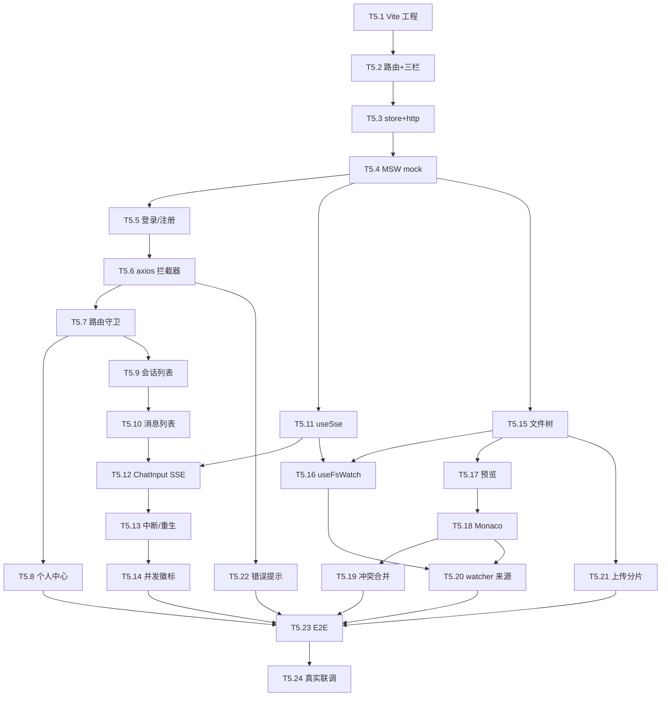

# Tasks-05 前端（Vue 3）

> 关联 [plan-05-frontend.md](../plan/plan-05-frontend.md) · [tasks-00-overview.md](./tasks-00-overview.md)
>
> **前端可以完全独立开发**——所有后端接口用 MSW mock，等后端 OpenAPI 一交付就并行开工。

---

## 0. 模块开发指引

### 0.1 我依赖什么 → 怎么 mock

| 依赖 | 来源 | mock 策略 |
|------|------|---------|
| `/auth/*` `/me` `/me/quota` | foundation T1.12 ~ T1.17 | MSW handler 模拟 |
| `/workspace/files/*` REST | workspace T3.7 ~ T3.12 | MSW handler 模拟 |
| `/workspace/files/watch` SSE | workspace T3.14 | 用 `msw + sse` 或本地 mock server 定时发事件 |
| `/sessions/*` REST | chat-agent T4.9 | MSW handler |
| `/chat/sse` SSE | chat-agent T4.13 | 本地 mock server emit thinking/tool_call/message/done |

### 0.2 我给后端什么

| 产出 | 给谁 | 形式 |
|------|------|------|
| Playwright E2E 脚本 | 整个项目 | 后端做集成测试时可借用此 E2E 验证完整链路 |
| 错误码 → 文案映射表 | 所有模块 | 任何新错误码后端都要同步加进此表，前端的 toast 才有友好文案 |

### 0.3 W1 必交付

| 交付 | task |
|------|------|
| 工程骨架 + 路由 + 三栏布局 + 主题 | T5.1 ~ T5.3 |
| MSW mock 模式（VITE_ENABLE_MOCK=true 全套接口可联调） | T5.4 |
| 登录页 + 主页骨架（用 mock 数据展示） | T5.5 ~ T5.7 |

### 0.4 节奏

24 条 task，分 6 个阶段。1 个前端开发者节奏：
- W1：T5.1 ~ T5.8（骨架 + mock + 登录 + 主页布局）
- W2：T5.9 ~ T5.16（会话 + 对话 + 文件树）
- W3：T5.17 ~ T5.22（Monaco + 合并 + 上传 + watcher）
- W4：T5.23 ~ T5.24（E2E + 联调真实后端）

---

## 1. 工程骨架（Stage A，W1 必交）

### T5.1 创建 Vite + Vue 3 + TS 工程
**前置**：无
**产出**：`ai-agent-frontend/` 子目录
**工作**：
- `npm create vite@latest ai-agent-frontend -- --template vue-ts`
- 安装：`vue-router pinia axios naive-ui @vicons/ionicons5`
- 配置 ESLint + Prettier + tsconfig（strict）
- `package.json` scripts：`dev / build / test / e2e`
**测试**：`npm run dev` 启动到默认 Vite 页
**DoD**：
- [ ] dev / build 都能跑
- [ ] lint 0 error

### T5.2 路由 + 三栏布局 + Naive UI 主题
**前置**：T5.1
**产出**：路由表（plan-05 §3）+ MainPage 三栏（左/中/右）+ 全局深/浅色主题
**工作**：
- vue-router 4 配置 5 个路由
- `MainPage.vue`：grid 三栏（300px / 1fr / 400px），< 1024px 右栏抽屉化
- `App.vue` 全局 `NConfigProvider`
**测试**：浏览器目视；resize 触发抽屉
**DoD**：
- [ ] 路由切换工作
- [ ] 响应式正确

### T5.3 全局 store + axios 实例（暂不接 mock）
**前置**：T5.2
**产出**：5 个 store + `api/http.ts`
**工作**：
- pinia init
- stores: auth / sessions / messages / workspace / runningAgents / ui
- `http.ts`：axios 实例，base url 从 `VITE_API_BASE` 读，**先不加拦截器**（T5.6 加）
**测试**：单测 stores defineStore 能 init
**DoD**：
- [ ] 5 个 store 注册
- [ ] api 可调用（dev tools 看请求）

### T5.4 引入 MSW（mock service worker）
**前置**：T5.3
**产出**：`src/mocks/` + MSW 启动器
**工作**：
- `npm i -D msw`
- 三个 handler 文件：`auth.ts` / `workspace.ts` / `sessions.ts`
- 每个 handler 按 OpenAPI 草案（后端给的）返回示例数据
- `main.ts` 判断 `import.meta.env.VITE_ENABLE_MOCK === 'true'` 加载 worker
- 公共 mock 数据：fake user / 5 个 session / 10 个文件
**Mock**：本身就是 mock
**测试**：浏览器开 `VITE_ENABLE_MOCK=true npm run dev` → 任何 API 调用都被 MSW 拦截
**DoD**：
- [ ] mock 模式下所有 API 有响应
- [ ] 在 README 写清楚开关方法

---

## 2. 认证 + 主页（Stage B）

### T5.5 登录页 + 注册页
**前置**：T5.4
**产出**：`LoginPage.vue` + `RegisterPage.vue` + `api/auth.ts`
**工作**：
- form：邮箱 / 密码（注册多一个确认密码）
- 调 `/auth/login` `/auth/register`
- 成功后 `useAuth().setTokens(...)` + 跳 `/`
- 错误码 → 文案：`USER_EMAIL_TAKEN` "邮箱已注册" / `USER_PASSWORD_WEAK` "密码至少 8 位含字母+数字" / `AUTH_BAD_CREDENTIALS` "邮箱或密码错误"
**测试**：Vitest 组件测试 happy + 各错误码
**DoD**：
- [ ] 两页能用 mock 数据走通

### T5.6 axios 拦截器：JWT + refresh + 错误码 toast
**前置**：T5.5
**产出**：完整 http 拦截器（plan-05 §5.1）
**工作**：
- request：注入 Authorization
- response：401 + `AUTH_TOKEN_EXPIRED` 触发 refresh 一次重放
- 其他错误：调 `ui.toast(mapCodeToText(...))` + reject
- 维护错误码 → 文案映射表（一个集中文件 `src/errorTexts.ts`）
**测试**：Vitest：
- mock 401 + AUTH_TOKEN_EXPIRED → 重放，第二次 200
- mock 任意错误 → toast 被调用
**DoD**：
- [ ] 自动 refresh 工作
- [ ] 错误码统一处理

### T5.7 路由守卫 + 当前用户加载
**前置**：T5.6
**产出**：进入受保护路由前确认 access token 有效 + 拉 `/me`
**工作**：
- `router.beforeEach`：无 token → /login；有 token 但 store 没 user → `await fetchMe()`
- `useAuth().logout()` 清 token + 跳 /login
**测试**：未登录访问 / → 重定向 /login
**DoD**：
- [ ] 守卫工作

### T5.8 个人中心 + 配额面板（`/me`, `/me/quota`）
**前置**：T5.7
**产出**：`MePage.vue` 显示邮箱 / 套餐 / 配额
**工作**：
- 调 `/me` + `/me/quota`
- 显示 4 个进度条：sessionsActive / workspaceMB / tokensToday / agentsRunningNow
- `QuotaBadge.vue` 可复用组件（标题栏右上角小徽标）
**测试**：mock 数据显示正确
**DoD**：
- [ ] 4 个进度条
- [ ] QuotaBadge 抽出来

---

## 3. 会话与对话（Stage C）

### T5.9 会话列表 `SessionList`
**前置**：T5.7
**产出**：左栏组件 + sessions store
**工作**：
- 调 `GET /sessions`
- 列表项：name / mode / lastActiveAt + 右侧运行徽标
- 选中态：当前 sessionId
- 新建按钮 → `NewSessionDialog`（输入 name + mode 下拉）
- 右键菜单：重命名 / 归档 / 删除
**测试**：组件测试 + 用 MSW 数据展示 5 个 session
**DoD**：
- [ ] CRUD 工作

### T5.10 消息列表 `MessageList` + 滚动加载
**前置**：T5.9
**产出**：中栏上部组件
**工作**：
- 调 `GET /sessions/{id}/messages?cursor=`
- 消息气泡 `MessageBubble.vue`（区分 user/assistant/tool_call/tool_result/system）
- `ToolCallCard.vue`：折叠/展开工具调用详情
- 滚到顶部触发加载更多（游标 id < currentCursor）
- 切换 session 立即清空 + 重新加载
**测试**：mock 30 条消息 → 滚动 OK
**DoD**：
- [ ] 五类消息渲染对
- [ ] 历史加载流畅

### T5.11 SSE 客户端 `useSse` + mock SSE server
**前置**：T5.4
**产出**：`composables/useSse.ts` + 本地 mock SSE（用 MSW 的 SSE 拓展或独立 Express server）
**工作**：
- `useSse(url, handlers)`：实现 plan-05 §5.2
- 自动重连 + 关闭
- 暴露 `connected/lastEventId/error` ref
- mock SSE：定时发 thinking → tool_call → tool_result → message * 5 → done
**测试**：
- 启动 mock SSE → useSse 收到 5 类事件
- 重连 → 收到 snapshot 事件
**DoD**：
- [ ] 通用 hook
- [ ] mock server 文档化

### T5.12 对话输入 `ChatInput` + 发送 SSE
**前置**：T5.11 + T5.10
**产出**：中栏下部 + 接入 chat SSE
**工作**：
- 输入框 + 模式选择 `ModeSelector`（normal/thinking/super）+ 发送按钮
- 发送：调 `useSse('/sessions/{id}/chat/sse?message=...')`，事件 dispatch 到 messages store
- 接收 message delta 实时追加
- done 后保存历史 + 让发送按钮恢复
**Mock**：用 T5.11 的 mock SSE
**测试**：mock 模式发"hi"→ 看到 echo 回答
**DoD**：
- [ ] 五类事件渲染对
- [ ] UX 顺畅

### T5.13 中断 + 重新生成
**前置**：T5.12
**产出**：发送按钮变中断 + 重新生成按钮
**工作**：
- Agent 运行中按钮显示"中断"，点击调 `POST /chat/interrupt`
- 最后一条 assistant 悬停显示"重新生成" → `POST /chat/regenerate`
**测试**：mock 长任务中断 → SSE 收到 error/done
**DoD**：
- [ ] 两个操作可用

### T5.14 多会话并发徽标 + `/me/running` 刷新
**前置**：T5.13
**产出**：会话项右侧徽标 + 标题栏全局徽标
**工作**：
- runningAgents store：调 `/me/running` 后缓存
- 触发刷新时机：SSE done / interrupt / 每 30s 兜底
- 全局徽标：`X 个会话正在运行（X/3）`
**测试**：mock 多个 running session 显示徽标
**DoD**：
- [ ] FR-11 可视化

---

## 4. Workspace 文件树 + 编辑器（Stage D，难点）

### T5.15 文件树 `FileTree` 虚拟列表
**前置**：T5.4 + `vue-virtual-scroller` 引入
**产出**：右栏顶部文件树
**工作**：
- workspace store：`tree: Map<path, FileNode>`
- 初始调 `GET /workspace/files?path=/`
- 节点：图标 + 名称 + 右键菜单（重命名/删除/下载）
- 点击 dir 展开 → 拉子节点
- 虚拟滚动渲染可见节点（10k 节点 < 100ms）
**测试**：组件测试 + 性能（mock 10k 节点初次渲染 < 100ms）
**DoD**：
- [ ] 性能达标
- [ ] 右键菜单完整

### T5.16 watcher SSE 接入 `useFsWatch` + 文件树同步
**前置**：T5.15 + T5.11
**产出**：实时同步文件变更
**工作**：
- `useFsWatch()`：内部用 useSse 连 `/workspace/files/watch`
- 收到事件调 `workspace.applyEvent(ev)`（plan-05 §6）
- snapshot 事件 → 清空可见节点缓存 + 重拉
**Mock**：mock SSE 定时发 created / modified / deleted 事件
**测试**：mock 触发 created → 文件树立刻多一行
**DoD**：
- [ ] 5 类事件正确应用
- [ ] 重连发 snapshot 可恢复

### T5.17 文件预览 `FilePreview`
**前置**：T5.15
**产出**：点击文件后右栏底部显示
**工作**：
- 根据扩展名分流：
  - 图片：直接 ``（带 Authorization → 用 `fetch + blob URL`）
  - PDF：iframe + blob URL
  - markdown：调 `/raw` + markdown-it 渲染
  - 其他 → 显示"用编辑器打开"
- 大于 `online-edit-max` 显示"强制下载"按钮
**测试**：mock 几种类型预览
**DoD**：
- [ ] 多类型支持

### T5.18 Monaco 编辑器 `FileEditor` + 保存
**前置**：T5.17 + `@guolao/vue-monaco-editor`
**产出**：可编辑文件
**工作**：
- 路由级懒加载 Monaco（plan-05 §12 提及体积大）
- 打开文件：调 `/raw` + 缓存 etag 到 store
- Ctrl+S / 顶部保存按钮 → `useEtagSave.save(path, content, etag)`
- 未保存有红点 + dirty 标
- 切换文件前提示未保存
**测试**：打开 + 编辑 + 保存 happy
**DoD**：
- [ ] Ctrl+S 工作
- [ ] dirty 标
- [ ] 切换提示

### T5.19 ETag 冲突合并 `ConflictMergeDialog` + `useEtagSave`
**前置**：T5.18
**产出**：plan-05 §5.4 + §3 合并 UI
**工作**：
- `useEtagSave`：409 时弹合并对话框
- 简版 UI：左右栏（local / remote）+ 三按钮：用本地覆盖（强写）/ 用远端覆盖 / 手动合并
- 手动合并打开 Monaco diff editor，编辑后用 remoteEtag 重试保存
**Mock**：MSW 加一个 endpoint mock 返 409 + currentContent
**测试**：触发 409 → 对话框弹出 → 选"用本地"成功保存
**DoD**：
- [ ] 三种选项都工作
- [ ] 手动合并 UI 可用

### T5.20 watcher 来源提示（编辑中文件被 Agent 改）
**前置**：T5.16 + T5.18 + T5.9 (sessions store)
**产出**：plan-05 §5.5
**工作**：
- 收到 modified 事件 + 当前正在编辑此文件：
  - dirty=false → 静默 reload + toast "已自动同步会话 X 的更新"
  - dirty=true → 编辑器顶黄条 + 3 按钮（查看远端 / 合并 / 忽略）
- 来源映射：actor.sessionId → sessions store 查名字
**测试**：mock 改动当前文件 → 两条路径都覆盖
**DoD**：
- [ ] 三种行为正确

### T5.21 上传分片 `UploadDropZone`
**前置**：T5.15
**产出**：拖拽 / 右键 / 顶部按钮上传
**工作**：
- 小文件（<16MB）单次 multipart 上传
- 大文件分片（plan-03 §2.5 协议）+ 进度条
- 进度条嵌在文件树占位项里
- 完成依赖 watcher created 事件确认
**Mock**：MSW 多次接受 chunk + 最后返完成
**测试**：上传 50MB（mock 数据，伪进度）
**DoD**：
- [ ] 两种模式
- [ ] 取消 / 重试

### T5.22 通用错误提示 + 配额超限友好 UI
**前置**：T5.6
**产出**：友好提示组件
**工作**：
- `errorTexts.ts` 完整覆盖所有错误码（plan-01/02/03/04 §x.x 错误码）
- 特殊 UI：
  - `QUOTA_AGENT_CONCURRENCY` → 横幅"已有 3 个会话在跑，请先中断"
  - `FILE_QUOTA_EXCEEDED` → 横幅 + 链接到配额页
  - `FILE_TOO_LARGE` → 横幅"文件过大，请走附件上传"
**测试**：每个特殊场景都能触发 UI
**DoD**：
- [ ] 所有错误码有友好文案

---

## 5. 集成与验收（Stage Z）

### T5.23 Playwright E2E 测试套
**前置**：T5.1 ~ T5.22 + 后端 mock 接口完整
**产出**：`e2e/` 目录 + 6 个 spec
**工作**：
- 用 MSW 提供数据（CI 中也跑 mock 模式）
- spec 1：登录 → 主页 → 显示用户名
- spec 2：新建 session → 发消息 → 收到 done
- spec 3：编辑文件 → 保存 → 文件树看到 modified
- spec 4：触发 409 → 走合并 → 保存成功
- spec 5：多 tab → A tab 改文件 → B tab 提示
- spec 6：超并发 → 友好横幅
**DoD**：
- [ ] 6 spec 全过
- [ ] CI 集成

### T5.24 真实后端联调 + 切换文档
**前置**：T5.23 + 后端 plan-01 ~ 04 全部交付
**产出**：
- `VITE_ENABLE_MOCK=false` 跑 `VITE_API_BASE=http://localhost:8123` 端到端走通
- README：本地起前后端步骤 / 切 mock / 切真实
- 错误码映射表确认无遗漏
**DoD**：
- [ ] 真实后端 happy path 全跑通
- [ ] plan-05 §9 验收清单全打勾
- [ ] **本模块完结**

---

## 6. 任务依赖图

---

## 7. 早期解锁里程碑

| Week | 完成 | 状态 |
|------|------|------|
| W1 | T5.1 ~ T5.8（骨架 + 登录 + 个人中心）| mock 模式跑通登录链路 |
| W2 | T5.9 ~ T5.14（会话 + 对话 + 中断）| 前端 happy path 完整可见 |
| W3 | T5.15 ~ T5.22（文件树 + 编辑器 + 合并 + 上传）| Workspace 体验完整 |
| W4 | T5.23 + T5.24 | E2E 通过，切真实后端 |

---

## 8. 给后端的反向请求清单

前端在做 task 时如果遇到下面情况，请后端模块负责人配合：

| 场景 | 找谁 |
|------|------|
| 某错误码我不知道怎么显示文案 | 对应模块 plan/tasks 负责人补 §错误码 |
| OpenAPI 字段对不上代码 | 模块负责人补 OpenApiContractTest |
| SSE 事件结构变更 | plan-03 / plan-04 同步 sse-events.json |
| 想测大文件上传但 mock 太假 | 后端起 sandbox 真实接口给联调 |
